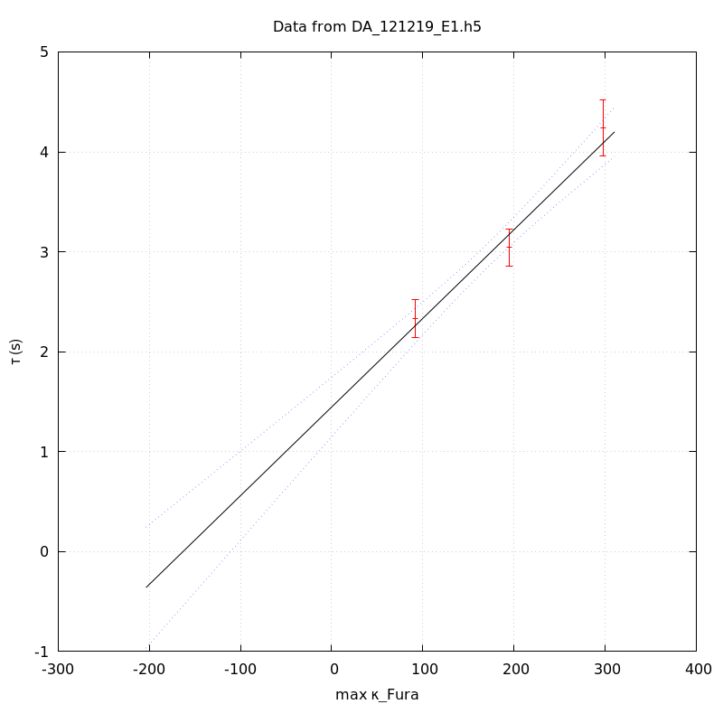

*Analysis of dataset DA_121219_E1*
-----

[TOC]

The baseline length is: 7.

**When fitting tau against kappa_Fura only the transients for which the fit RSS and the lag 1 auto-correlation of the residuals were small enough, giving an overall probability of false negative of 0.02, were kept** (see the numerical summary associated with each transient).

The good transients are: 1, 2, 3.

# Loading curve
The time at which the 'good' transients were recorded appear in red.

# Transients 
On each graph, the residuals appear on top.
**Under the null hypothesis**, if the monoexponential fit is correct **they should be centered on 0 and have a SD close to 1** (not exactly 1 since parameters were obtained through the fitting procedure form the data.

The estimated [Ca2+] appears on the second row. The estimate is show in black together with pointwise 95% confidence intervals. The fitted curve appears in red. **The whole transient is not fitted**, only a portion of it is: a portion of the baseline made of 7 points and the decay phase starting at the time where the Delta[Ca2+] has reached 50% of its peak value.

The time appearing on the abscissa is the time from the beginning of the experiment.

## Transient 1
**Transient 1 is 'good'.**

### Fit graphical summary

### Fit numerical summary

> nobs = 173

> number of degrees of freedom = 170

> baseline length = 7

> fit started from point 34

> estimated baseline 0.0589308 and standard error 0.000575038

> estimated delta 0.113877 and standard error 0.00340461

> estimated tau 2.33157 and standard error 0.0961161

> residual sum of squares: 124.173

> RSS per degree of freedom: 0.730432

> Probability of observing a larger of equal RSS per DOF under the null hypothesis: 0.996686

> Lag 1 residuals auto-correlation: 0.022

> Pr[Lag 1 auto-corr. > 0.022] = 0.304

## Transient 2
**Transient 2 is 'good'.**

### Fit graphical summary

### Fit numerical summary

> nobs = 165

> number of degrees of freedom = 162

> baseline length = 7

> fit started from point 42

> estimated baseline 0.0531948 and standard error 0.000408082

> estimated delta 0.079805 and standard error 0.00144353

> estimated tau 3.04201 and standard error 0.0933074

> residual sum of squares: 146.318

> RSS per degree of freedom: 0.903198

> Probability of observing a larger of equal RSS per DOF under the null hypothesis: 0.806118

> Lag 1 residuals auto-correlation: -0.032

> Pr[Lag 1 auto-corr. > -0.032] = 0.668

## Transient 3
**Transient 3 is 'good'.**

### Fit graphical summary

### Fit numerical summary

> nobs = 155

> number of degrees of freedom = 152

> baseline length = 7

> fit started from point 52

> estimated baseline 0.0503984 and standard error 0.000449798

> estimated delta 0.0560404 and standard error 0.000837688

> estimated tau 4.24049 and standard error 0.141395

> residual sum of squares: 146.478

> RSS per degree of freedom: 0.963669

> Probability of observing a larger of equal RSS per DOF under the null hypothesis: 0.611137

> Lag 1 residuals auto-correlation: 0.058

> Pr[Lag 1 auto-corr. > 0.058] = 0.214

# tau vs kappa 
Since the [Fura] changes during a transient (and it can change a lot during the early transients), the _unique_ value to use as '[Fura]' is not obvious. We therefore perform 3 fits: one using the minimal value, one using the mean and one using the maximal value.

The observed tau (shown in red) are displayed with a 95% confidence interval that results from the fitting procedure and _is_ therefore _meaningful only if the fit is correct_!

No serious attempt at quantifying the precision of [Fura] and therefore kappa_Fura has been made since the choice of which [Fura] to use has a larger effect and since the other dominating effect is often the certainty we can have that the saturating value (the [Fura] in the pipette) has been reached.

The straight line in black is the result of a _weighted_ linear regression. The blue dotted lines correspond to the limits of _pointwise 95% confidence intervals_.

## tau vs kappa  using the min [Fura] value
### Fit graphical summary

### Fit numerical summary

> Best fit: tau = 1.53841 + 0.00911139 kappa_Fura

> Covariance matrix:

> [ +2.06548e-02, -1.07410e-04  

>   -1.07410e-04, +6.78904e-07  ]

> Total sum of squares (TSS) = 125.427

> chisq (Residual sum of squares, RSS) = 3.14551

> Probability of observing a larger of equal RSS per DOF under the null hypothesis: 0.0761362

> R squared (1-RSS/TSS) = 0.974922

> Estimated gamma/v with standard error: 109.753 +/- 9.9251

> Estimates kappa_S with standard error (using error propagation): 167.845 +/- 21.9531

> kappa_S confidence intervals based on parametric bootstrap

> 0.95 CI for kappa_S: [116.698,240.231]

> 0.99 CI for kappa_S: [101.804,269.365]

## tau vs kappa  using the mean [Fura] value
### Fit graphical summary

### Fit numerical summary

> Best fit: tau = 1.48699 + 0.00898643 kappa_Fura

> Covariance matrix:

> [ +2.19195e-02, -1.09901e-04  

>   -1.09901e-04, +6.61522e-07  ]

> Total sum of squares (TSS) = 125.427

> chisq (Residual sum of squares, RSS) = 3.35098

> Probability of observing a larger of equal RSS per DOF under the null hypothesis: 0.0671651

> R squared (1-RSS/TSS) = 0.973283

> Estimated gamma/v with standard error: 111.279 +/- 10.0716

> Estimates kappa_S with standard error (using error propagation): 164.47 +/- 22.2648

> kappa_S confidence intervals based on parametric bootstrap

> 0.95 CI for kappa_S: [112.97,237.809]

> 0.99 CI for kappa_S: [101.067,270.658]

## tau vs kappa  using the max [Fura] value
### Fit graphical summary

### Fit numerical summary

> Best fit: tau = 1.44698 + 0.00886952 kappa_Fura

> Covariance matrix:

> [ +2.29830e-02, -1.11793e-04  

>   -1.11793e-04, +6.46822e-07  ]

> Total sum of squares (TSS) = 125.427

> chisq (Residual sum of squares, RSS) = 3.80417

> Probability of observing a larger of equal RSS per DOF under the null hypothesis: 0.0511251

> R squared (1-RSS/TSS) = 0.96967

> Estimated gamma/v with standard error: 112.746 +/- 10.2233

> Estimates kappa_S with standard error (using error propagation): 162.14 +/- 22.6049

> kappa_S confidence intervals based on parametric bootstrap

> 0.95 CI for kappa_S: [109.769,234.137]

> 0.99 CI for kappa_S: [96.3416,264.062]

# RSS per DOF, standard error of tau and lag 1 residual correlation for each 'good' tansient
3 out of 3 transients  were kept.

sigma(tau): 0.0961161, 0.0933074, 0.141395

Residual correlation at lag 1: 0.021898540901528023, -0.032414210792370474, 0.05839573984343951

Probablity of a correlation at lag 1 smaller or equal than observed: 0.30400000000000005, 0.6679999999999999, 0.21399999999999997

RSS/DOF: 0.730432, 0.903198, 0.963669
