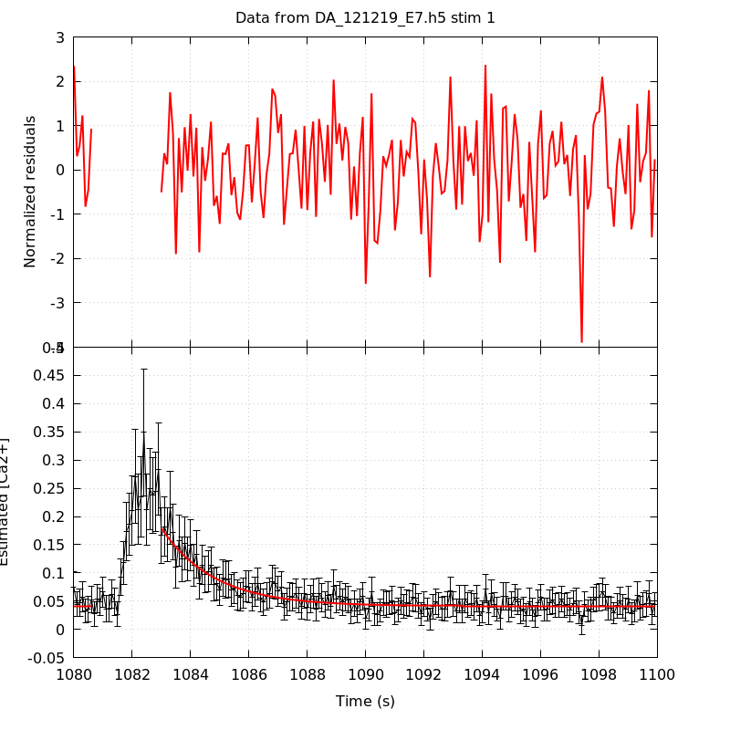
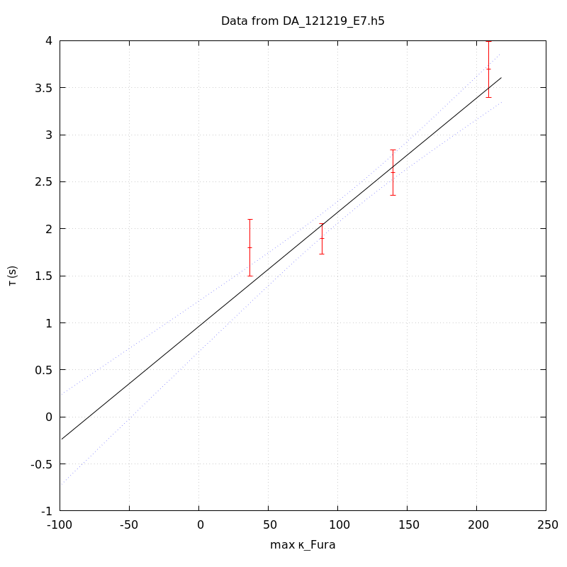

*Analysis of dataset DA_121219_E7*
-----

[TOC]

The baseline length is: 7.

**When fitting tau against kappa_Fura only the transients for which the fit RSS and the lag 1 auto-correlation of the residuals were small enough, giving an overall probability of false negative of 0.02, were kept** (see the numerical summary associated with each transient).

The good transients are: 1, 2, 3, 4.

# Loading curve
The time at which the 'good' transients were recorded appear in red.

# Transients 
On each graph, the residuals appear on top.
**Under the null hypothesis**, if the monoexponential fit is correct **they should be centered on 0 and have a SD close to 1** (not exactly 1 since parameters were obtained through the fitting procedure form the data.

The estimated [Ca2+] appears on the second row. The estimate is show in black together with pointwise 95% confidence intervals. The fitted curve appears in red. **The whole transient is not fitted**, only a portion of it is: a portion of the baseline made of 7 points and the decay phase starting at the time where the Delta[Ca2+] has reached 50% of its peak value.

The time appearing on the abscissa is the time from the beginning of the experiment.

## Transient 1
**Transient 1 is 'good'.**

### Fit graphical summary

### Fit numerical summary

> nobs = 177

> number of degrees of freedom = 174

> baseline length = 7

> fit started from point 30

> estimated baseline 0.0409885 and standard error 0.00110734

> estimated delta 0.138189 and standard error 0.00995014

> estimated tau 1.80089 and standard error 0.154414

> residual sum of squares: 189.943

> RSS per degree of freedom: 1.09163

> Probability of observing a larger of equal RSS per DOF under the null hypothesis: 0.193429

> Lag 1 residuals auto-correlation: -0.017

> Pr[Lag 1 auto-corr. > -0.017] = 0.572

## Transient 2
**Transient 2 is 'good'.**

### Fit graphical summary

### Fit numerical summary

> nobs = 173

> number of degrees of freedom = 170

> baseline length = 7

> fit started from point 34

> estimated baseline 0.0408608 and standard error 0.000523249

> estimated delta 0.113225 and standard error 0.00382174

> estimated tau 1.89405 and standard error 0.0825595

> residual sum of squares: 160.333

> RSS per degree of freedom: 0.943133

> Probability of observing a larger of equal RSS per DOF under the null hypothesis: 0.690839

> Lag 1 residuals auto-correlation: 0.058

> Pr[Lag 1 auto-corr. > 0.058] = 0.200

## Transient 3
**Transient 3 is 'good'.**

### Fit graphical summary

### Fit numerical summary

> nobs = 163

> number of degrees of freedom = 160

> baseline length = 7

> fit started from point 44

> estimated baseline 0.0410633 and standard error 0.000464681

> estimated delta 0.0650056 and standard error 0.00190273

> estimated tau 2.59983 and standard error 0.122714

> residual sum of squares: 145.897

> RSS per degree of freedom: 0.911859

> Probability of observing a larger of equal RSS per DOF under the null hypothesis: 0.780897

> Lag 1 residuals auto-correlation: 0.023

> Pr[Lag 1 auto-corr. > 0.023] = 0.330

## Transient 4
**Transient 4 is 'good'.**

### Fit graphical summary

### Fit numerical summary

> nobs = 155

> number of degrees of freedom = 152

> baseline length = 7

> fit started from point 52

> estimated baseline 0.0374321 and standard error 0.000513458

> estimated delta 0.0595404 and standard error 0.00118663

> estimated tau 3.69508 and standard error 0.15065

> residual sum of squares: 166.038

> RSS per degree of freedom: 1.09236

> Probability of observing a larger of equal RSS per DOF under the null hypothesis: 0.206228

> Lag 1 residuals auto-correlation: -0.089

> Pr[Lag 1 auto-corr. > -0.089] = 0.840

# tau vs kappa 
Since the [Fura] changes during a transient (and it can change a lot during the early transients), the _unique_ value to use as '[Fura]' is not obvious. We therefore perform 3 fits: one using the minimal value, one using the mean and one using the maximal value.

The observed tau (shown in red) are displayed with a 95% confidence interval that results from the fitting procedure and _is_ therefore _meaningful only if the fit is correct_!

No serious attempt at quantifying the precision of [Fura] and therefore kappa_Fura has been made since the choice of which [Fura] to use has a larger effect and since the other dominating effect is often the certainty we can have that the saturating value (the [Fura] in the pipette) has been reached.

The straight line in black is the result of a _weighted_ linear regression. The blue dotted lines correspond to the limits of _pointwise 95% confidence intervals_.

## tau vs kappa  using the min [Fura] value
### Fit graphical summary

### Fit numerical summary

> Best fit: tau = 1.0384 + 0.0128579 kappa_Fura

> Covariance matrix:

> [ +1.72930e-02, -1.41838e-04  

>   -1.41838e-04, +1.44218e-06  ]

> Total sum of squares (TSS) = 126.348

> chisq (Residual sum of squares, RSS) = 11.7113

> Probability of observing a larger of equal RSS per DOF under the null hypothesis: 0.00286369

> R squared (1-RSS/TSS) = 0.907309

> Estimated gamma/v with standard error: 77.7731 +/- 7.26387

> Estimates kappa_S with standard error (using error propagation): 79.7596 +/- 12.708

> kappa_S confidence intervals based on parametric bootstrap

> 0.95 CI for kappa_S: [50.6555,121.256]

> 0.99 CI for kappa_S: [42.3435,138.258]

## tau vs kappa  using the mean [Fura] value
### Fit graphical summary

### Fit numerical summary

> Best fit: tau = 0.982486 + 0.0126476 kappa_Fura

> Covariance matrix:

> [ +1.86067e-02, -1.46194e-04  

>   -1.46194e-04, +1.40024e-06  ]

> Total sum of squares (TSS) = 126.348

> chisq (Residual sum of squares, RSS) = 12.1085

> Probability of observing a larger of equal RSS per DOF under the null hypothesis: 0.00234791

> R squared (1-RSS/TSS) = 0.904166

> Estimated gamma/v with standard error: 79.0662 +/- 7.39747

> Estimates kappa_S with standard error (using error propagation): 76.6814 +/- 13.0054

> kappa_S confidence intervals based on parametric bootstrap

> 0.95 CI for kappa_S: [47.2216,118.705]

> 0.99 CI for kappa_S: [40.2268,138.455]

## tau vs kappa  using the max [Fura] value
### Fit graphical summary

### Fit numerical summary

> Best fit: tau = 0.961677 + 0.0121443 kappa_Fura

> Covariance matrix:

> [ +1.90012e-02, -1.41770e-04  

>   -1.41770e-04, +1.28361e-06  ]

> Total sum of squares (TSS) = 126.348

> chisq (Residual sum of squares, RSS) = 11.4488

> Probability of observing a larger of equal RSS per DOF under the null hypothesis: 0.00326524

> R squared (1-RSS/TSS) = 0.909386

> Estimated gamma/v with standard error: 82.3429 +/- 7.68189

> Estimates kappa_S with standard error (using error propagation): 78.1873 +/- 13.5429

> kappa_S confidence intervals based on parametric bootstrap

> 0.95 CI for kappa_S: [47.4643,120.628]

> 0.99 CI for kappa_S: [39.4577,138.341]

# RSS per DOF, standard error of tau and lag 1 residual correlation for each 'good' tansient
4 out of 4 transients  were kept.

sigma(tau): 0.154414, 0.0825595, 0.122714, 0.15065

Residual correlation at lag 1: -0.0170594044925267, 0.058241398743121696, 0.023204770792844245, -0.08852519243471753

Probablity of a correlation at lag 1 smaller or equal than observed: 0.5720000000000001, 0.19999999999999996, 0.32999999999999996, 0.84

RSS/DOF: 1.09163, 0.943133, 0.911859, 1.09236
