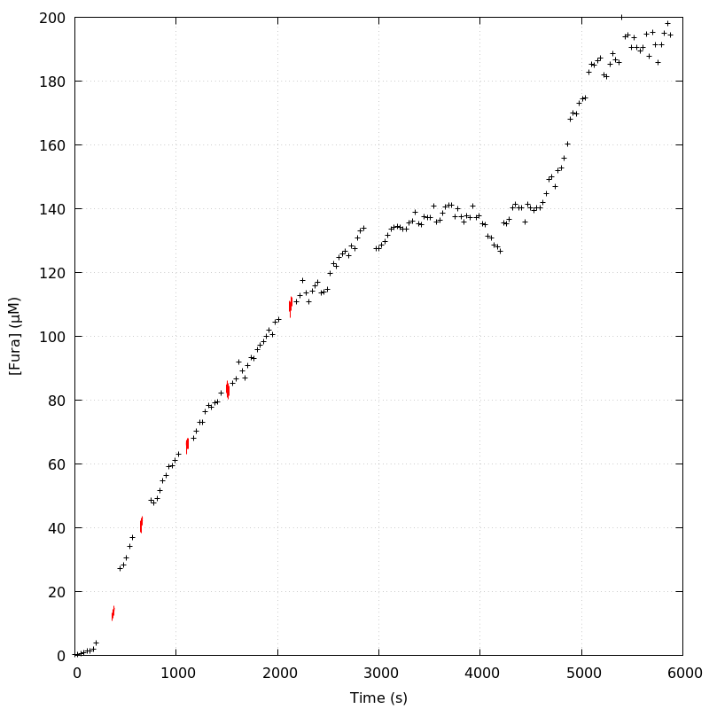
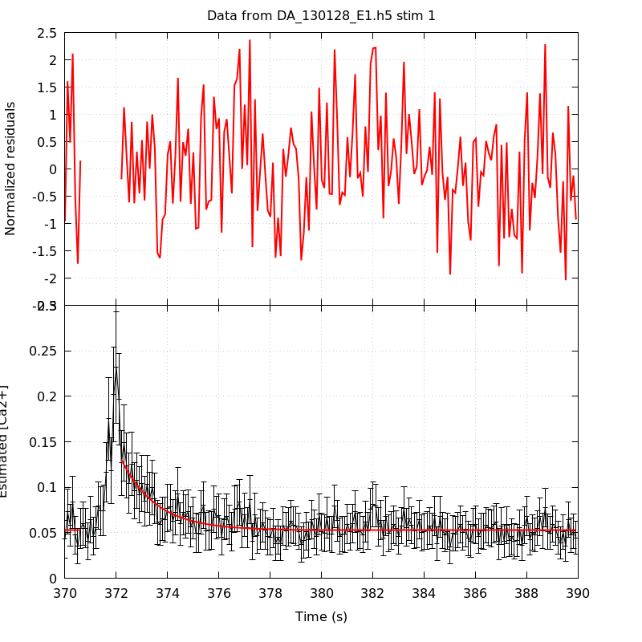
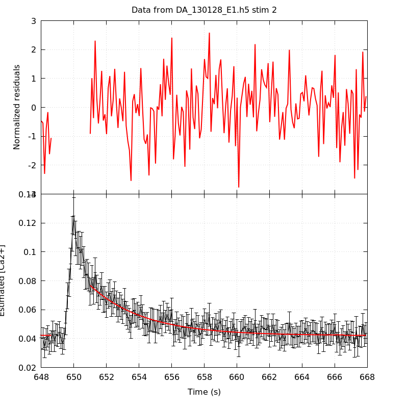
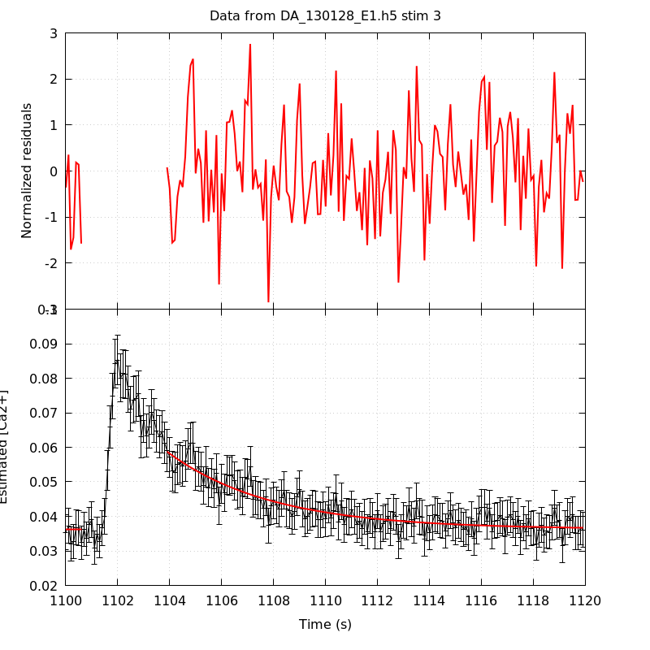
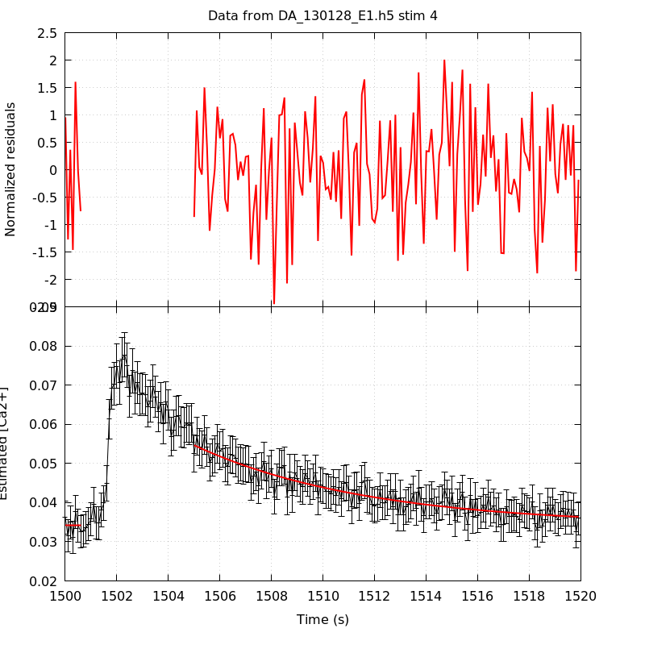
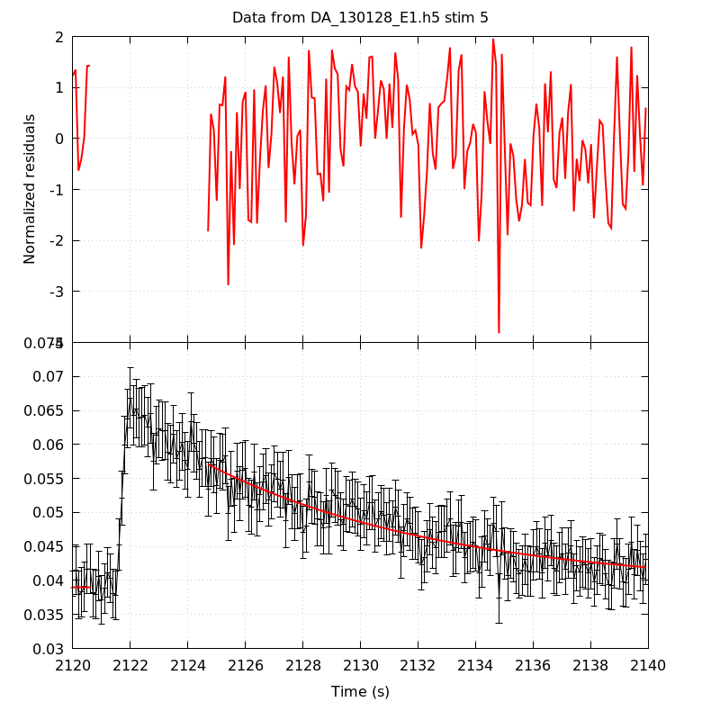
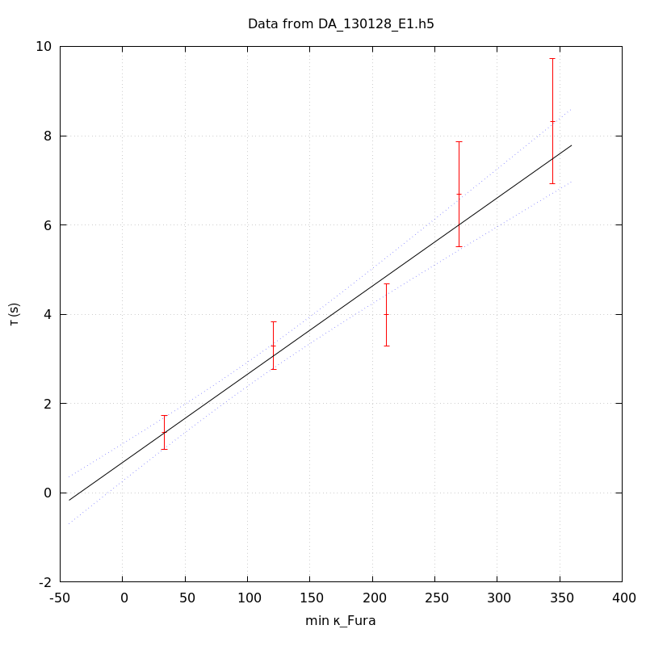
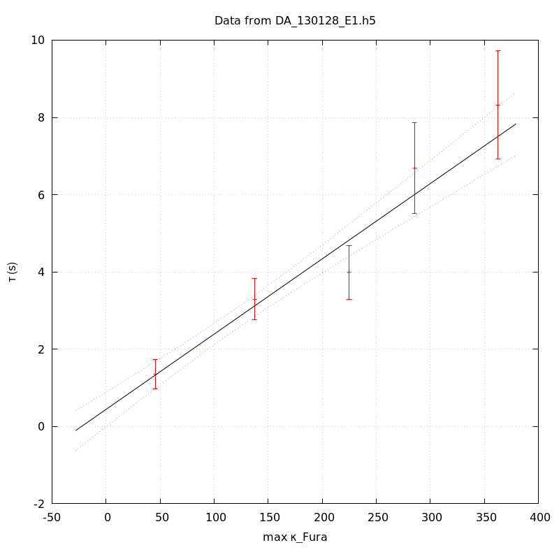

*Analysis of dataset DA_130128_E1*
-----

[TOC]

The baseline length is: 7.

**When fitting tau against kappa_Fura only the transients for which the fit RSS and the lag 1 auto-correlation of the residuals were small enough, giving an overall probability of false negative of 0.02, were kept** (see the numerical summary associated with each transient).

The good transients are: 1, 2, 3, 4, 5.

# Loading curve
The time at which the 'good' transients were recorded appear in red.

# Transients 
On each graph, the residuals appear on top.
**Under the null hypothesis**, if the monoexponential fit is correct **they should be centered on 0 and have a SD close to 1** (not exactly 1 since parameters were obtained through the fitting procedure form the data.

The estimated [Ca2+] appears on the second row. The estimate is show in black together with pointwise 95% confidence intervals. The fitted curve appears in red. **The whole transient is not fitted**, only a portion of it is: a portion of the baseline made of 7 points and the decay phase starting at the time where the Delta[Ca2+] has reached 50% of its peak value.

The time appearing on the abscissa is the time from the beginning of the experiment.

## Transient 1
**Transient 1 is 'good'.**

### Fit graphical summary

### Fit numerical summary

> nobs = 185

> number of degrees of freedom = 182

> baseline length = 7

> fit started from point 22

> estimated baseline 0.0528621 and standard error 0.000905524

> estimated delta 0.0772703 and standard error 0.00867

> estimated tau 1.35364 and standard error 0.192373

> residual sum of squares: 171.825

> RSS per degree of freedom: 0.944096

> Probability of observing a larger of equal RSS per DOF under the null hypothesis: 0.694431

> Lag 1 residuals auto-correlation: 0.033

> Pr[Lag 1 auto-corr. > 0.033] = 0.306

## Transient 2
**Transient 2 is 'good'.**

### Fit graphical summary

### Fit numerical summary

> nobs = 177

> number of degrees of freedom = 174

> baseline length = 7

> fit started from point 30

> estimated baseline 0.0420977 and standard error 0.00051857

> estimated delta 0.0346766 and standard error 0.00155551

> estimated tau 3.29466 and standard error 0.274881

> residual sum of squares: 182.239

> RSS per degree of freedom: 1.04735

> Probability of observing a larger of equal RSS per DOF under the null hypothesis: 0.319014

> Lag 1 residuals auto-correlation: 0.019

> Pr[Lag 1 auto-corr. > 0.019] = 0.354

## Transient 3
**Transient 3 is 'good'.**

### Fit graphical summary

### Fit numerical summary

> nobs = 168

> number of degrees of freedom = 165

> baseline length = 7

> fit started from point 39

> estimated baseline 0.0362997 and standard error 0.000449918

> estimated delta 0.0224485 and standard error 0.000905034

> estimated tau 3.98821 and standard error 0.35594

> residual sum of squares: 181.995

> RSS per degree of freedom: 1.103

> Probability of observing a larger of equal RSS per DOF under the null hypothesis: 0.173197

> Lag 1 residuals auto-correlation: 0.156

> Pr[Lag 1 auto-corr. > 0.156] = 0.027

## Transient 4
**Transient 4 is 'good'.**

### Fit graphical summary

### Fit numerical summary

> nobs = 157

> number of degrees of freedom = 154

> baseline length = 7

> fit started from point 50

> estimated baseline 0.0341591 and standard error 0.000648853

> estimated delta 0.0204927 and standard error 0.000731058

> estimated tau 6.68807 and standard error 0.600155

> residual sum of squares: 135.564

> RSS per degree of freedom: 0.880283

> Probability of observing a larger of equal RSS per DOF under the null hypothesis: 0.854799

> Lag 1 residuals auto-correlation: -0.116

> Pr[Lag 1 auto-corr. > -0.116] = 0.954

## Transient 5
**Transient 5 is 'good'.**

### Fit graphical summary

### Fit numerical summary

> nobs = 160

> number of degrees of freedom = 157

> baseline length = 7

> fit started from point 47

> estimated baseline 0.0390377 and standard error 0.000621145

> estimated delta 0.0180354 and standard error 0.000663066

> estimated tau 8.32472 and standard error 0.716199

> residual sum of squares: 197.149

> RSS per degree of freedom: 1.25573

> Probability of observing a larger of equal RSS per DOF under the null hypothesis: 0.0164202

> Lag 1 residuals auto-correlation: 0.089

> Pr[Lag 1 auto-corr. > 0.089] = 0.153

# tau vs kappa 
Since the [Fura] changes during a transient (and it can change a lot during the early transients), the _unique_ value to use as '[Fura]' is not obvious. We therefore perform 3 fits: one using the minimal value, one using the mean and one using the maximal value.

The observed tau (shown in red) are displayed with a 95% confidence interval that results from the fitting procedure and _is_ therefore _meaningful only if the fit is correct_!

No serious attempt at quantifying the precision of [Fura] and therefore kappa_Fura has been made since the choice of which [Fura] to use has a larger effect and since the other dominating effect is often the certainty we can have that the saturating value (the [Fura] in the pipette) has been reached.

The straight line in black is the result of a _weighted_ linear regression. The blue dotted lines correspond to the limits of _pointwise 95% confidence intervals_.

## tau vs kappa  using the min [Fura] value
### Fit graphical summary

### Fit numerical summary

> Best fit: tau = 0.68068 + 0.019753 kappa_Fura

> Covariance matrix:

> [ +4.56923e-02, -2.53198e-04  

>   -2.53198e-04, +2.39394e-06  ]

> Total sum of squares (TSS) = 172.337

> chisq (Residual sum of squares, RSS) = 9.34948

> Probability of observing a larger of equal RSS per DOF under the null hypothesis: 0.0249877

> R squared (1-RSS/TSS) = 0.945749

> Estimated gamma/v with standard error: 50.6251 +/- 3.96541

> Estimates kappa_S with standard error (using error propagation): 33.4595 +/- 11.1531

> kappa_S confidence intervals based on parametric bootstrap

> 0.95 CI for kappa_S: [10.6434,63.0427]

> 0.99 CI for kappa_S: [3.69988,74.1558]

## tau vs kappa  using the mean [Fura] value
### Fit graphical summary

### Fit numerical summary

> Best fit: tau = 0.549789 + 0.0195745 kappa_Fura

> Covariance matrix:

> [ +4.90248e-02, -2.65498e-04  

>   -2.65498e-04, +2.34089e-06  ]

> Total sum of squares (TSS) = 172.337

> chisq (Residual sum of squares, RSS) = 8.6555

> Probability of observing a larger of equal RSS per DOF under the null hypothesis: 0.0342398

> R squared (1-RSS/TSS) = 0.949776

> Estimated gamma/v with standard error: 51.0869 +/- 3.99309

> Estimates kappa_S with standard error (using error propagation): 27.087 +/- 11.5225

> kappa_S confidence intervals based on parametric bootstrap

> 0.95 CI for kappa_S: [4.14147,56.8259]

> 0.99 CI for kappa_S: [-1.47132,69.8052]

## tau vs kappa  using the max [Fura] value
### Fit graphical summary

### Fit numerical summary

> Best fit: tau = 0.442697 + 0.0194787 kappa_Fura

> Covariance matrix:

> [ +5.19686e-02, -2.76682e-04  

>   -2.76682e-04, +2.31585e-06  ]

> Total sum of squares (TSS) = 172.337

> chisq (Residual sum of squares, RSS) = 8.50052

> Probability of observing a larger of equal RSS per DOF under the null hypothesis: 0.0367244

> R squared (1-RSS/TSS) = 0.950675

> Estimated gamma/v with standard error: 51.338 +/- 4.01082

> Estimates kappa_S with standard error (using error propagation): 21.7272 +/- 11.8373

> kappa_S confidence intervals based on parametric bootstrap

> 0.95 CI for kappa_S: [-1.51938,50.4742]

> 0.99 CI for kappa_S: [-7.69217,61.8326]

# RSS per DOF, standard error of tau and lag 1 residual correlation for each 'good' tansient
5 out of 5 transients  were kept.

sigma(tau): 0.192373, 0.274881, 0.35594, 0.600155, 0.716199

Residual correlation at lag 1: 0.033046612734191176, 0.019123075975603674, 0.15621807941849286, -0.11554265458423434, 0.08895863732849349

Probablity of a correlation at lag 1 smaller or equal than observed: 0.30600000000000005, 0.354, 0.027000000000000024, 0.954, 0.15300000000000002

RSS/DOF: 0.944096, 1.04735, 1.103, 0.880283, 1.25573
