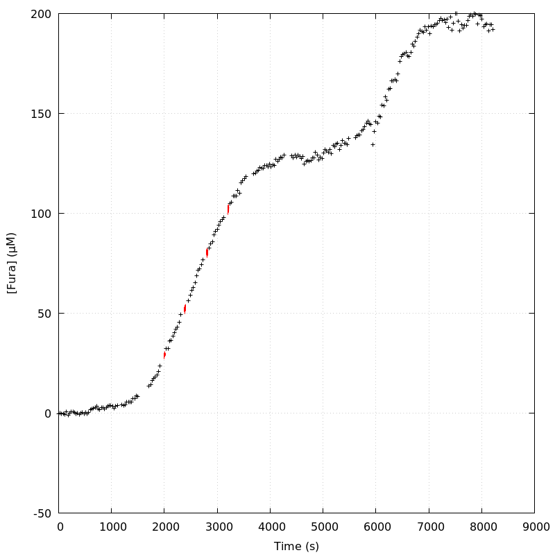
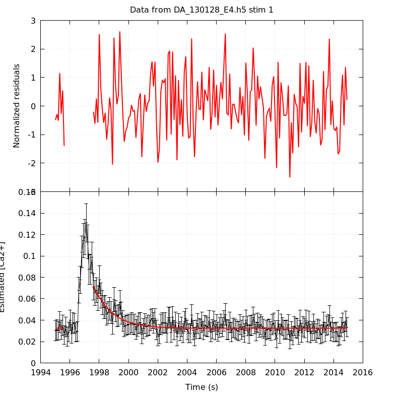
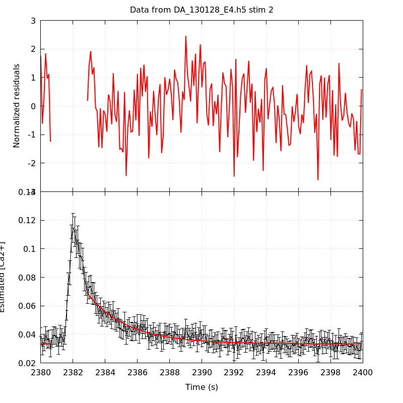
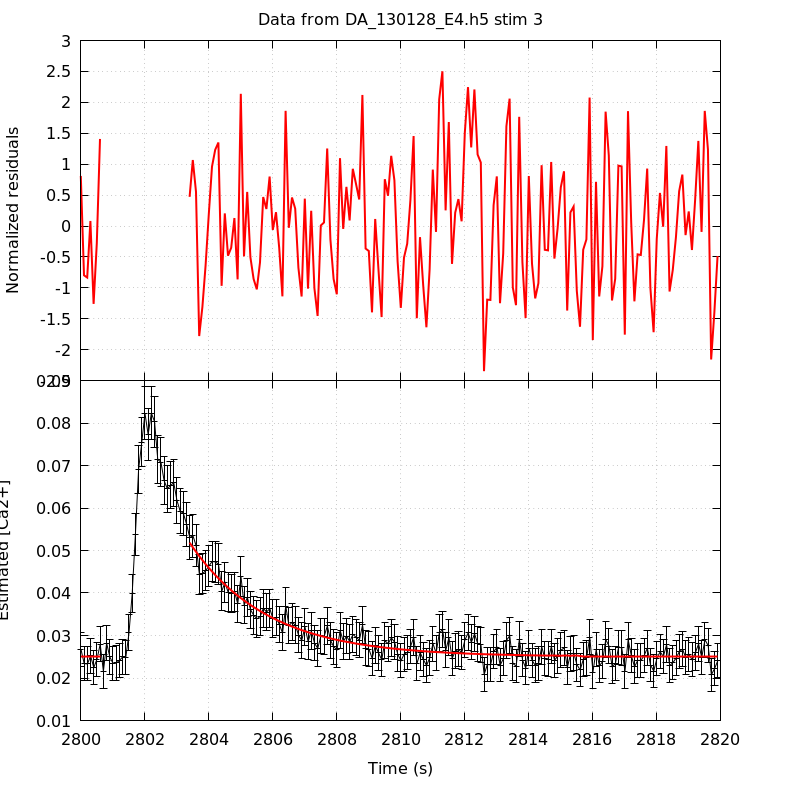
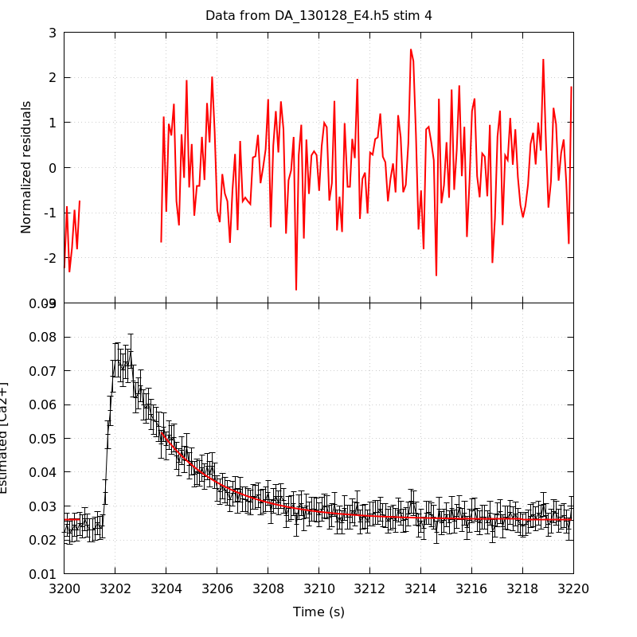
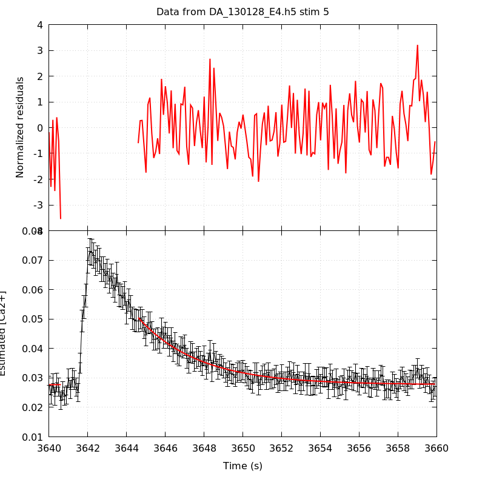
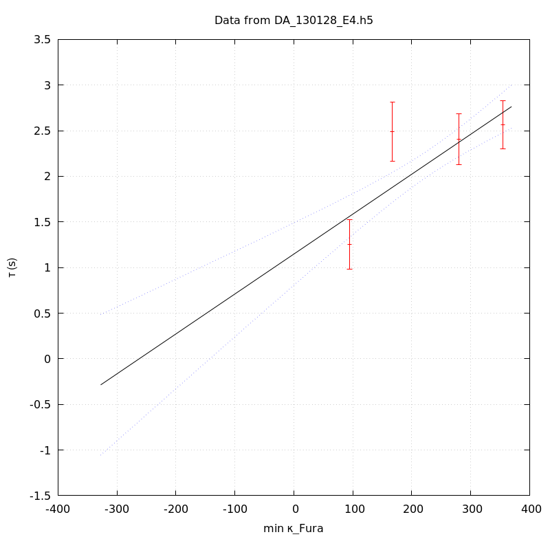
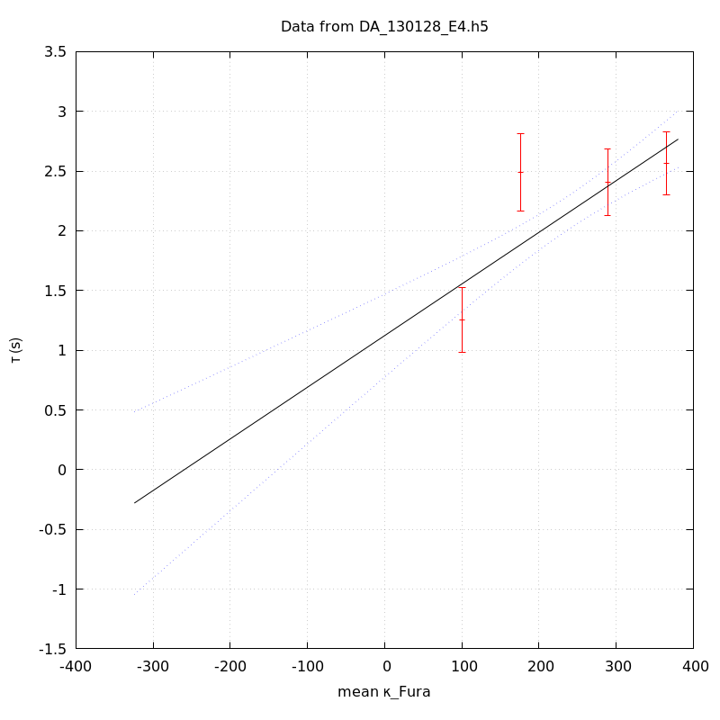
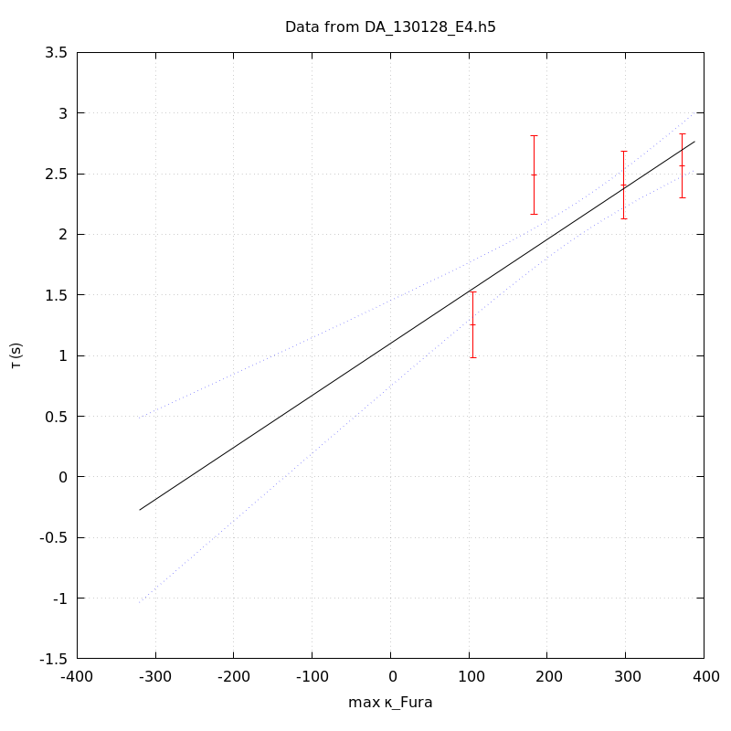

*Analysis of dataset DA_130128_E4*
-----

[TOC]

The baseline length is: 7.

**When fitting tau against kappa_Fura only the transients for which the fit RSS and the lag 1 auto-correlation of the residuals were small enough, giving an overall probability of false negative of 0.02, were kept** (see the numerical summary associated with each transient).

The good transients are: 1, 2, 3, 4.

# Loading curve
The time at which the 'good' transients were recorded appear in red.

# Transients 
On each graph, the residuals appear on top.
**Under the null hypothesis**, if the monoexponential fit is correct **they should be centered on 0 and have a SD close to 1** (not exactly 1 since parameters were obtained through the fitting procedure form the data.

The estimated [Ca2+] appears on the second row. The estimate is show in black together with pointwise 95% confidence intervals. The fitted curve appears in red. **The whole transient is not fitted**, only a portion of it is: a portion of the baseline made of 7 points and the decay phase starting at the time where the Delta[Ca2+] has reached 50% of its peak value.

The time appearing on the abscissa is the time from the beginning of the experiment.

## Transient 1
**Transient 1 is 'good'.**

### Fit graphical summary

### Fit numerical summary

> nobs = 181

> number of degrees of freedom = 178

> baseline length = 7

> fit started from point 26

> estimated baseline 0.0323933 and standard error 0.000407219

> estimated delta 0.039938 and standard error 0.00308493

> estimated tau 1.2526 and standard error 0.137453

> residual sum of squares: 190.174

> RSS per degree of freedom: 1.06839

> Probability of observing a larger of equal RSS per DOF under the null hypothesis: 0.252635

> Lag 1 residuals auto-correlation: -0.045

> Pr[Lag 1 auto-corr. > -0.045] = 0.678

## Transient 2
**Transient 2 is 'good'.**

### Fit graphical summary

### Fit numerical summary

> nobs = 178

> number of degrees of freedom = 175

> baseline length = 7

> fit started from point 29

> estimated baseline 0.0334017 and standard error 0.000337176

> estimated delta 0.0351155 and standard error 0.00143021

> estimated tau 2.4886 and standard error 0.165598

> residual sum of squares: 187.229

> RSS per degree of freedom: 1.06988

> Probability of observing a larger of equal RSS per DOF under the null hypothesis: 0.249999

> Lag 1 residuals auto-correlation: 0.087

> Pr[Lag 1 auto-corr. > 0.087] = 0.115

## Transient 3
**Transient 3 is 'good'.**

### Fit graphical summary

### Fit numerical summary

> nobs = 173

> number of degrees of freedom = 170

> baseline length = 7

> fit started from point 34

> estimated baseline 0.025022 and standard error 0.000235615

> estimated delta 0.0268255 and standard error 0.000949547

> estimated tau 2.40438 and standard error 0.142914

> residual sum of squares: 189.655

> RSS per degree of freedom: 1.11562

> Probability of observing a larger of equal RSS per DOF under the null hypothesis: 0.143835

> Lag 1 residuals auto-correlation: 0.116

> Pr[Lag 1 auto-corr. > 0.116] = 0.074

## Transient 4
**Transient 4 is 'good'.**

### Fit graphical summary

### Fit numerical summary

> nobs = 169

> number of degrees of freedom = 166

> baseline length = 7

> fit started from point 38

> estimated baseline 0.0260209 and standard error 0.000214631

> estimated delta 0.025747 and standard error 0.00078001

> estimated tau 2.56488 and standard error 0.135284

> residual sum of squares: 180.856

> RSS per degree of freedom: 1.08949

> Probability of observing a larger of equal RSS per DOF under the null hypothesis: 0.203685

> Lag 1 residuals auto-correlation: 0.063

> Pr[Lag 1 auto-corr. > 0.063] = 0.224

## Transient 5
**Transient 5 is a 'bad'.**

### Fit graphical summary

### Fit numerical summary

> nobs = 161

> number of degrees of freedom = 158

> baseline length = 7

> fit started from point 46

> estimated baseline 0.0277386 and standard error 0.000240653

> estimated delta 0.0227467 and standard error 0.000638539

> estimated tau 3.10516 and standard error 0.172172

> residual sum of squares: 202.398

> RSS per degree of freedom: 1.281

> Probability of observing a larger of equal RSS per DOF under the null hypothesis: 0.00983743

> WARNING: THE FIT IS NOT GOOD!

> Lag 1 residuals auto-correlation: 0.121

> Pr[Lag 1 auto-corr. > 0.121] = 0.097

# tau vs kappa 
Since the [Fura] changes during a transient (and it can change a lot during the early transients), the _unique_ value to use as '[Fura]' is not obvious. We therefore perform 3 fits: one using the minimal value, one using the mean and one using the maximal value.

The observed tau (shown in red) are displayed with a 95% confidence interval that results from the fitting procedure and _is_ therefore _meaningful only if the fit is correct_!

No serious attempt at quantifying the precision of [Fura] and therefore kappa_Fura has been made since the choice of which [Fura] to use has a larger effect and since the other dominating effect is often the certainty we can have that the saturating value (the [Fura] in the pipette) has been reached.

The straight line in black is the result of a _weighted_ linear regression. The blue dotted lines correspond to the limits of _pointwise 95% confidence intervals_.

## tau vs kappa  using the min [Fura] value
### Fit graphical summary

### Fit numerical summary

> Best fit: tau = 1.1481 + 0.0043762 kappa_Fura

> Covariance matrix:

> [ +3.04236e-02, -1.10271e-04  

>   -1.10271e-04, +4.81720e-07  ]

> Total sum of squares (TSS) = 59.3784

> chisq (Residual sum of squares, RSS) = 19.6227

> Probability of observing a larger of equal RSS per DOF under the null hypothesis: 5.48249e-05

> R squared (1-RSS/TSS) = 0.669531

> Estimated gamma/v with standard error: 228.509 +/- 36.2412

> Estimates kappa_S with standard error (using error propagation): 261.351 +/- 57.6184

> kappa_S confidence intervals based on parametric bootstrap

> 0.95 CI for kappa_S: [140.717,488.521]

> 0.99 CI for kappa_S: [110.351,611.801]

## tau vs kappa  using the mean [Fura] value
### Fit graphical summary

### Fit numerical summary

> Best fit: tau = 1.12301 + 0.00432369 kappa_Fura

> Covariance matrix:

> [ +3.14373e-02, -1.10554e-04  

>   -1.10554e-04, +4.65504e-07  ]

> Total sum of squares (TSS) = 59.3784

> chisq (Residual sum of squares, RSS) = 19.2192

> Probability of observing a larger of equal RSS per DOF under the null hypothesis: 6.70817e-05

> R squared (1-RSS/TSS) = 0.676327

> Estimated gamma/v with standard error: 231.284 +/- 36.4966

> Estimates kappa_S with standard error (using error propagation): 258.734 +/- 57.9785

> kappa_S confidence intervals based on parametric bootstrap

> 0.95 CI for kappa_S: [137.494,485.882]

> 0.99 CI for kappa_S: [112.857,614.562]

## tau vs kappa  using the max [Fura] value
### Fit graphical summary

### Fit numerical summary

> Best fit: tau = 1.10072 + 0.00428917 kappa_Fura

> Covariance matrix:

> [ +3.24474e-02, -1.11471e-04  

>   -1.11471e-04, +4.55723e-07  ]

> Total sum of squares (TSS) = 59.3784

> chisq (Residual sum of squares, RSS) = 19.0097

> Probability of observing a larger of equal RSS per DOF under the null hypothesis: 7.449e-05

> R squared (1-RSS/TSS) = 0.679855

> Estimated gamma/v with standard error: 233.145 +/- 36.6948

> Estimates kappa_S with standard error (using error propagation): 255.628 +/- 58.2678

> kappa_S confidence intervals based on parametric bootstrap

> 0.95 CI for kappa_S: [133.344,473.511]

> 0.99 CI for kappa_S: [105.193,590.883]

# RSS per DOF, standard error of tau and lag 1 residual correlation for each 'good' tansient
4 out of 5 transients  were kept.

sigma(tau): 0.137453, 0.165598, 0.142914, 0.135284

Residual correlation at lag 1: -0.04463526866026426, 0.08695044728435182, 0.11605436355963565, 0.06316359160286658

Probablity of a correlation at lag 1 smaller or equal than observed: 0.6779999999999999, 0.11499999999999999, 0.07399999999999995, 0.22399999999999998

RSS/DOF: 1.06839, 1.06988, 1.11562, 1.08949
