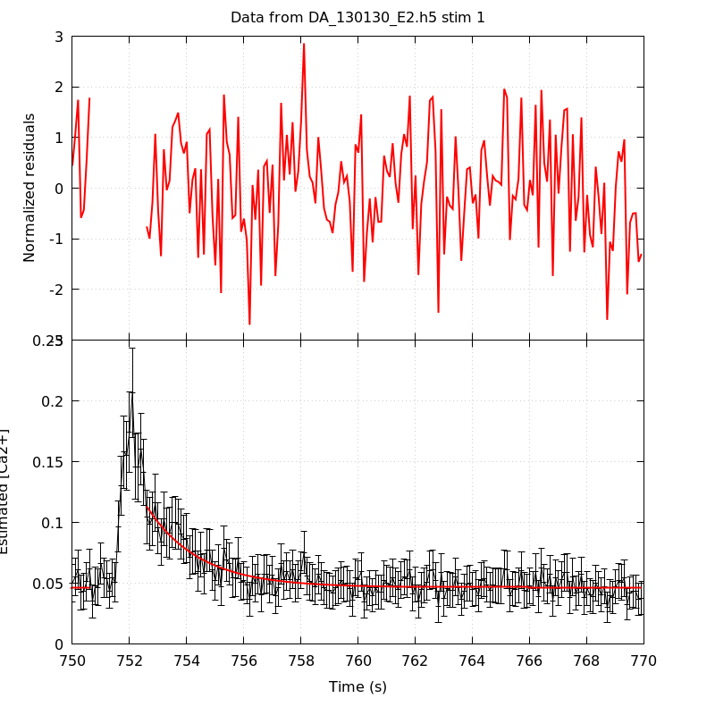
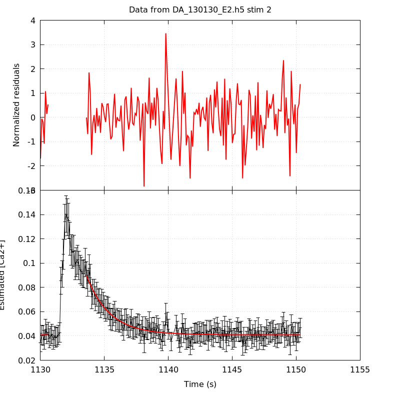
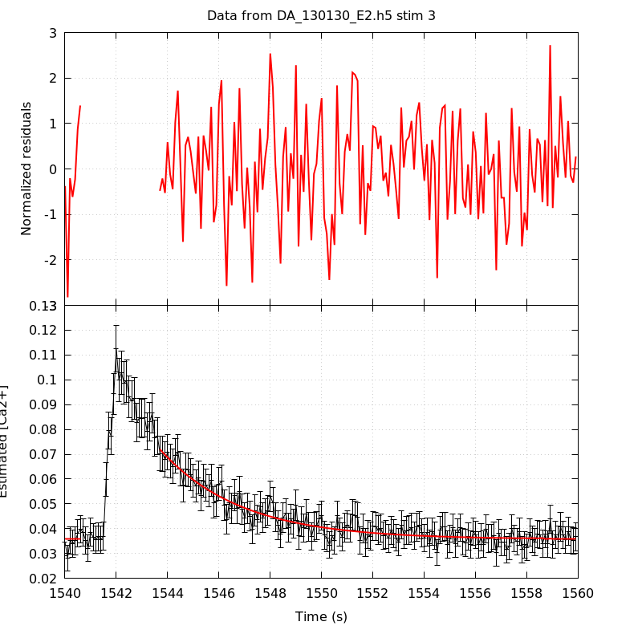
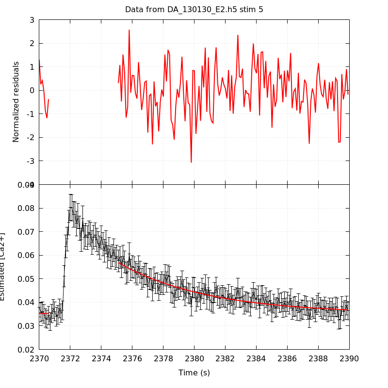
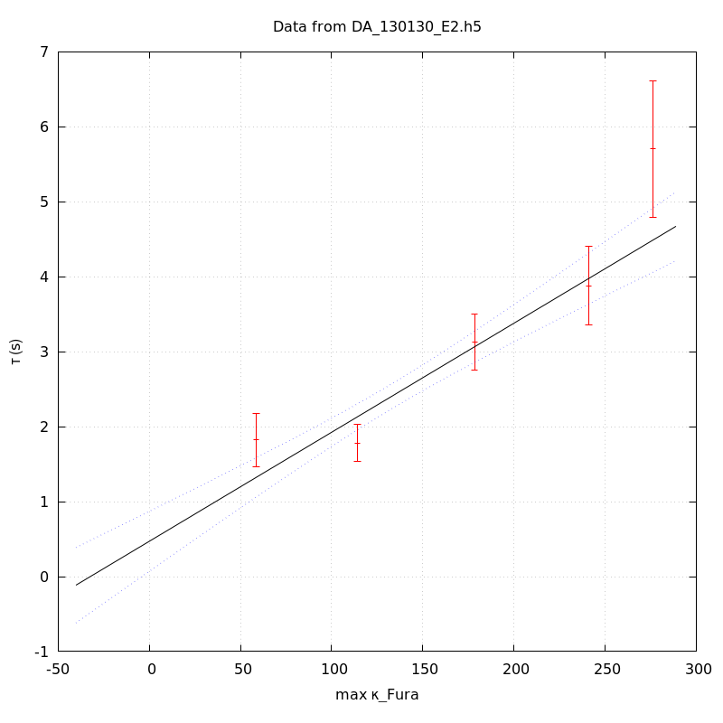

*Analysis of dataset DA_130130_E2*
-----

[TOC]

The baseline length is: 7.

**When fitting tau against kappa_Fura only the transients for which the fit RSS and the lag 1 auto-correlation of the residuals were small enough, giving an overall probability of false negative of 0.02, were kept** (see the numerical summary associated with each transient).

The good transients are: 1, 2, 3, 4, 5.

# Loading curve
The time at which the 'good' transients were recorded appear in red.

# Transients 
On each graph, the residuals appear on top.
**Under the null hypothesis**, if the monoexponential fit is correct **they should be centered on 0 and have a SD close to 1** (not exactly 1 since parameters were obtained through the fitting procedure form the data.

The estimated [Ca2+] appears on the second row. The estimate is show in black together with pointwise 95% confidence intervals. The fitted curve appears in red. **The whole transient is not fitted**, only a portion of it is: a portion of the baseline made of 7 points and the decay phase starting at the time where the Delta[Ca2+] has reached 50% of its peak value.

The time appearing on the abscissa is the time from the beginning of the experiment.

## Transient 1
**Transient 1 is 'good'.**

### Fit graphical summary

### Fit numerical summary

> nobs = 181

> number of degrees of freedom = 178

> baseline length = 7

> fit started from point 26

> estimated baseline 0.0466352 and standard error 0.000712525

> estimated delta 0.0665676 and standard error 0.00469285

> estimated tau 1.82178 and standard error 0.179009

> residual sum of squares: 189.302

> RSS per degree of freedom: 1.06349

> Probability of observing a larger of equal RSS per DOF under the null hypothesis: 0.26699

> Lag 1 residuals auto-correlation: 0.064

> Pr[Lag 1 auto-corr. > 0.064] = 0.169

## Transient 2
**Transient 2 is 'good'.**

### Fit graphical summary

### Fit numerical summary

> nobs = 171

> number of degrees of freedom = 168

> baseline length = 7

> fit started from point 36

> estimated baseline 0.0410404 and standard error 0.000402645

> estimated delta 0.0488653 and standard error 0.00237676

> estimated tau 1.78303 and standard error 0.127275

> residual sum of squares: 166.535

> RSS per degree of freedom: 0.991279

> Probability of observing a larger of equal RSS per DOF under the null hypothesis: 0.517452

> Lag 1 residuals auto-correlation: -0.024

> Pr[Lag 1 auto-corr. > -0.024] = 0.625

## Transient 3
**Transient 3 is 'good'.**

### Fit graphical summary

### Fit numerical summary

> nobs = 170

> number of degrees of freedom = 167

> baseline length = 7

> fit started from point 37

> estimated baseline 0.0357049 and standard error 0.000393404

> estimated delta 0.0363293 and standard error 0.00119247

> estimated tau 3.12474 and standard error 0.190503

> residual sum of squares: 197.353

> RSS per degree of freedom: 1.18175

> Probability of observing a larger of equal RSS per DOF under the null hypothesis: 0.0541759

> Lag 1 residuals auto-correlation: 0.022

> Pr[Lag 1 auto-corr. > 0.022] = 0.363

## Transient 4
**Transient 4 is 'good'.**

### Fit graphical summary

### Fit numerical summary

> nobs = 164

> number of degrees of freedom = 161

> baseline length = 7

> fit started from point 43

> estimated baseline 0.0351866 and standard error 0.000400354

> estimated delta 0.0260399 and standard error 0.000811195

> estimated tau 3.88232 and standard error 0.267584

> residual sum of squares: 135.459

> RSS per degree of freedom: 0.841358

> Probability of observing a larger of equal RSS per DOF under the null hypothesis: 0.929056

> Lag 1 residuals auto-correlation: -0.047

> Pr[Lag 1 auto-corr. > -0.047] = 0.746

## Transient 5
**Transient 5 is 'good'.**

### Fit graphical summary

### Fit numerical summary

> nobs = 156

> number of degrees of freedom = 153

> baseline length = 7

> fit started from point 51

> estimated baseline 0.0352163 and standard error 0.000555117

> estimated delta 0.0216578 and standard error 0.000678764

> estimated tau 5.70377 and standard error 0.462412

> residual sum of squares: 152.695

> RSS per degree of freedom: 0.998005

> Probability of observing a larger of equal RSS per DOF under the null hypothesis: 0.491756

> Lag 1 residuals auto-correlation: 0.076

> Pr[Lag 1 auto-corr. > 0.076] = 0.161

# tau vs kappa 
Since the [Fura] changes during a transient (and it can change a lot during the early transients), the _unique_ value to use as '[Fura]' is not obvious. We therefore perform 3 fits: one using the minimal value, one using the mean and one using the maximal value.

The observed tau (shown in red) are displayed with a 95% confidence interval that results from the fitting procedure and _is_ therefore _meaningful only if the fit is correct_!

No serious attempt at quantifying the precision of [Fura] and therefore kappa_Fura has been made since the choice of which [Fura] to use has a larger effect and since the other dominating effect is often the certainty we can have that the saturating value (the [Fura] in the pipette) has been reached.

The straight line in black is the result of a _weighted_ linear regression. The blue dotted lines correspond to the limits of _pointwise 95% confidence intervals_.

## tau vs kappa  using the min [Fura] value
### Fit graphical summary

### Fit numerical summary

> Best fit: tau = 0.617255 + 0.0148229 kappa_Fura

> Covariance matrix:

> [ +3.69762e-02, -2.47695e-04  

>   -2.47695e-04, +2.05958e-06  ]

> Total sum of squares (TSS) = 130.139

> chisq (Residual sum of squares, RSS) = 23.4572

> Probability of observing a larger of equal RSS per DOF under the null hypothesis: 3.24242e-05

> R squared (1-RSS/TSS) = 0.819753

> Estimated gamma/v with standard error: 67.463 +/- 6.53162

> Estimates kappa_S with standard error (using error propagation): 40.6419 +/- 13.5847

> kappa_S confidence intervals based on parametric bootstrap

> 0.95 CI for kappa_S: [12.6114,80.6762]

> 0.99 CI for kappa_S: [4.62632,96.9799]

## tau vs kappa  using the mean [Fura] value
### Fit graphical summary

### Fit numerical summary

> Best fit: tau = 0.531881 + 0.0147365 kappa_Fura

> Covariance matrix:

> [ +3.95210e-02, -2.55072e-04  

>   -2.55072e-04, +2.01218e-06  ]

> Total sum of squares (TSS) = 130.139

> chisq (Residual sum of squares, RSS) = 22.2141

> Probability of observing a larger of equal RSS per DOF under the null hypothesis: 5.88712e-05

> R squared (1-RSS/TSS) = 0.829305

> Estimated gamma/v with standard error: 67.8587 +/- 6.53197

> Estimates kappa_S with standard error (using error propagation): 35.0927 +/- 13.9304

> kappa_S confidence intervals based on parametric bootstrap

> 0.95 CI for kappa_S: [7.10193,75.2667]

> 0.99 CI for kappa_S: [0.539659,93.8298]

## tau vs kappa  using the max [Fura] value
### Fit graphical summary

### Fit numerical summary

> Best fit: tau = 0.471682 + 0.0145441 kappa_Fura

> Covariance matrix:

> [ +4.16516e-02, -2.59953e-04  

>   -2.59953e-04, +1.96073e-06  ]

> Total sum of squares (TSS) = 130.139

> chisq (Residual sum of squares, RSS) = 22.2549

> Probability of observing a larger of equal RSS per DOF under the null hypothesis: 5.77309e-05

> R squared (1-RSS/TSS) = 0.828991

> Estimated gamma/v with standard error: 68.7563 +/- 6.61963

> Estimates kappa_S with standard error (using error propagation): 31.4311 +/- 14.3755

> kappa_S confidence intervals based on parametric bootstrap

> 0.95 CI for kappa_S: [2.90292,70.3198]

> 0.99 CI for kappa_S: [-4.46584,86.846]

# RSS per DOF, standard error of tau and lag 1 residual correlation for each 'good' tansient
5 out of 5 transients  were kept.

sigma(tau): 0.179009, 0.127275, 0.190503, 0.267584, 0.462412

Residual correlation at lag 1: 0.06371842301776723, -0.02424765164508734, 0.022126796742796728, -0.04749938836759481, 0.07639986484693485

Probablity of a correlation at lag 1 smaller or equal than observed: 0.16900000000000004, 0.625, 0.363, 0.746, 0.16100000000000003

RSS/DOF: 1.06349, 0.991279, 1.18175, 0.841358, 0.998005
