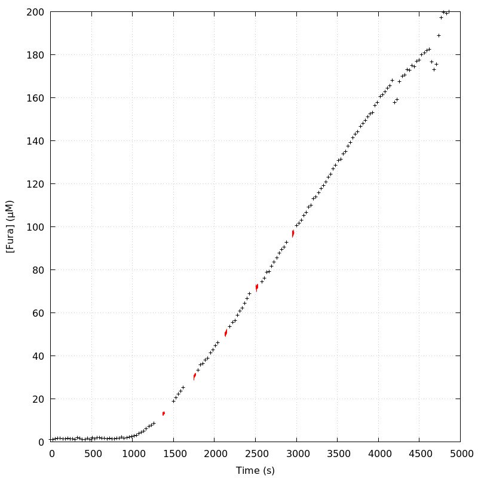
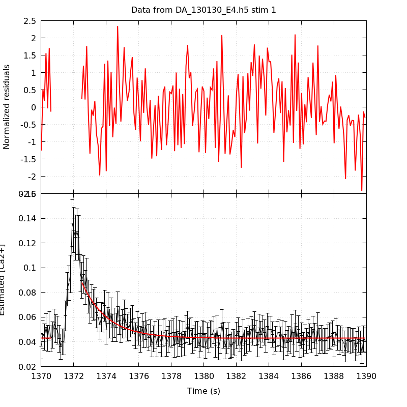
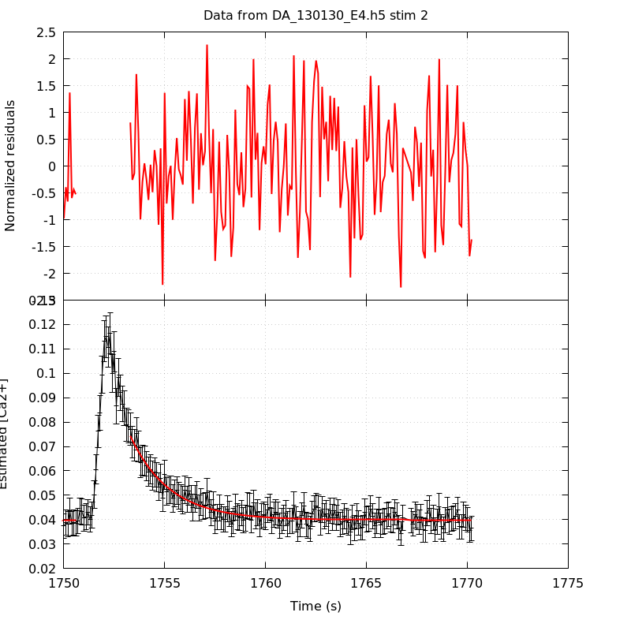
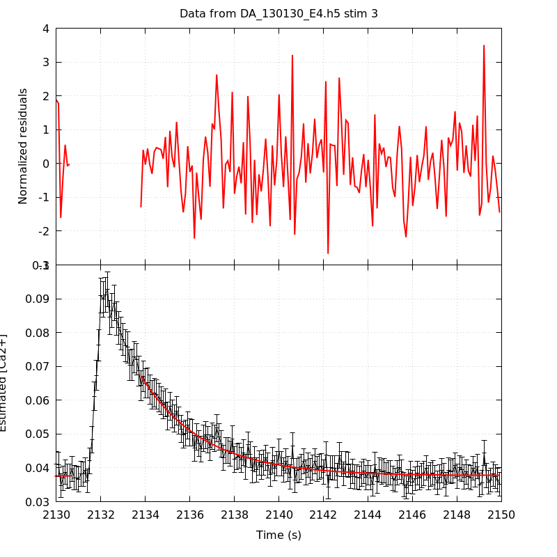
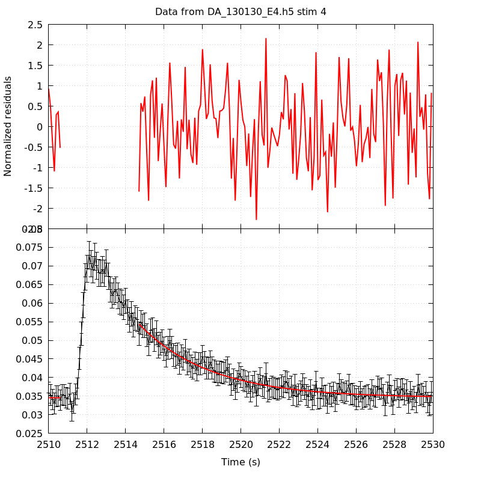
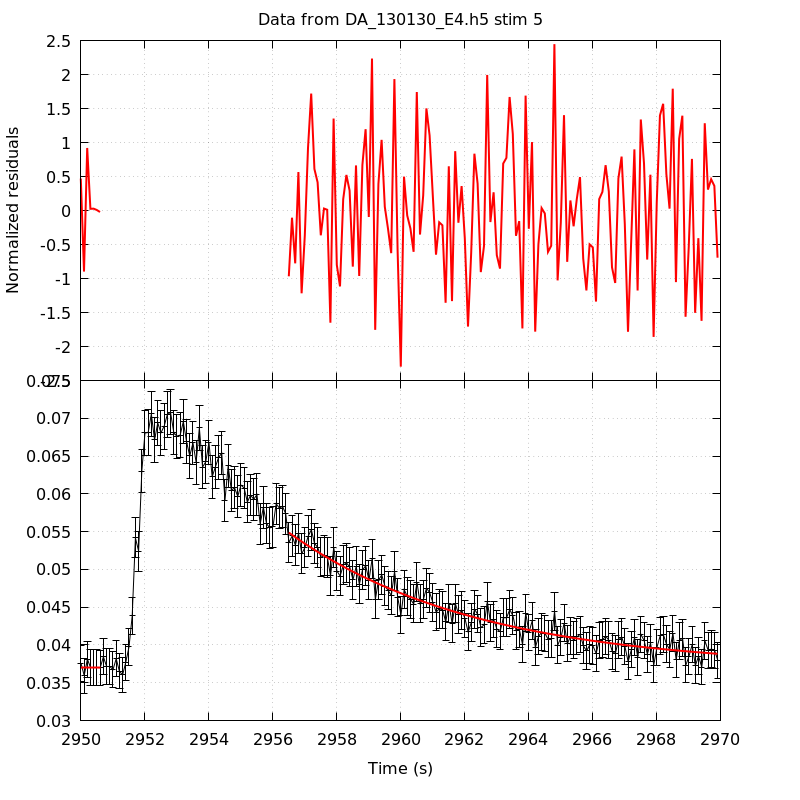
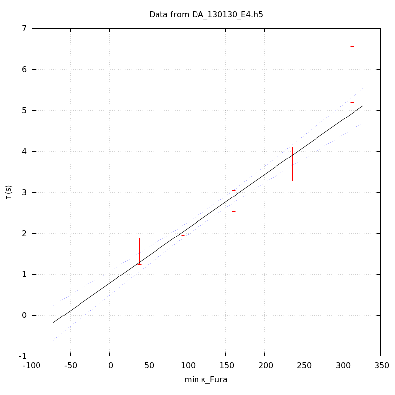
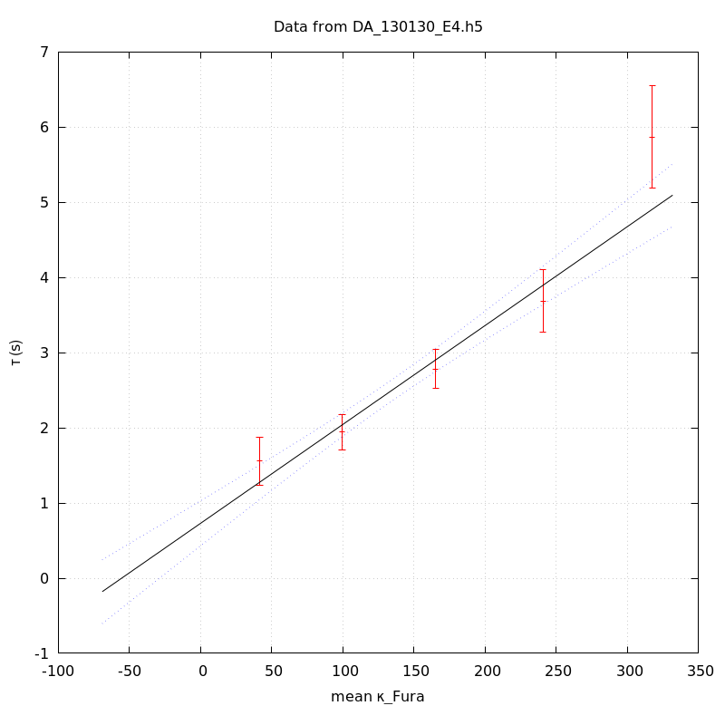
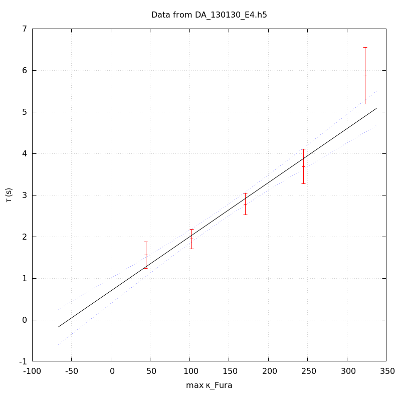

*Analysis of dataset DA_130130_E4*
-----

[TOC]

The baseline length is: 7.

**When fitting tau against kappa_Fura only the transients for which the fit RSS and the lag 1 auto-correlation of the residuals were small enough, giving an overall probability of false negative of 0.02, were kept** (see the numerical summary associated with each transient).

The good transients are: 1, 2, 3, 4, 5.

# Loading curve
The time at which the 'good' transients were recorded appear in red.

# Transients 
On each graph, the residuals appear on top.
**Under the null hypothesis**, if the monoexponential fit is correct **they should be centered on 0 and have a SD close to 1** (not exactly 1 since parameters were obtained through the fitting procedure form the data.

The estimated [Ca2+] appears on the second row. The estimate is show in black together with pointwise 95% confidence intervals. The fitted curve appears in red. **The whole transient is not fitted**, only a portion of it is: a portion of the baseline made of 7 points and the decay phase starting at the time where the Delta[Ca2+] has reached 50% of its peak value.

The time appearing on the abscissa is the time from the beginning of the experiment.

## Transient 1
**Transient 1 is 'good'.**

### Fit graphical summary

### Fit numerical summary

> nobs = 182

> number of degrees of freedom = 179

> baseline length = 7

> fit started from point 25

> estimated baseline 0.0430217 and standard error 0.000484343

> estimated delta 0.0449902 and standard error 0.00330315

> estimated tau 1.55719 and standard error 0.1648

> residual sum of squares: 164.316

> RSS per degree of freedom: 0.917964

> Probability of observing a larger of equal RSS per DOF under the null hypothesis: 0.777239

> Lag 1 residuals auto-correlation: -0.027

> Pr[Lag 1 auto-corr. > -0.027] = 0.623

## Transient 2
**Transient 2 is 'good'.**

### Fit graphical summary

### Fit numerical summary

> nobs = 174

> number of degrees of freedom = 171

> baseline length = 7

> fit started from point 33

> estimated baseline 0.0398618 and standard error 0.000268954

> estimated delta 0.0344543 and standard error 0.00138133

> estimated tau 1.94367 and standard error 0.120784

> residual sum of squares: 165.824

> RSS per degree of freedom: 0.969734

> Probability of observing a larger of equal RSS per DOF under the null hypothesis: 0.597384

> Lag 1 residuals auto-correlation: 0.054

> Pr[Lag 1 auto-corr. > 0.054] = 0.219

## Transient 3
**Transient 3 is 'good'.**

### Fit graphical summary

### Fit numerical summary

> nobs = 169

> number of degrees of freedom = 166

> baseline length = 7

> fit started from point 38

> estimated baseline 0.0376601 and standard error 0.000234957

> estimated delta 0.029518 and standard error 0.000786931

> estimated tau 2.78147 and standard error 0.133035

> residual sum of squares: 185.426

> RSS per degree of freedom: 1.11702

> Probability of observing a larger of equal RSS per DOF under the null hypothesis: 0.143791

> Lag 1 residuals auto-correlation: -0.066

> Pr[Lag 1 auto-corr. > -0.066] = 0.756

## Transient 4
**Transient 4 is 'good'.**

### Fit graphical summary

### Fit numerical summary

> nobs = 160

> number of degrees of freedom = 157

> baseline length = 7

> fit started from point 47

> estimated baseline 0.0345599 and standard error 0.000248771

> estimated delta 0.0198037 and standard error 0.000511037

> estimated tau 3.6884 and standard error 0.209818

> residual sum of squares: 140.912

> RSS per degree of freedom: 0.897531

> Probability of observing a larger of equal RSS per DOF under the null hypothesis: 0.816716

> Lag 1 residuals auto-correlation: 0.041

> Pr[Lag 1 auto-corr. > 0.041] = 0.261

## Transient 5
**Transient 5 is 'good'.**

### Fit graphical summary

### Fit numerical summary

> nobs = 142

> number of degrees of freedom = 139

> baseline length = 7

> fit started from point 65

> estimated baseline 0.0370116 and standard error 0.00036778

> estimated delta 0.0178621 and standard error 0.000424059

> estimated tau 5.86966 and standard error 0.349246

> residual sum of squares: 132.228

> RSS per degree of freedom: 0.951278

> Probability of observing a larger of equal RSS per DOF under the null hypothesis: 0.645354

> Lag 1 residuals auto-correlation: -0.137

> Pr[Lag 1 auto-corr. > -0.137] = 0.964

# tau vs kappa 
Since the [Fura] changes during a transient (and it can change a lot during the early transients), the _unique_ value to use as '[Fura]' is not obvious. We therefore perform 3 fits: one using the minimal value, one using the mean and one using the maximal value.

The observed tau (shown in red) are displayed with a 95% confidence interval that results from the fitting procedure and _is_ therefore _meaningful only if the fit is correct_!

No serious attempt at quantifying the precision of [Fura] and therefore kappa_Fura has been made since the choice of which [Fura] to use has a larger effect and since the other dominating effect is often the certainty we can have that the saturating value (the [Fura] in the pipette) has been reached.

The straight line in black is the result of a _weighted_ linear regression. The blue dotted lines correspond to the limits of _pointwise 95% confidence intervals_.

## tau vs kappa  using the min [Fura] value
### Fit graphical summary

### Fit numerical summary

> Best fit: tau = 0.770812 + 0.0132558 kappa_Fura

> Covariance matrix:

> [ +2.24214e-02, -1.33043e-04  

>   -1.33043e-04, +1.02706e-06  ]

> Total sum of squares (TSS) = 183.565

> chisq (Residual sum of squares, RSS) = 12.4785

> Probability of observing a larger of equal RSS per DOF under the null hypothesis: 0.00591161

> R squared (1-RSS/TSS) = 0.932022

> Estimated gamma/v with standard error: 75.4388 +/- 5.76749

> Estimates kappa_S with standard error (using error propagation): 57.1491 +/- 12.1394

> kappa_S confidence intervals based on parametric bootstrap

> 0.95 CI for kappa_S: [30.5533,92.2717]

> 0.99 CI for kappa_S: [22.7269,105.812]

## tau vs kappa  using the mean [Fura] value
### Fit graphical summary

### Fit numerical summary

> Best fit: tau = 0.730141 + 0.0131489 kappa_Fura

> Covariance matrix:

> [ +2.32907e-02, -1.35420e-04  

>   -1.35420e-04, +1.01298e-06  ]

> Total sum of squares (TSS) = 183.565

> chisq (Residual sum of squares, RSS) = 12.8869

> Probability of observing a larger of equal RSS per DOF under the null hypothesis: 0.00488771

> R squared (1-RSS/TSS) = 0.929797

> Estimated gamma/v with standard error: 76.0519 +/- 5.82131

> Estimates kappa_S with standard error (using error propagation): 54.5286 +/- 12.3603

> kappa_S confidence intervals based on parametric bootstrap

> 0.95 CI for kappa_S: [27.797,90.0426]

> 0.99 CI for kappa_S: [21.3868,105.813]

## tau vs kappa  using the max [Fura] value
### Fit graphical summary

### Fit numerical summary

> Best fit: tau = 0.697119 + 0.0129975 kappa_Fura

> Covariance matrix:

> [ +2.40045e-02, -1.36572e-04  

>   -1.36572e-04, +9.91215e-07  ]

> Total sum of squares (TSS) = 183.565

> chisq (Residual sum of squares, RSS) = 13.1337

> Probability of observing a larger of equal RSS per DOF under the null hypothesis: 0.00435618

> R squared (1-RSS/TSS) = 0.928452

> Estimated gamma/v with standard error: 76.938 +/- 5.8934

> Estimates kappa_S with standard error (using error propagation): 52.635 +/- 12.6084

> kappa_S confidence intervals based on parametric bootstrap

> 0.95 CI for kappa_S: [25.3993,87.3407]

> 0.99 CI for kappa_S: [17.9078,101.059]

# RSS per DOF, standard error of tau and lag 1 residual correlation for each 'good' tansient
5 out of 5 transients  were kept.

sigma(tau): 0.1648, 0.120784, 0.133035, 0.209818, 0.349246

Residual correlation at lag 1: -0.02680794064168342, 0.053755925460598736, -0.06554234177825391, 0.04096082831767608, -0.1368534420475585

Probablity of a correlation at lag 1 smaller or equal than observed: 0.623, 0.21899999999999997, 0.756, 0.261, 0.964

RSS/DOF: 0.917964, 0.969734, 1.11702, 0.897531, 0.951278
