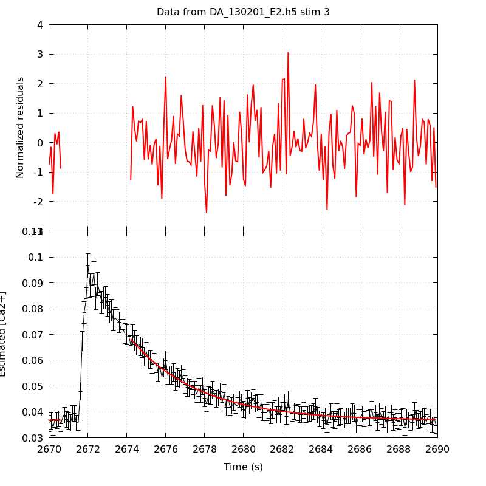
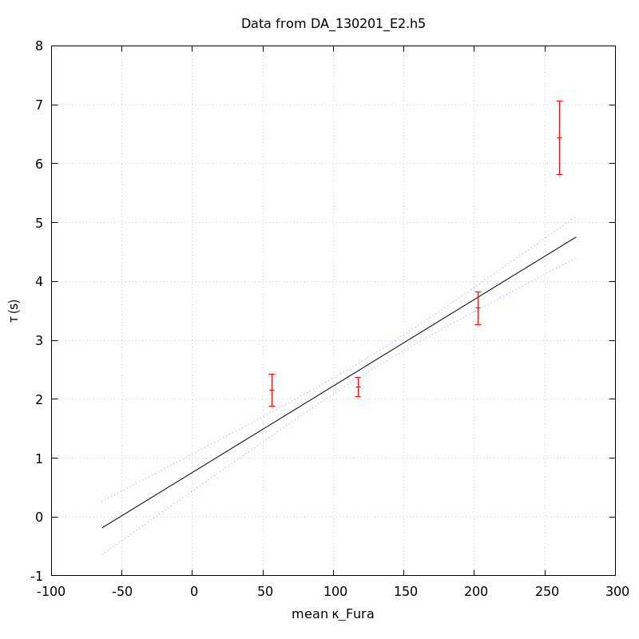

*Analysis of dataset DA_130201_E2*
-----

[TOC]

The baseline length is: 7.

**When fitting tau against kappa_Fura only the transients for which the fit RSS and the lag 1 auto-correlation of the residuals were small enough, giving an overall probability of false negative of 0.02, were kept** (see the numerical summary associated with each transient).

The good transients are: 1, 2, 3, 4.

# Loading curve
The time at which the 'good' transients were recorded appear in red.

# Transients 
On each graph, the residuals appear on top.
**Under the null hypothesis**, if the monoexponential fit is correct **they should be centered on 0 and have a SD close to 1** (not exactly 1 since parameters were obtained through the fitting procedure form the data.

The estimated [Ca2+] appears on the second row. The estimate is show in black together with pointwise 95% confidence intervals. The fitted curve appears in red. **The whole transient is not fitted**, only a portion of it is: a portion of the baseline made of 7 points and the decay phase starting at the time where the Delta[Ca2+] has reached 50% of its peak value.

The time appearing on the abscissa is the time from the beginning of the experiment.

## Transient 1
**Transient 1 is 'good'.**

### Fit graphical summary

### Fit numerical summary

> nobs = 178

> number of degrees of freedom = 175

> baseline length = 7

> fit started from point 29

> estimated baseline 0.0460509 and standard error 0.000461572

> estimated delta 0.0574638 and standard error 0.00245224

> estimated tau 2.15515 and standard error 0.137694

> residual sum of squares: 149.613

> RSS per degree of freedom: 0.854929

> Probability of observing a larger of equal RSS per DOF under the null hypothesis: 0.918148

> Lag 1 residuals auto-correlation: 0.113

> Pr[Lag 1 auto-corr. > 0.113] = 0.023

## Transient 2
**Transient 2 is 'good'.**

### Fit graphical summary

### Fit numerical summary

> nobs = 179

> number of degrees of freedom = 176

> baseline length = 7

> fit started from point 28

> estimated baseline 0.040331 and standard error 0.000252043

> estimated delta 0.0519228 and standard error 0.00129469

> estimated tau 2.20872 and standard error 0.0834809

> residual sum of squares: 171.361

> RSS per degree of freedom: 0.973641

> Probability of observing a larger of equal RSS per DOF under the null hypothesis: 0.584671

> Lag 1 residuals auto-correlation: -0.044

> Pr[Lag 1 auto-corr. > -0.044] = 0.710

## Transient 3
**Transient 3 is 'good'.**

### Fit graphical summary

### Fit numerical summary

> nobs = 165

> number of degrees of freedom = 162

> baseline length = 7

> fit started from point 42

> estimated baseline 0.0367198 and standard error 0.000254786

> estimated delta 0.0315362 and standard error 0.000611614

> estimated tau 3.54538 and standard error 0.140892

> residual sum of squares: 165.501

> RSS per degree of freedom: 1.02161

> Probability of observing a larger of equal RSS per DOF under the null hypothesis: 0.409009

> Lag 1 residuals auto-correlation: -0.143

> Pr[Lag 1 auto-corr. > -0.143] = 0.952

## Transient 4
**Transient 4 is 'good'.**

### Fit graphical summary

### Fit numerical summary

> nobs = 141

> number of degrees of freedom = 138

> baseline length = 7

> fit started from point 66

> estimated baseline 0.0414663 and standard error 0.000428811

> estimated delta 0.0237312 and standard error 0.000487081

> estimated tau 6.44018 and standard error 0.318427

> residual sum of squares: 136.085

> RSS per degree of freedom: 0.986125

> Probability of observing a larger of equal RSS per DOF under the null hypothesis: 0.530133

> Lag 1 residuals auto-correlation: 0.161

> Pr[Lag 1 auto-corr. > 0.161] = 0.016

# tau vs kappa 
Since the [Fura] changes during a transient (and it can change a lot during the early transients), the _unique_ value to use as '[Fura]' is not obvious. We therefore perform 3 fits: one using the minimal value, one using the mean and one using the maximal value.

The observed tau (shown in red) are displayed with a 95% confidence interval that results from the fitting procedure and _is_ therefore _meaningful only if the fit is correct_!

No serious attempt at quantifying the precision of [Fura] and therefore kappa_Fura has been made since the choice of which [Fura] to use has a larger effect and since the other dominating effect is often the certainty we can have that the saturating value (the [Fura] in the pipette) has been reached.

The straight line in black is the result of a _weighted_ linear regression. The blue dotted lines correspond to the limits of _pointwise 95% confidence intervals_.

## tau vs kappa  using the min [Fura] value
### Fit graphical summary

### Fit numerical summary

> Best fit: tau = 0.783142 + 0.0150057 kappa_Fura

> Covariance matrix:

> [ +2.48134e-02, -1.70579e-04  

>   -1.70579e-04, +1.39125e-06  ]

> Total sum of squares (TSS) = 222.734

> chisq (Residual sum of squares, RSS) = 60.886

> Probability of observing a larger of equal RSS per DOF under the null hypothesis: 6.00852e-14

> R squared (1-RSS/TSS) = 0.726643

> Estimated gamma/v with standard error: 66.6413 +/- 5.23828

> Estimates kappa_S with standard error (using error propagation): 51.1896 +/- 11.2706

> kappa_S confidence intervals based on parametric bootstrap

> 0.95 CI for kappa_S: [26.511,84.3102]

> 0.99 CI for kappa_S: [19.2192,97.4403]

## tau vs kappa  using the mean [Fura] value
### Fit graphical summary

### Fit numerical summary

> Best fit: tau = 0.756647 + 0.0146877 kappa_Fura

> Covariance matrix:

> [ +2.57524e-02, -1.71983e-04  

>   -1.71983e-04, +1.35348e-06  ]

> Total sum of squares (TSS) = 222.734

> chisq (Residual sum of squares, RSS) = 63.3475

> Probability of observing a larger of equal RSS per DOF under the null hypothesis: 1.75493e-14

> R squared (1-RSS/TSS) = 0.715592

> Estimated gamma/v with standard error: 68.0843 +/- 5.39288

> Estimates kappa_S with standard error (using error propagation): 50.5158 +/- 11.663

> kappa_S confidence intervals based on parametric bootstrap

> 0.95 CI for kappa_S: [25.1471,84.8569]

> 0.99 CI for kappa_S: [19.046,99.6415]

## tau vs kappa  using the max [Fura] value
### Fit graphical summary

### Fit numerical summary

> Best fit: tau = 0.704735 + 0.01449 kappa_Fura

> Covariance matrix:

> [ +2.75436e-02, -1.78608e-04  

>   -1.78608e-04, +1.34918e-06  ]

> Total sum of squares (TSS) = 222.734

> chisq (Residual sum of squares, RSS) = 67.1129

> Probability of observing a larger of equal RSS per DOF under the null hypothesis: 2.67063e-15

> R squared (1-RSS/TSS) = 0.698686

> Estimated gamma/v with standard error: 69.0129 +/- 5.53217

> Estimates kappa_S with standard error (using error propagation): 47.6358 +/- 12.0989

> kappa_S confidence intervals based on parametric bootstrap

> 0.95 CI for kappa_S: [21.5994,81.3085]

> 0.99 CI for kappa_S: [14.4895,95.0123]

# RSS per DOF, standard error of tau and lag 1 residual correlation for each 'good' tansient
4 out of 4 transients  were kept.

sigma(tau): 0.137694, 0.0834809, 0.140892, 0.318427

Residual correlation at lag 1: 0.11296482602320768, -0.04371325476646513, -0.14273672939910786, 0.1610020933193901

Probablity of a correlation at lag 1 smaller or equal than observed: 0.02300000000000002, 0.71, 0.952, 0.016000000000000014

RSS/DOF: 0.854929, 0.973641, 1.02161, 0.986125
