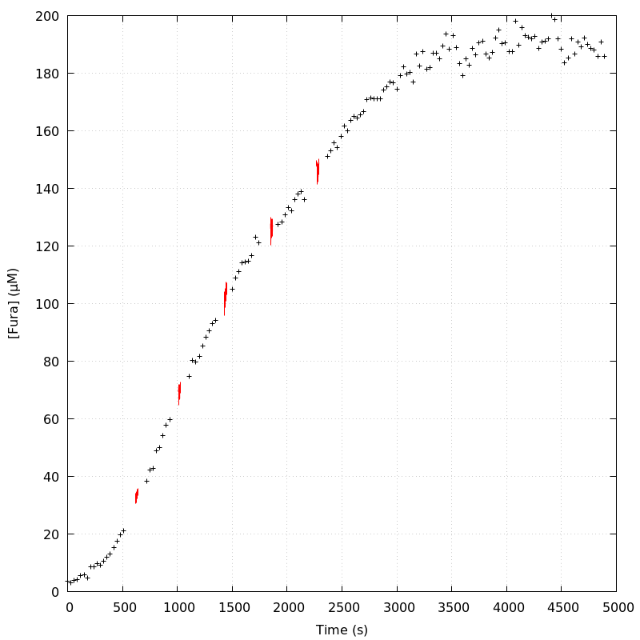
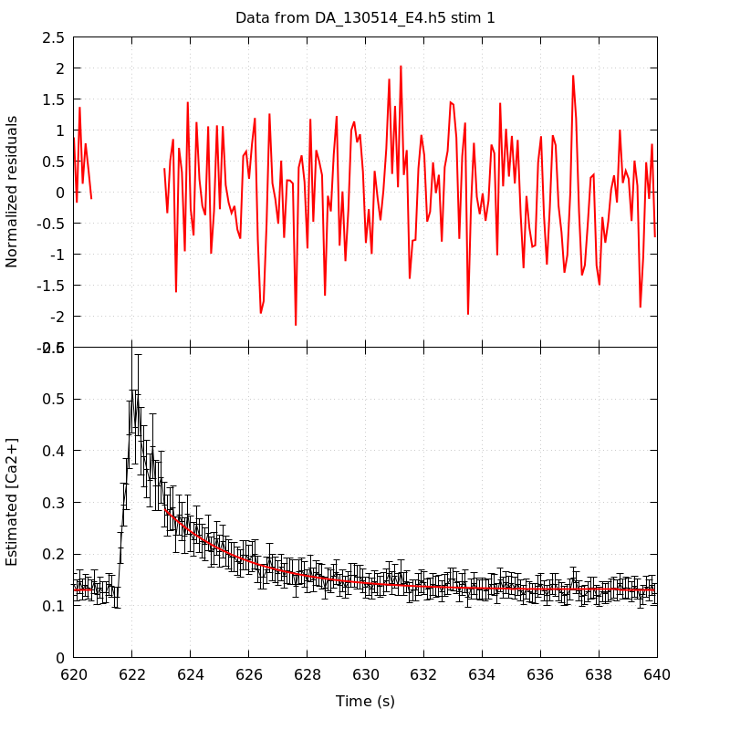
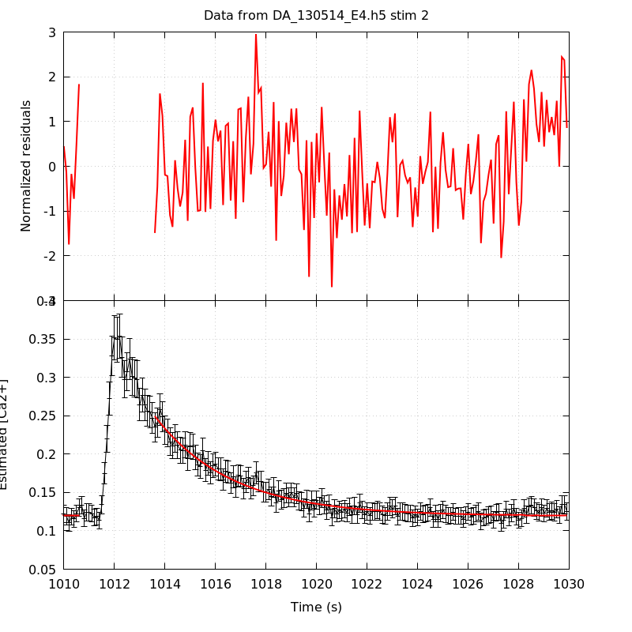
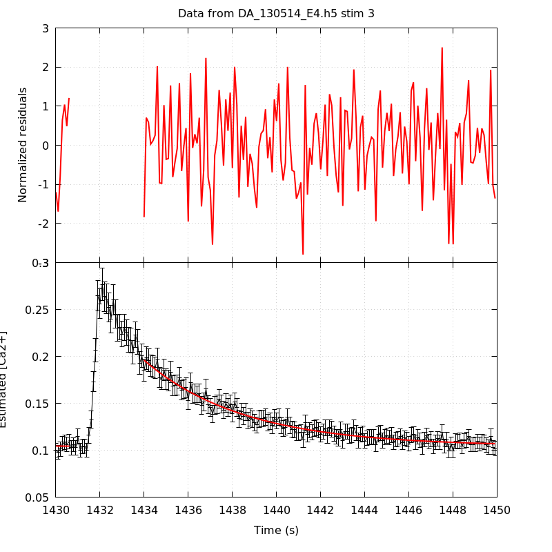
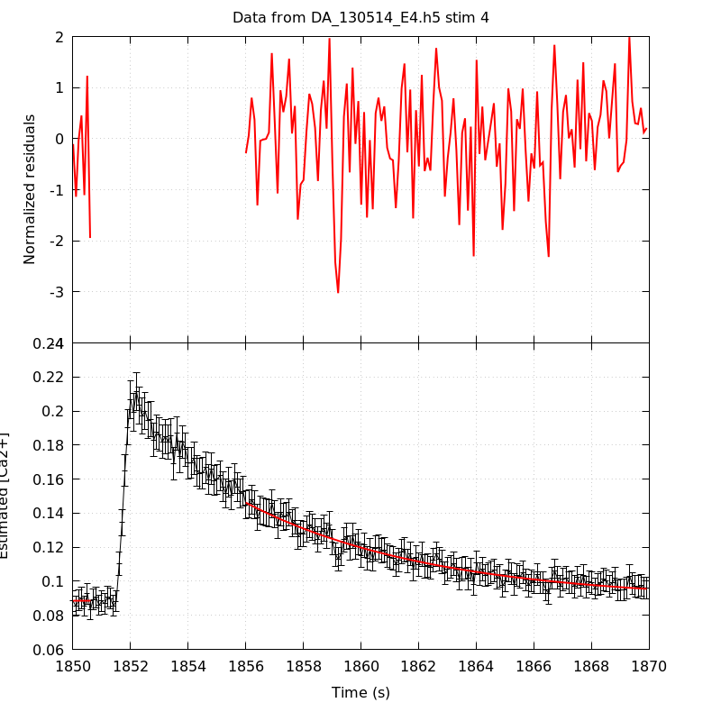
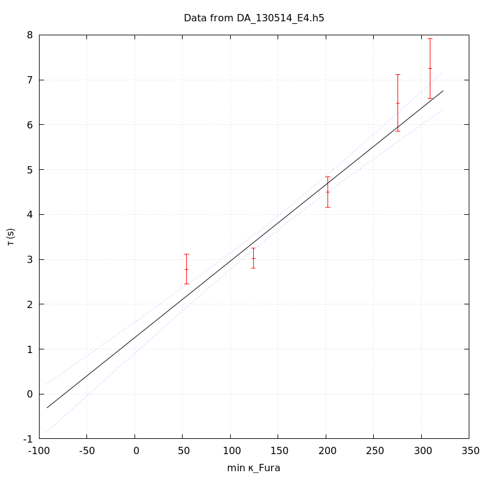
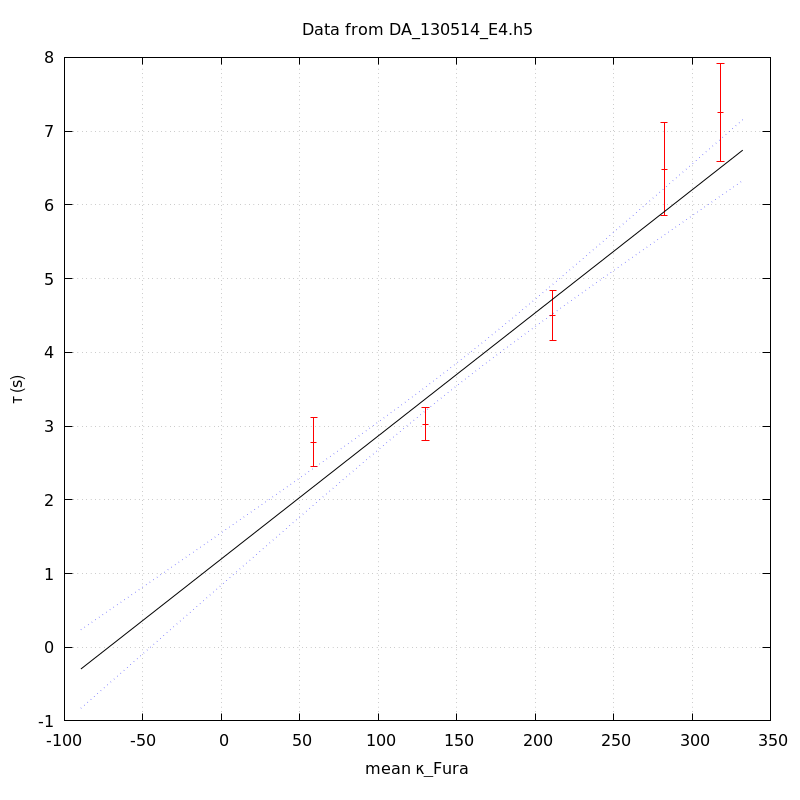
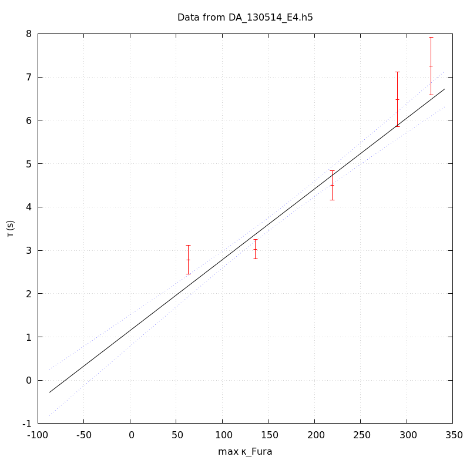

*Analysis of dataset DA_130514_E4*
-----

[TOC]

The baseline length is: 7.

**When fitting tau against kappa_Fura only the transients for which the fit RSS and the lag 1 auto-correlation of the residuals were small enough, giving an overall probability of false negative of 0.02, were kept** (see the numerical summary associated with each transient).

The good transients are: 1, 2, 3, 4, 5.

# Loading curve
The time at which the 'good' transients were recorded appear in red.

# Transients 
On each graph, the residuals appear on top.
**Under the null hypothesis**, if the monoexponential fit is correct **they should be centered on 0 and have a SD close to 1** (not exactly 1 since parameters were obtained through the fitting procedure form the data.

The estimated [Ca2+] appears on the second row. The estimate is show in black together with pointwise 95% confidence intervals. The fitted curve appears in red. **The whole transient is not fitted**, only a portion of it is: a portion of the baseline made of 7 points and the decay phase starting at the time where the Delta[Ca2+] has reached 50% of its peak value.

The time appearing on the abscissa is the time from the beginning of the experiment.

## Transient 1
**Transient 1 is 'good'.**

### Fit graphical summary

### Fit numerical summary

> nobs = 176

> number of degrees of freedom = 173

> baseline length = 7

> fit started from point 31

> estimated baseline 0.130956 and standard error 0.00130467

> estimated delta 0.15591 and standard error 0.00658718

> estimated tau 2.77942 and standard error 0.170097

> residual sum of squares: 120.711

> RSS per degree of freedom: 0.697752

> Probability of observing a larger of equal RSS per DOF under the null hypothesis: 0.999099

> Lag 1 residuals auto-correlation: 0.092

> Pr[Lag 1 auto-corr. > 0.092] = 0.040

## Transient 2
**Transient 2 is 'good'.**

### Fit graphical summary

### Fit numerical summary

> nobs = 171

> number of degrees of freedom = 168

> baseline length = 7

> fit started from point 36

> estimated baseline 0.119537 and standard error 0.000779242

> estimated delta 0.129906 and standard error 0.00307864

> estimated tau 3.02685 and standard error 0.116119

> residual sum of squares: 184.611

> RSS per degree of freedom: 1.09887

> Probability of observing a larger of equal RSS per DOF under the null hypothesis: 0.180353

> Lag 1 residuals auto-correlation: 0.126

> Pr[Lag 1 auto-corr. > 0.126] = 0.073

## Transient 3
**Transient 3 is 'good'.**

### Fit graphical summary

### Fit numerical summary

> nobs = 167

> number of degrees of freedom = 164

> baseline length = 7

> fit started from point 40

> estimated baseline 0.104311 and standard error 0.000814964

> estimated delta 0.0916963 and standard error 0.00160984

> estimated tau 4.50159 and standard error 0.171759

> residual sum of squares: 180.604

> RSS per degree of freedom: 1.10125

> Probability of observing a larger of equal RSS per DOF under the null hypothesis: 0.177717

> Lag 1 residuals auto-correlation: -0.106

> Pr[Lag 1 auto-corr. > -0.106] = 0.878

## Transient 4
**Transient 4 is 'good'.**

### Fit graphical summary

### Fit numerical summary

> nobs = 147

> number of degrees of freedom = 144

> baseline length = 7

> fit started from point 60

> estimated baseline 0.0887892 and standard error 0.000989134

> estimated delta 0.0574015 and standard error 0.00119027

> estimated tau 6.48385 and standard error 0.320083

> residual sum of squares: 137.282

> RSS per degree of freedom: 0.953348

> Probability of observing a larger of equal RSS per DOF under the null hypothesis: 0.641597

> Lag 1 residuals auto-correlation: 0.082

> Pr[Lag 1 auto-corr. > 0.082] = 0.130

## Transient 5
**Transient 5 is 'good'.**

### Fit graphical summary

### Fit numerical summary

> nobs = 144

> number of degrees of freedom = 141

> baseline length = 7

> fit started from point 63

> estimated baseline 0.0935648 and standard error 0.000982943

> estimated delta 0.055593 and standard error 0.00114156

> estimated tau 7.25705 and standard error 0.339601

> residual sum of squares: 158.23

> RSS per degree of freedom: 1.1222

> Probability of observing a larger of equal RSS per DOF under the null hypothesis: 0.152373

> Lag 1 residuals auto-correlation: 0.144

> Pr[Lag 1 auto-corr. > 0.144] = 0.048

# tau vs kappa 
Since the [Fura] changes during a transient (and it can change a lot during the early transients), the _unique_ value to use as '[Fura]' is not obvious. We therefore perform 3 fits: one using the minimal value, one using the mean and one using the maximal value.

The observed tau (shown in red) are displayed with a 95% confidence interval that results from the fitting procedure and _is_ therefore _meaningful only if the fit is correct_!

No serious attempt at quantifying the precision of [Fura] and therefore kappa_Fura has been made since the choice of which [Fura] to use has a larger effect and since the other dominating effect is often the certainty we can have that the saturating value (the [Fura] in the pipette) has been reached.

The straight line in black is the result of a _weighted_ linear regression. The blue dotted lines correspond to the limits of _pointwise 95% confidence intervals_.

## tau vs kappa  using the min [Fura] value
### Fit graphical summary

### Fit numerical summary

> Best fit: tau = 1.25681 + 0.0170278 kappa_Fura

> Covariance matrix:

> [ +3.15123e-02, -1.74820e-04  

>   -1.74820e-04, +1.20783e-06  ]

> Total sum of squares (TSS) = 269.955

> chisq (Residual sum of squares, RSS) = 29.8989

> Probability of observing a larger of equal RSS per DOF under the null hypothesis: 1.44932e-06

> R squared (1-RSS/TSS) = 0.889245

> Estimated gamma/v with standard error: 58.7274 +/- 3.7904

> Estimates kappa_S with standard error (using error propagation): 72.8089 +/- 11.462

> kappa_S confidence intervals based on parametric bootstrap

> 0.95 CI for kappa_S: [46.6186,106.023]

> 0.99 CI for kappa_S: [38.7583,118.228]

## tau vs kappa  using the mean [Fura] value
### Fit graphical summary

### Fit numerical summary

> Best fit: tau = 1.19777 + 0.0166819 kappa_Fura

> Covariance matrix:

> [ +3.28432e-02, -1.76060e-04  

>   -1.76060e-04, +1.16382e-06  ]

> Total sum of squares (TSS) = 269.955

> chisq (Residual sum of squares, RSS) = 30.8391

> Probability of observing a larger of equal RSS per DOF under the null hypothesis: 9.19012e-07

> R squared (1-RSS/TSS) = 0.885762

> Estimated gamma/v with standard error: 59.9452 +/- 3.87659

> Estimates kappa_S with standard error (using error propagation): 70.8007 +/- 11.8144

> kappa_S confidence intervals based on parametric bootstrap

> 0.95 CI for kappa_S: [44.0707,104.834]

> 0.99 CI for kappa_S: [37.5319,119.306]

## tau vs kappa  using the max [Fura] value
### Fit graphical summary

### Fit numerical summary

> Best fit: tau = 1.14696 + 0.0163377 kappa_Fura

> Covariance matrix:

> [ +3.40254e-02, -1.76527e-04  

>   -1.76527e-04, +1.12026e-06  ]

> Total sum of squares (TSS) = 269.955

> chisq (Residual sum of squares, RSS) = 31.6874

> Probability of observing a larger of equal RSS per DOF under the null hypothesis: 6.09055e-07

> R squared (1-RSS/TSS) = 0.882619

> Estimated gamma/v with standard error: 61.2079 +/- 3.9653

> Estimates kappa_S with standard error (using error propagation): 69.2028 +/- 12.172

> kappa_S confidence intervals based on parametric bootstrap

> 0.95 CI for kappa_S: [41.9265,102.751]

> 0.99 CI for kappa_S: [34.2483,115.481]

# RSS per DOF, standard error of tau and lag 1 residual correlation for each 'good' tansient
5 out of 5 transients  were kept.

sigma(tau): 0.170097, 0.116119, 0.171759, 0.320083, 0.339601

Residual correlation at lag 1: 0.09177903245176572, 0.1259590470576882, -0.10615689327481688, 0.08168520821259095, 0.1444831441072326

Probablity of a correlation at lag 1 smaller or equal than observed: 0.040000000000000036, 0.07299999999999995, 0.878, 0.13, 0.04800000000000004

RSS/DOF: 0.697752, 1.09887, 1.10125, 0.953348, 1.1222
