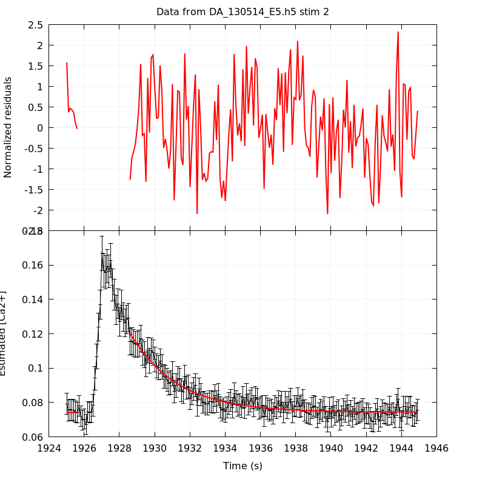

*Analysis of dataset DA_130514_E5*
-----

[TOC]

The baseline length is: 7.

**When fitting tau against kappa_Fura only the transients for which the fit RSS and the lag 1 auto-correlation of the residuals were small enough, giving an overall probability of false negative of 0.02, were kept** (see the numerical summary associated with each transient).

The good transients are: 1, 2, 3, 4.

# Loading curve
The time at which the 'good' transients were recorded appear in red.

# Transients 
On each graph, the residuals appear on top.
**Under the null hypothesis**, if the monoexponential fit is correct **they should be centered on 0 and have a SD close to 1** (not exactly 1 since parameters were obtained through the fitting procedure form the data.

The estimated [Ca2+] appears on the second row. The estimate is show in black together with pointwise 95% confidence intervals. The fitted curve appears in red. **The whole transient is not fitted**, only a portion of it is: a portion of the baseline made of 7 points and the decay phase starting at the time where the Delta[Ca2+] has reached 50% of its peak value.

The time appearing on the abscissa is the time from the beginning of the experiment.

## Transient 1
**Transient 1 is 'good'.**

### Fit graphical summary

### Fit numerical summary

> nobs = 179

> number of degrees of freedom = 176

> baseline length = 7

> fit started from point 28

> estimated baseline 0.0771418 and standard error 0.000478628

> estimated delta 0.0568142 and standard error 0.00230458

> estimated tau 2.26968 and standard error 0.143607

> residual sum of squares: 173.056

> RSS per degree of freedom: 0.983272

> Probability of observing a larger of equal RSS per DOF under the null hypothesis: 0.548635

> Lag 1 residuals auto-correlation: 0.131

> Pr[Lag 1 auto-corr. > 0.131] = 0.025

## Transient 2
**Transient 2 is 'good'.**

### Fit graphical summary

### Fit numerical summary

> nobs = 171

> number of degrees of freedom = 168

> baseline length = 7

> fit started from point 36

> estimated baseline 0.0742503 and standard error 0.000379343

> estimated delta 0.0461055 and standard error 0.00141724

> estimated tau 2.64688 and standard error 0.138896

> residual sum of squares: 161.697

> RSS per degree of freedom: 0.962483

> Probability of observing a larger of equal RSS per DOF under the null hypothesis: 0.622386

> Lag 1 residuals auto-correlation: 0.166

> Pr[Lag 1 auto-corr. > 0.166] = 0.012

## Transient 3
**Transient 3 is 'good'.**

### Fit graphical summary

### Fit numerical summary

> nobs = 159

> number of degrees of freedom = 156

> baseline length = 7

> fit started from point 48

> estimated baseline 0.0715721 and standard error 0.000475745

> estimated delta 0.0335651 and standard error 0.000860133

> estimated tau 4.10667 and standard error 0.243325

> residual sum of squares: 150.757

> RSS per degree of freedom: 0.966394

> Probability of observing a larger of equal RSS per DOF under the null hypothesis: 0.603468

> Lag 1 residuals auto-correlation: -0.017

> Pr[Lag 1 auto-corr. > -0.017] = 0.553

## Transient 4
**Transient 4 is 'good'.**

### Fit graphical summary

### Fit numerical summary

> nobs = 149

> number of degrees of freedom = 146

> baseline length = 7

> fit started from point 58

> estimated baseline 0.0664601 and standard error 0.000530369

> estimated delta 0.0263432 and standard error 0.000696334

> estimated tau 5.01376 and standard error 0.339135

> residual sum of squares: 154.255

> RSS per degree of freedom: 1.05654

> Probability of observing a larger of equal RSS per DOF under the null hypothesis: 0.303938

> Lag 1 residuals auto-correlation: -0.144

> Pr[Lag 1 auto-corr. > -0.144] = 0.950

# tau vs kappa 
Since the [Fura] changes during a transient (and it can change a lot during the early transients), the _unique_ value to use as '[Fura]' is not obvious. We therefore perform 3 fits: one using the minimal value, one using the mean and one using the maximal value.

The observed tau (shown in red) are displayed with a 95% confidence interval that results from the fitting procedure and _is_ therefore _meaningful only if the fit is correct_!

No serious attempt at quantifying the precision of [Fura] and therefore kappa_Fura has been made since the choice of which [Fura] to use has a larger effect and since the other dominating effect is often the certainty we can have that the saturating value (the [Fura] in the pipette) has been reached.

The straight line in black is the result of a _weighted_ linear regression. The blue dotted lines correspond to the limits of _pointwise 95% confidence intervals_.

## tau vs kappa  using the min [Fura] value
### Fit graphical summary

### Fit numerical summary

> Best fit: tau = 0.803076 + 0.0108867 kappa_Fura

> Covariance matrix:

> [ +6.24324e-02, -2.88276e-04  

>   -2.88276e-04, +1.52510e-06  ]

> Total sum of squares (TSS) = 85.8331

> chisq (Residual sum of squares, RSS) = 8.12035

> Probability of observing a larger of equal RSS per DOF under the null hypothesis: 0.017246

> R squared (1-RSS/TSS) = 0.905394

> Estimated gamma/v with standard error: 91.8554 +/- 10.4198

> Estimates kappa_S with standard error (using error propagation): 72.7668 +/- 24.4293

> kappa_S confidence intervals based on parametric bootstrap

> 0.95 CI for kappa_S: [22.3533,150.215]

> 0.99 CI for kappa_S: [8.60853,184.788]

## tau vs kappa  using the mean [Fura] value
### Fit graphical summary

### Fit numerical summary

> Best fit: tau = 0.736919 + 0.0109346 kappa_Fura

> Covariance matrix:

> [ +6.57028e-02, -2.97364e-04  

>   -2.97364e-04, +1.53090e-06  ]

> Total sum of squares (TSS) = 85.8331

> chisq (Residual sum of squares, RSS) = 7.73081

> Probability of observing a larger of equal RSS per DOF under the null hypothesis: 0.0209545

> R squared (1-RSS/TSS) = 0.909932

> Estimated gamma/v with standard error: 91.4524 +/- 10.3482

> Estimates kappa_S with standard error (using error propagation): 66.3931 +/- 24.6508

> kappa_S confidence intervals based on parametric bootstrap

> 0.95 CI for kappa_S: [16.4927,144.046]

> 0.99 CI for kappa_S: [5.28205,181.321]

## tau vs kappa  using the max [Fura] value
### Fit graphical summary

### Fit numerical summary

> Best fit: tau = 0.708661 + 0.0107767 kappa_Fura

> Covariance matrix:

> [ +6.75454e-02, -2.98446e-04  

>   -2.98446e-04, +1.49438e-06  ]

> Total sum of squares (TSS) = 85.8331

> chisq (Residual sum of squares, RSS) = 8.11799

> Probability of observing a larger of equal RSS per DOF under the null hypothesis: 0.0172664

> R squared (1-RSS/TSS) = 0.905421

> Estimated gamma/v with standard error: 92.7932 +/- 10.526

> Estimates kappa_S with standard error (using error propagation): 64.7589 +/- 25.2438

> kappa_S confidence intervals based on parametric bootstrap

> 0.95 CI for kappa_S: [13.7162,139.806]

> 0.99 CI for kappa_S: [0.972533,173.861]

# RSS per DOF, standard error of tau and lag 1 residual correlation for each 'good' tansient
4 out of 4 transients  were kept.

sigma(tau): 0.143607, 0.138896, 0.243325, 0.339135

Residual correlation at lag 1: 0.13065137354307668, 0.1660021356302587, -0.017487857465106626, -0.14374662210597905

Probablity of a correlation at lag 1 smaller or equal than observed: 0.025000000000000022, 0.01200000000000001, 0.5529999999999999, 0.95

RSS/DOF: 0.983272, 0.962483, 0.966394, 1.05654
