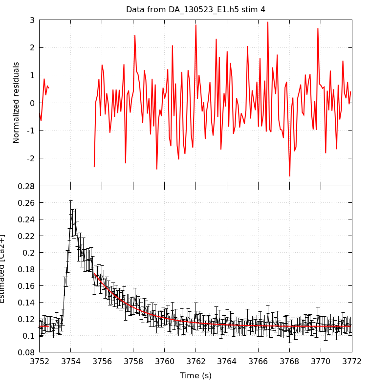

*Analysis of dataset DA_130523_E1*
-----

[TOC]

The baseline length is: 7.

**When fitting tau against kappa_Fura only the transients for which the fit RSS and the lag 1 auto-correlation of the residuals were small enough, giving an overall probability of false negative of 0.02, were kept** (see the numerical summary associated with each transient).

The good transients are: 1, 3, 4, 5.

# Loading curve
The time at which the 'good' transients were recorded appear in red.

# Transients 
On each graph, the residuals appear on top.
**Under the null hypothesis**, if the monoexponential fit is correct **they should be centered on 0 and have a SD close to 1** (not exactly 1 since parameters were obtained through the fitting procedure form the data.

The estimated [Ca2+] appears on the second row. The estimate is show in black together with pointwise 95% confidence intervals. The fitted curve appears in red. **The whole transient is not fitted**, only a portion of it is: a portion of the baseline made of 7 points and the decay phase starting at the time where the Delta[Ca2+] has reached 50% of its peak value.

The time appearing on the abscissa is the time from the beginning of the experiment.

## Transient 1
**Transient 1 is 'good'.**

### Fit graphical summary

### Fit numerical summary

> nobs = 180

> number of degrees of freedom = 177

> baseline length = 7

> fit started from point 27

> estimated baseline 0.151297 and standard error 0.00121249

> estimated delta 0.0898766 and standard error 0.00708778

> estimated tau 1.96137 and standard error 0.225125

> residual sum of squares: 185.595

> RSS per degree of freedom: 1.04856

> Probability of observing a larger of equal RSS per DOF under the null hypothesis: 0.313867

> Lag 1 residuals auto-correlation: -0.057

> Pr[Lag 1 auto-corr. > -0.057] = 0.761

## Transient 2
**Transient 2 is a 'bad'.**

### Fit graphical summary

### Fit numerical summary

> nobs = 180

> number of degrees of freedom = 177

> baseline length = 7

> fit started from point 27

> estimated baseline 0.13962 and standard error nan

> estimated delta 0.0357428 and standard error nan

> estimated tau -0.0166306 and standard error nan

> residual sum of squares: inf

> RSS per degree of freedom: inf

> Probability of observing a larger of equal RSS per DOF under the null hypothesis: -nan

> Lag 1 residuals auto-correlation: inf

> Pr[Lag 1 auto-corr. > inf] = 0.020

## Transient 3
**Transient 3 is 'good'.**

### Fit graphical summary

### Fit numerical summary

> nobs = 177

> number of degrees of freedom = 174

> baseline length = 7

> fit started from point 30

> estimated baseline 0.114153 and standard error 0.000617191

> estimated delta 0.0854548 and standard error 0.00306105

> estimated tau 2.30649 and standard error 0.125881

> residual sum of squares: 169.616

> RSS per degree of freedom: 0.974803

> Probability of observing a larger of equal RSS per DOF under the null hypothesis: 0.57973

> Lag 1 residuals auto-correlation: 0.095

> Pr[Lag 1 auto-corr. > 0.095] = 0.068

## Transient 4
**Transient 4 is 'good'.**

### Fit graphical summary

### Fit numerical summary

> nobs = 172

> number of degrees of freedom = 169

> baseline length = 7

> fit started from point 35

> estimated baseline 0.110938 and standard error 0.000539049

> estimated delta 0.0639525 and standard error 0.00226973

> estimated tau 2.44051 and standard error 0.141435

> residual sum of squares: 183.401

> RSS per degree of freedom: 1.08521

> Probability of observing a larger of equal RSS per DOF under the null hypothesis: 0.212404

> Lag 1 residuals auto-correlation: -0.045

> Pr[Lag 1 auto-corr. > -0.045] = 0.681

## Transient 5
**Transient 5 is 'good'.**

### Fit graphical summary

### Fit numerical summary

> nobs = 168

> number of degrees of freedom = 165

> baseline length = 7

> fit started from point 39

> estimated baseline 0.107662 and standard error 0.00059211

> estimated delta 0.054783 and standard error 0.00167156

> estimated tau 3.25206 and standard error 0.189013

> residual sum of squares: 165.454

> RSS per degree of freedom: 1.00275

> Probability of observing a larger of equal RSS per DOF under the null hypothesis: 0.47541

> Lag 1 residuals auto-correlation: -0.033

> Pr[Lag 1 auto-corr. > -0.033] = 0.650

# tau vs kappa 
Since the [Fura] changes during a transient (and it can change a lot during the early transients), the _unique_ value to use as '[Fura]' is not obvious. We therefore perform 3 fits: one using the minimal value, one using the mean and one using the maximal value.

The observed tau (shown in red) are displayed with a 95% confidence interval that results from the fitting procedure and _is_ therefore _meaningful only if the fit is correct_!

No serious attempt at quantifying the precision of [Fura] and therefore kappa_Fura has been made since the choice of which [Fura] to use has a larger effect and since the other dominating effect is often the certainty we can have that the saturating value (the [Fura] in the pipette) has been reached.

The straight line in black is the result of a _weighted_ linear regression. The blue dotted lines correspond to the limits of _pointwise 95% confidence intervals_.

## tau vs kappa  using the min [Fura] value
### Fit graphical summary

### Fit numerical summary

> Best fit: tau = 1.36435 + 0.0109192 kappa_Fura

> Covariance matrix:

> [ +7.50372e-02, -6.79407e-04  

>   -6.79407e-04, +6.70736e-06  ]

> Total sum of squares (TSS) = 23.9552

> chisq (Residual sum of squares, RSS) = 6.17942

> Probability of observing a larger of equal RSS per DOF under the null hypothesis: 0.0455152

> R squared (1-RSS/TSS) = 0.742043

> Estimated gamma/v with standard error: 91.5819 +/- 21.7218

> Estimates kappa_S with standard error (using error propagation): 123.95 +/- 38.8285

> kappa_S confidence intervals based on parametric bootstrap

> 0.95 CI for kappa_S: [50.8108,323.75]

> 0.99 CI for kappa_S: [34.911,480.143]

## tau vs kappa  using the mean [Fura] value
### Fit graphical summary

### Fit numerical summary

> Best fit: tau = 1.34211 + 0.0107074 kappa_Fura

> Covariance matrix:

> [ +7.82499e-02, -6.83584e-04  

>   -6.83584e-04, +6.48723e-06  ]

> Total sum of squares (TSS) = 23.9552

> chisq (Residual sum of squares, RSS) = 6.28234

> Probability of observing a larger of equal RSS per DOF under the null hypothesis: 0.0432322

> R squared (1-RSS/TSS) = 0.737747

> Estimated gamma/v with standard error: 93.3935 +/- 22.2158

> Estimates kappa_S with standard error (using error propagation): 124.344 +/- 39.6424

> kappa_S confidence intervals based on parametric bootstrap

> 0.95 CI for kappa_S: [49.6866,327.22]

> 0.99 CI for kappa_S: [36.3801,522.358]

## tau vs kappa  using the max [Fura] value
### Fit graphical summary

### Fit numerical summary

> Best fit: tau = 1.33316 + 0.010384 kappa_Fura

> Covariance matrix:

> [ +8.06431e-02, -6.79571e-04  

>   -6.79571e-04, +6.20513e-06  ]

> Total sum of squares (TSS) = 23.9552

> chisq (Residual sum of squares, RSS) = 6.57819

> Probability of observing a larger of equal RSS per DOF under the null hypothesis: 0.0372875

> R squared (1-RSS/TSS) = 0.725396

> Estimated gamma/v with standard error: 96.3023 +/- 23.102

> Estimates kappa_S with standard error (using error propagation): 127.386 +/- 41.1879

> kappa_S confidence intervals based on parametric bootstrap

> 0.95 CI for kappa_S: [50.085,330.252]

> 0.99 CI for kappa_S: [34.3743,494.256]

# RSS per DOF, standard error of tau and lag 1 residual correlation for each 'good' tansient
4 out of 5 transients  were kept.

sigma(tau): 0.225125, 0.125881, 0.141435, 0.189013

Residual correlation at lag 1: -0.05681391842762806, 0.09484337210408128, -0.04484029531163392, -0.033356865588099395

Probablity of a correlation at lag 1 smaller or equal than observed: 0.761, 0.06799999999999995, 0.681, 0.65

RSS/DOF: 1.04856, 0.974803, 1.08521, 1.00275
