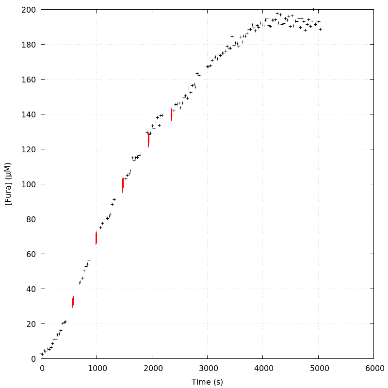
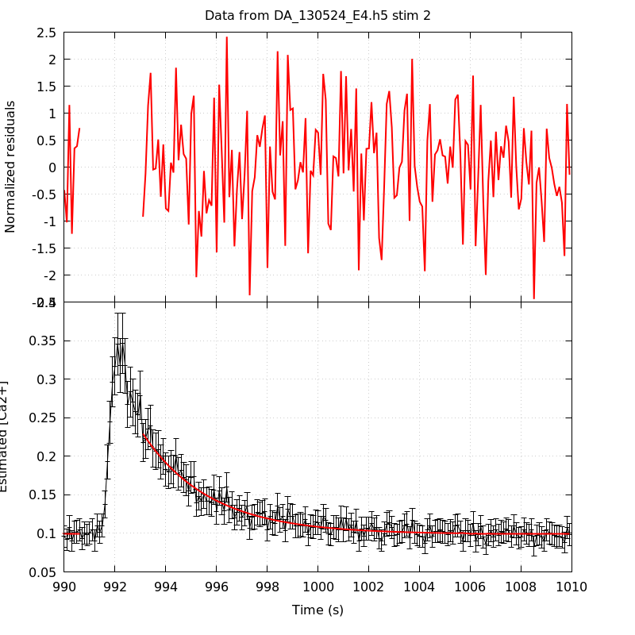
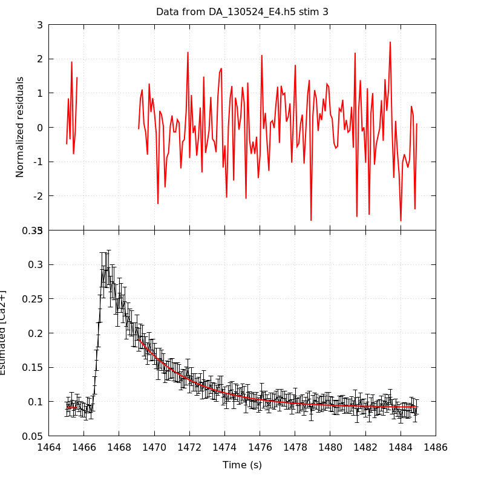
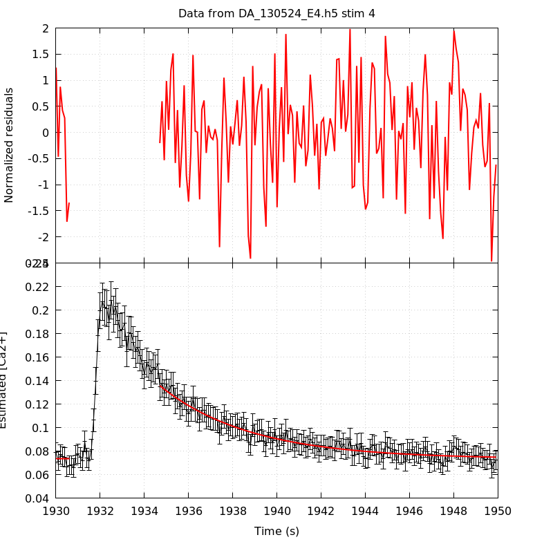
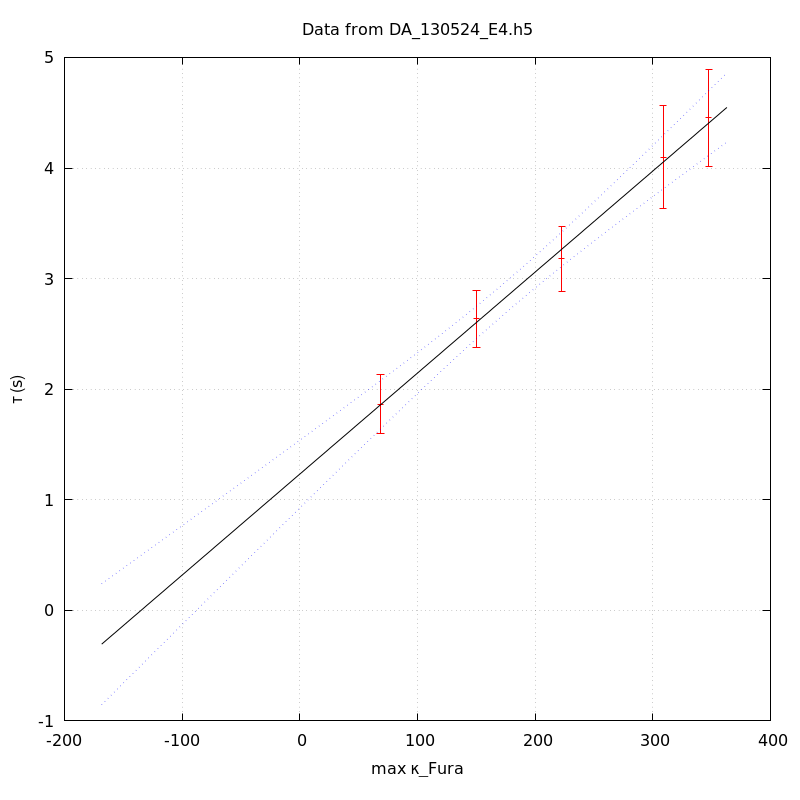

*Analysis of dataset DA_130524_E4*
-----

[TOC]

The baseline length is: 7.

**When fitting tau against kappa_Fura only the transients for which the fit RSS and the lag 1 auto-correlation of the residuals were small enough, giving an overall probability of false negative of 0.02, were kept** (see the numerical summary associated with each transient).

The good transients are: 1, 2, 3, 4, 5.

# Loading curve
The time at which the 'good' transients were recorded appear in red.

# Transients 
On each graph, the residuals appear on top.
**Under the null hypothesis**, if the monoexponential fit is correct **they should be centered on 0 and have a SD close to 1** (not exactly 1 since parameters were obtained through the fitting procedure form the data.

The estimated [Ca2+] appears on the second row. The estimate is show in black together with pointwise 95% confidence intervals. The fitted curve appears in red. **The whole transient is not fitted**, only a portion of it is: a portion of the baseline made of 7 points and the decay phase starting at the time where the Delta[Ca2+] has reached 50% of its peak value.

The time appearing on the abscissa is the time from the beginning of the experiment.

## Transient 1
**Transient 1 is 'good'.**

### Fit graphical summary

### Fit numerical summary

> nobs = 180

> number of degrees of freedom = 177

> baseline length = 7

> fit started from point 27

> estimated baseline 0.120418 and standard error 0.00142964

> estimated delta 0.203002 and standard error 0.0122113

> estimated tau 1.86444 and standard error 0.136466

> residual sum of squares: 168.033

> RSS per degree of freedom: 0.949339

> Probability of observing a larger of equal RSS per DOF under the null hypothesis: 0.673391

> Lag 1 residuals auto-correlation: -0.016

> Pr[Lag 1 auto-corr. > -0.016] = 0.567

## Transient 2
**Transient 2 is 'good'.**

### Fit graphical summary

### Fit numerical summary

> nobs = 176

> number of degrees of freedom = 173

> baseline length = 7

> fit started from point 31

> estimated baseline 0.0989784 and standard error 0.000883665

> estimated delta 0.130237 and standard error 0.00433949

> estimated tau 2.63523 and standard error 0.129955

> residual sum of squares: 161.759

> RSS per degree of freedom: 0.935025

> Probability of observing a larger of equal RSS per DOF under the null hypothesis: 0.719671

> Lag 1 residuals auto-correlation: -0.106

> Pr[Lag 1 auto-corr. > -0.106] = 0.933

## Transient 3
**Transient 3 is 'good'.**

### Fit graphical summary

### Fit numerical summary

> nobs = 166

> number of degrees of freedom = 163

> baseline length = 7

> fit started from point 41

> estimated baseline 0.0914367 and standard error 0.000808395

> estimated delta 0.0996035 and standard error 0.00267387

> estimated tau 3.17859 and standard error 0.149099

> residual sum of squares: 166.096

> RSS per degree of freedom: 1.01899

> Probability of observing a larger of equal RSS per DOF under the null hypothesis: 0.417908

> Lag 1 residuals auto-correlation: -0.028

> Pr[Lag 1 auto-corr. > -0.028] = 0.625

## Transient 4
**Transient 4 is 'good'.**

### Fit graphical summary

### Fit numerical summary

> nobs = 160

> number of degrees of freedom = 157

> baseline length = 7

> fit started from point 47

> estimated baseline 0.0732924 and standard error 0.000834676

> estimated delta 0.0623265 and standard error 0.00165936

> estimated tau 4.09915 and standard error 0.239297

> residual sum of squares: 142.371

> RSS per degree of freedom: 0.906823

> Probability of observing a larger of equal RSS per DOF under the null hypothesis: 0.792391

> Lag 1 residuals auto-correlation: 0.058

> Pr[Lag 1 auto-corr. > 0.058] = 0.166

## Transient 5
**Transient 5 is 'good'.**

### Fit graphical summary

### Fit numerical summary

> nobs = 157

> number of degrees of freedom = 154

> baseline length = 7

> fit started from point 50

> estimated baseline 0.071933 and standard error 0.000868446

> estimated delta 0.0699027 and standard error 0.00151718

> estimated tau 4.45326 and standard error 0.222276

> residual sum of squares: 157.141

> RSS per degree of freedom: 1.0204

> Probability of observing a larger of equal RSS per DOF under the null hypothesis: 0.414606

> Lag 1 residuals auto-correlation: -0.005

> Pr[Lag 1 auto-corr. > -0.005] = 0.471

# tau vs kappa 
Since the [Fura] changes during a transient (and it can change a lot during the early transients), the _unique_ value to use as '[Fura]' is not obvious. We therefore perform 3 fits: one using the minimal value, one using the mean and one using the maximal value.

The observed tau (shown in red) are displayed with a 95% confidence interval that results from the fitting procedure and _is_ therefore _meaningful only if the fit is correct_!

No serious attempt at quantifying the precision of [Fura] and therefore kappa_Fura has been made since the choice of which [Fura] to use has a larger effect and since the other dominating effect is often the certainty we can have that the saturating value (the [Fura] in the pipette) has been reached.

The straight line in black is the result of a _weighted_ linear regression. The blue dotted lines correspond to the limits of _pointwise 95% confidence intervals_.

## tau vs kappa  using the min [Fura] value
### Fit graphical summary

### Fit numerical summary

> Best fit: tau = 1.36226 + 0.0092821 kappa_Fura

> Covariance matrix:

> [ +2.14730e-02, -1.00892e-04  

>   -1.00892e-04, +6.22189e-07  ]

> Total sum of squares (TSS) = 138.961

> chisq (Residual sum of squares, RSS) = 0.486637

> Probability of observing a larger of equal RSS per DOF under the null hypothesis: 0.921817

> R squared (1-RSS/TSS) = 0.996498

> Estimated gamma/v with standard error: 107.734 +/- 9.15522

> Estimates kappa_S with standard error (using error propagation): 145.762 +/- 20.119

> kappa_S confidence intervals based on parametric bootstrap

> 0.95 CI for kappa_S: [99.0749,210.066]

> 0.99 CI for kappa_S: [85.2491,236.73]

## tau vs kappa  using the mean [Fura] value
### Fit graphical summary

### Fit numerical summary

> Best fit: tau = 1.30117 + 0.00919029 kappa_Fura

> Covariance matrix:

> [ +2.28371e-02, -1.04002e-04  

>   -1.04002e-04, +6.10252e-07  ]

> Total sum of squares (TSS) = 138.961

> chisq (Residual sum of squares, RSS) = 0.557261

> Probability of observing a larger of equal RSS per DOF under the null hypothesis: 0.906143

> R squared (1-RSS/TSS) = 0.99599

> Estimated gamma/v with standard error: 108.811 +/- 9.24904

> Estimates kappa_S with standard error (using error propagation): 140.581 +/- 20.3768

> kappa_S confidence intervals based on parametric bootstrap

> 0.95 CI for kappa_S: [93.7519,205.438]

> 0.99 CI for kappa_S: [82.8582,233.076]

## tau vs kappa  using the max [Fura] value
### Fit graphical summary

### Fit numerical summary

> Best fit: tau = 1.23205 + 0.00913375 kappa_Fura

> Covariance matrix:

> [ +2.44271e-02, -1.07874e-04  

>   -1.07874e-04, +6.02492e-07  ]

> Total sum of squares (TSS) = 138.961

> chisq (Residual sum of squares, RSS) = 0.493891

> Probability of observing a larger of equal RSS per DOF under the null hypothesis: 0.920232

> R squared (1-RSS/TSS) = 0.996446

> Estimated gamma/v with standard error: 109.484 +/- 9.30416

> Estimates kappa_S with standard error (using error propagation): 133.89 +/- 20.5963

> kappa_S confidence intervals based on parametric bootstrap

> 0.95 CI for kappa_S: [86.6293,196.916]

> 0.99 CI for kappa_S: [74.1481,222.736]

# RSS per DOF, standard error of tau and lag 1 residual correlation for each 'good' tansient
5 out of 5 transients  were kept.

sigma(tau): 0.136466, 0.129955, 0.149099, 0.239297, 0.222276

Residual correlation at lag 1: -0.015935874746313507, -0.10639203147422062, -0.02798917305770666, 0.05837308899724218, -0.004679496173859197

Probablity of a correlation at lag 1 smaller or equal than observed: 0.567, 0.933, 0.625, 0.16600000000000004, 0.471

RSS/DOF: 0.949339, 0.935025, 1.01899, 0.906823, 1.0204
