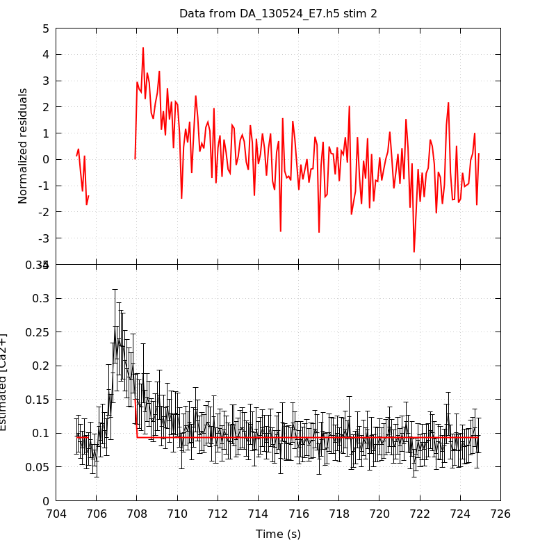
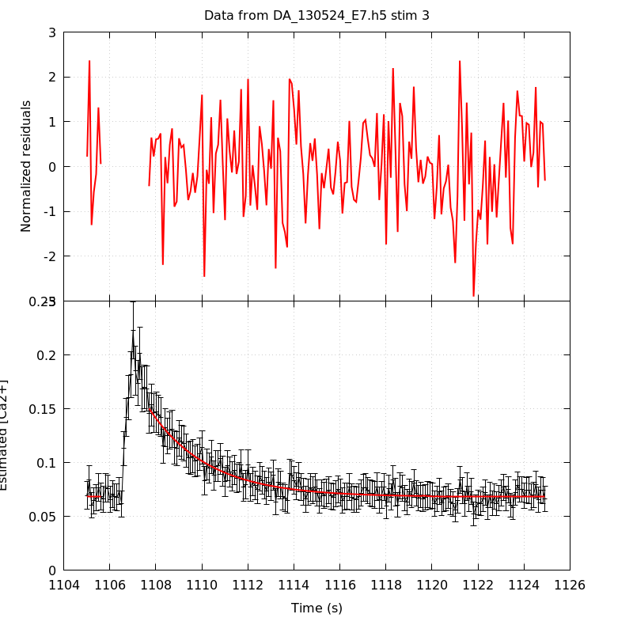
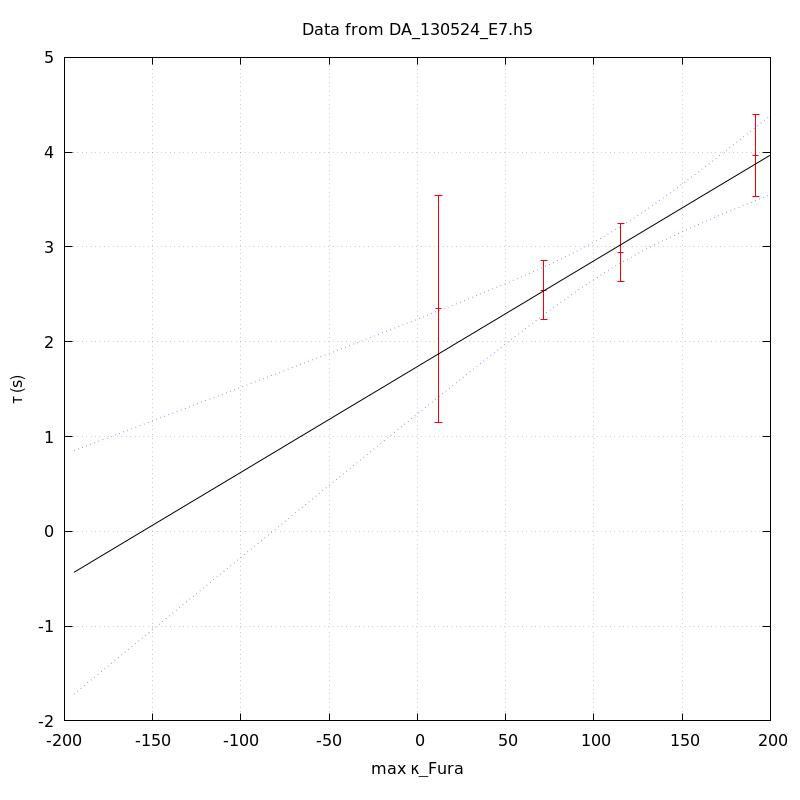

*Analysis of dataset DA_130524_E7*
-----

[TOC]

The baseline length is: 7.

**When fitting tau against kappa_Fura only the transients for which the fit RSS and the lag 1 auto-correlation of the residuals were small enough, giving an overall probability of false negative of 0.02, were kept** (see the numerical summary associated with each transient).

The good transients are: 1, 3, 4, 5.

# Loading curve
The time at which the 'good' transients were recorded appear in red.

# Transients 
On each graph, the residuals appear on top.
**Under the null hypothesis**, if the monoexponential fit is correct **they should be centered on 0 and have a SD close to 1** (not exactly 1 since parameters were obtained through the fitting procedure form the data.

The estimated [Ca2+] appears on the second row. The estimate is show in black together with pointwise 95% confidence intervals. The fitted curve appears in red. **The whole transient is not fitted**, only a portion of it is: a portion of the baseline made of 7 points and the decay phase starting at the time where the Delta[Ca2+] has reached 50% of its peak value.

The time appearing on the abscissa is the time from the beginning of the experiment.

## Transient 1
**Transient 1 is 'good'.**

### Fit graphical summary

### Fit numerical summary

> nobs = 186

> number of degrees of freedom = 183

> baseline length = 7

> fit started from point 21

> estimated baseline 0.117889 and standard error 0.00380029

> estimated delta 0.119577 and standard error 0.0224336

> estimated tau 2.34616 and standard error 0.610352

> residual sum of squares: 162.778

> RSS per degree of freedom: 0.889498

> Probability of observing a larger of equal RSS per DOF under the null hypothesis: 0.856217

> Lag 1 residuals auto-correlation: 0.129

> Pr[Lag 1 auto-corr. > 0.129] = 0.040

## Transient 2
**Transient 2 is a 'bad'.**

### Fit graphical summary

### Fit numerical summary

> nobs = 178

> number of degrees of freedom = 175

> baseline length = 7

> fit started from point 29

> estimated baseline 0.093706 and standard error 0.00102631

> estimated delta 0.0571377 and standard error 0.0187565

> estimated tau 0.00175563 and standard error 0

> residual sum of squares: 300.33

> RSS per degree of freedom: 1.71617

> Probability of observing a larger of equal RSS per DOF under the null hypothesis: 1.16965e-08

> WARNING: THE FIT IS NOT GOOD!

> Lag 1 residuals auto-correlation: 0.715

> Pr[Lag 1 auto-corr. > 0.715] = 0.000

## Transient 3
**Transient 3 is 'good'.**

### Fit graphical summary

### Fit numerical summary

> nobs = 180

> number of degrees of freedom = 177

> baseline length = 7

> fit started from point 27

> estimated baseline 0.068086 and standard error 0.000697476

> estimated delta 0.0820713 and standard error 0.0033251

> estimated tau 2.54379 and standard error 0.158424

> residual sum of squares: 175.644

> RSS per degree of freedom: 0.992342

> Probability of observing a larger of equal RSS per DOF under the null hypothesis: 0.514664

> Lag 1 residuals auto-correlation: 0.014

> Pr[Lag 1 auto-corr. > 0.014] = 0.373

## Transient 4
**Transient 4 is 'good'.**

### Fit graphical summary

### Fit numerical summary

> nobs = 172

> number of degrees of freedom = 169

> baseline length = 7

> fit started from point 35

> estimated baseline 0.0641069 and standard error 0.00055206

> estimated delta 0.0632209 and standard error 0.00193422

> estimated tau 2.94258 and standard error 0.15628

> residual sum of squares: 172.22

> RSS per degree of freedom: 1.01905

> Probability of observing a larger of equal RSS per DOF under the null hypothesis: 0.416741

> Lag 1 residuals auto-correlation: 0.093

> Pr[Lag 1 auto-corr. > 0.093] = 0.099

## Transient 5
**Transient 5 is 'good'.**

### Fit graphical summary

### Fit numerical summary

> nobs = 160

> number of degrees of freedom = 157

> baseline length = 7

> fit started from point 47

> estimated baseline 0.0582513 and standard error 0.000550247

> estimated delta 0.0436697 and standard error 0.00109433

> estimated tau 3.96811 and standard error 0.220803

> residual sum of squares: 147.116

> RSS per degree of freedom: 0.937042

> Probability of observing a larger of equal RSS per DOF under the null hypothesis: 0.702681

> Lag 1 residuals auto-correlation: -0.139

> Pr[Lag 1 auto-corr. > -0.139] = 0.958

# tau vs kappa 
Since the [Fura] changes during a transient (and it can change a lot during the early transients), the _unique_ value to use as '[Fura]' is not obvious. We therefore perform 3 fits: one using the minimal value, one using the mean and one using the maximal value.

The observed tau (shown in red) are displayed with a 95% confidence interval that results from the fitting procedure and _is_ therefore _meaningful only if the fit is correct_!

No serious attempt at quantifying the precision of [Fura] and therefore kappa_Fura has been made since the choice of which [Fura] to use has a larger effect and since the other dominating effect is often the certainty we can have that the saturating value (the [Fura] in the pipette) has been reached.

The straight line in black is the result of a _weighted_ linear regression. The blue dotted lines correspond to the limits of _pointwise 95% confidence intervals_.

## tau vs kappa  using the min [Fura] value
### Fit graphical summary

### Fit numerical summary

> Best fit: tau = 1.77285 + 0.0121204 kappa_Fura

> Covariance matrix:

> [ +6.25250e-02, -5.32695e-04  

>   -5.32695e-04, +5.36334e-06  ]

> Total sum of squares (TSS) = 28.742

> chisq (Residual sum of squares, RSS) = 1.35135

> Probability of observing a larger of equal RSS per DOF under the null hypothesis: 0.508812

> R squared (1-RSS/TSS) = 0.952983

> Estimated gamma/v with standard error: 82.5052 +/- 15.7645

> Estimates kappa_S with standard error (using error propagation): 145.269 +/- 34.7377

> kappa_S confidence intervals based on parametric bootstrap

> 0.95 CI for kappa_S: [76.4857,294.925]

> 0.99 CI for kappa_S: [60.213,387.768]

## tau vs kappa  using the mean [Fura] value
### Fit graphical summary

### Fit numerical summary

> Best fit: tau = 1.75973 + 0.0115694 kappa_Fura

> Covariance matrix:

> [ +6.31837e-02, -5.09259e-04  

>   -5.09259e-04, +4.84153e-06  ]

> Total sum of squares (TSS) = 28.742

> chisq (Residual sum of squares, RSS) = 1.09542

> Probability of observing a larger of equal RSS per DOF under the null hypothesis: 0.578272

> R squared (1-RSS/TSS) = 0.961888

> Estimated gamma/v with standard error: 86.4347 +/- 16.4387

> Estimates kappa_S with standard error (using error propagation): 151.102 +/- 36.1781

> kappa_S confidence intervals based on parametric bootstrap

> 0.95 CI for kappa_S: [79.6982,307.537]

> 0.99 CI for kappa_S: [66.0618,408.438]

## tau vs kappa  using the max [Fura] value
### Fit graphical summary

### Fit numerical summary

> Best fit: tau = 1.73889 + 0.011156 kappa_Fura

> Covariance matrix:

> [ +6.49455e-02, -4.98671e-04  

>   -4.98671e-04, +4.49447e-06  ]

> Total sum of squares (TSS) = 28.742

> chisq (Residual sum of squares, RSS) = 1.05093

> Probability of observing a larger of equal RSS per DOF under the null hypothesis: 0.591281

> R squared (1-RSS/TSS) = 0.963436

> Estimated gamma/v with standard error: 89.6378 +/- 17.0342

> Estimates kappa_S with standard error (using error propagation): 154.87 +/- 37.406

> kappa_S confidence intervals based on parametric bootstrap

> 0.95 CI for kappa_S: [80.7846,307.464]

> 0.99 CI for kappa_S: [64.9674,401.518]

# RSS per DOF, standard error of tau and lag 1 residual correlation for each 'good' tansient
4 out of 5 transients  were kept.

sigma(tau): 0.610352, 0.158424, 0.15628, 0.220803

Residual correlation at lag 1: 0.12867596516243548, 0.013762481798966482, 0.09274565592947634, -0.13870830732672906

Probablity of a correlation at lag 1 smaller or equal than observed: 0.040000000000000036, 0.373, 0.09899999999999998, 0.958

RSS/DOF: 0.889498, 0.992342, 1.01905, 0.937042
