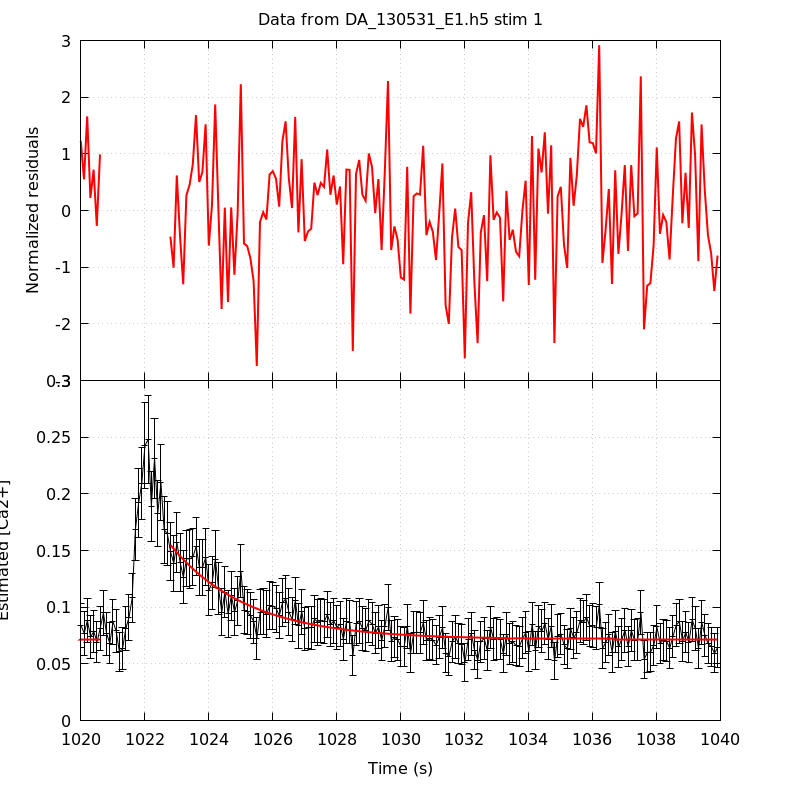

*Analysis of dataset DA_130531_E1*
-----

[TOC]

The baseline length is: 7.

**When fitting tau against kappa_Fura only the transients for which the fit RSS and the lag 1 auto-correlation of the residuals were small enough, giving an overall probability of false negative of 0.02, were kept** (see the numerical summary associated with each transient).

The good transients are: 1, 2, 3, 4, 5.

# Loading curve
The time at which the 'good' transients were recorded appear in red.

# Transients 
On each graph, the residuals appear on top.
**Under the null hypothesis**, if the monoexponential fit is correct **they should be centered on 0 and have a SD close to 1** (not exactly 1 since parameters were obtained through the fitting procedure form the data.

The estimated [Ca2+] appears on the second row. The estimate is show in black together with pointwise 95% confidence intervals. The fitted curve appears in red. **The whole transient is not fitted**, only a portion of it is: a portion of the baseline made of 7 points and the decay phase starting at the time where the Delta[Ca2+] has reached 50% of its peak value.

The time appearing on the abscissa is the time from the beginning of the experiment.

## Transient 1
**Transient 1 is 'good'.**

### Fit graphical summary

### Fit numerical summary

> nobs = 179

> number of degrees of freedom = 176

> baseline length = 7

> fit started from point 28

> estimated baseline 0.0716402 and standard error 0.00103022

> estimated delta 0.0833644 and standard error 0.00484279

> estimated tau 2.40145 and standard error 0.217242

> residual sum of squares: 188.711

> RSS per degree of freedom: 1.07222

> Probability of observing a larger of equal RSS per DOF under the null hypothesis: 0.242854

> Lag 1 residuals auto-correlation: 0.119

> Pr[Lag 1 auto-corr. > 0.119] = 0.056

## Transient 2
**Transient 2 is 'good'.**

### Fit graphical summary

### Fit numerical summary

> nobs = 169

> number of degrees of freedom = 166

> baseline length = 7

> fit started from point 38

> estimated baseline 0.0617005 and standard error 0.000728263

> estimated delta 0.0802983 and standard error 0.00295197

> estimated tau 2.58752 and standard error 0.15554

> residual sum of squares: 197.346

> RSS per degree of freedom: 1.18883

> Probability of observing a larger of equal RSS per DOF under the null hypothesis: 0.0485915

> Lag 1 residuals auto-correlation: 0.153

> Pr[Lag 1 auto-corr. > 0.153] = 0.039

## Transient 3
**Transient 3 is 'good'.**

### Fit graphical summary

### Fit numerical summary

> nobs = 172

> number of degrees of freedom = 169

> baseline length = 7

> fit started from point 35

> estimated baseline 0.0479562 and standard error 0.00060362

> estimated delta 0.0516261 and standard error 0.00176554

> estimated tau 3.25505 and standard error 0.208802

> residual sum of squares: 190.772

> RSS per degree of freedom: 1.12883

> Probability of observing a larger of equal RSS per DOF under the null hypothesis: 0.120436

> Lag 1 residuals auto-correlation: 0.029

> Pr[Lag 1 auto-corr. > 0.029] = 0.337

## Transient 4
**Transient 4 is 'good'.**

### Fit graphical summary

### Fit numerical summary

> nobs = 158

> number of degrees of freedom = 155

> baseline length = 7

> fit started from point 49

> estimated baseline 0.0464786 and standard error 0.000641672

> estimated delta 0.0439103 and standard error 0.00127858

> estimated tau 3.84203 and standard error 0.247316

> residual sum of squares: 160.008

> RSS per degree of freedom: 1.03231

> Probability of observing a larger of equal RSS per DOF under the null hypothesis: 0.374776

> Lag 1 residuals auto-correlation: 0.118

> Pr[Lag 1 auto-corr. > 0.118] = 0.068

## Transient 5
**Transient 5 is 'good'.**

### Fit graphical summary

### Fit numerical summary

> nobs = 150

> number of degrees of freedom = 147

> baseline length = 7

> fit started from point 57

> estimated baseline 0.050037 and standard error 0.000822106

> estimated delta 0.0413559 and standard error 0.00108824

> estimated tau 5.14467 and standard error 0.342831

> residual sum of squares: 137.32

> RSS per degree of freedom: 0.93415

> Probability of observing a larger of equal RSS per DOF under the null hypothesis: 0.704825

> Lag 1 residuals auto-correlation: -0.020

> Pr[Lag 1 auto-corr. > -0.020] = 0.563

# tau vs kappa 
Since the [Fura] changes during a transient (and it can change a lot during the early transients), the _unique_ value to use as '[Fura]' is not obvious. We therefore perform 3 fits: one using the minimal value, one using the mean and one using the maximal value.

The observed tau (shown in red) are displayed with a 95% confidence interval that results from the fitting procedure and _is_ therefore _meaningful only if the fit is correct_!

No serious attempt at quantifying the precision of [Fura] and therefore kappa_Fura has been made since the choice of which [Fura] to use has a larger effect and since the other dominating effect is often the certainty we can have that the saturating value (the [Fura] in the pipette) has been reached.

The straight line in black is the result of a _weighted_ linear regression. The blue dotted lines correspond to the limits of _pointwise 95% confidence intervals_.

## tau vs kappa  using the min [Fura] value
### Fit graphical summary

### Fit numerical summary

> Best fit: tau = 1.43087 + 0.0111634 kappa_Fura

> Covariance matrix:

> [ +5.43200e-02, -3.07519e-04  

>   -3.07519e-04, +2.08966e-06  ]

> Total sum of squares (TSS) = 66.2431

> chisq (Residual sum of squares, RSS) = 6.60545

> Probability of observing a larger of equal RSS per DOF under the null hypothesis: 0.0855953

> R squared (1-RSS/TSS) = 0.900285

> Estimated gamma/v with standard error: 89.5782 +/- 11.5996

> Estimates kappa_S with standard error (using error propagation): 127.175 +/- 26.6712

> kappa_S confidence intervals based on parametric bootstrap

> 0.95 CI for kappa_S: [69.1312,223.425]

> 0.99 CI for kappa_S: [53.6635,268.031]

## tau vs kappa  using the mean [Fura] value
### Fit graphical summary

### Fit numerical summary

> Best fit: tau = 1.37031 + 0.0110486 kappa_Fura

> Covariance matrix:

> [ +5.77867e-02, -3.16022e-04  

>   -3.16022e-04, +2.04979e-06  ]

> Total sum of squares (TSS) = 66.2431

> chisq (Residual sum of squares, RSS) = 6.68975

> Probability of observing a larger of equal RSS per DOF under the null hypothesis: 0.0824721

> R squared (1-RSS/TSS) = 0.899012

> Estimated gamma/v with standard error: 90.5091 +/- 11.7284

> Estimates kappa_S with standard error (using error propagation): 123.026 +/- 27.0496

> kappa_S confidence intervals based on parametric bootstrap

> 0.95 CI for kappa_S: [64.5552,219.792]

> 0.99 CI for kappa_S: [51.5545,270.579]

## tau vs kappa  using the max [Fura] value
### Fit graphical summary

### Fit numerical summary

> Best fit: tau = 1.3188 + 0.0108903 kappa_Fura

> Covariance matrix:

> [ +6.06352e-02, -3.20026e-04  

>   -3.20026e-04, +1.98596e-06  ]

> Total sum of squares (TSS) = 66.2431

> chisq (Residual sum of squares, RSS) = 6.52492

> Probability of observing a larger of equal RSS per DOF under the null hypothesis: 0.088685

> R squared (1-RSS/TSS) = 0.9015

> Estimated gamma/v with standard error: 91.8252 +/- 11.8825

> Estimates kappa_S with standard error (using error propagation): 120.099 +/- 27.5107

> kappa_S confidence intervals based on parametric bootstrap

> 0.95 CI for kappa_S: [60.6877,215.048]

> 0.99 CI for kappa_S: [46.2767,260.068]

# RSS per DOF, standard error of tau and lag 1 residual correlation for each 'good' tansient
5 out of 5 transients  were kept.

sigma(tau): 0.217242, 0.15554, 0.208802, 0.247316, 0.342831

Residual correlation at lag 1: 0.11861125567998455, 0.15337486902431377, 0.029077447530646252, 0.11817684920648149, -0.019934172213824288

Probablity of a correlation at lag 1 smaller or equal than observed: 0.05600000000000005, 0.039000000000000035, 0.33699999999999997, 0.06799999999999995, 0.563

RSS/DOF: 1.07222, 1.18883, 1.12883, 1.03231, 0.93415
