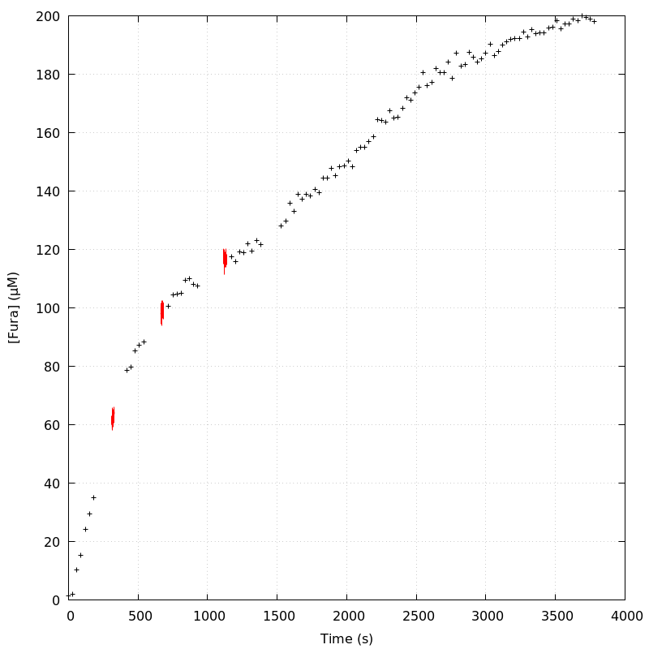
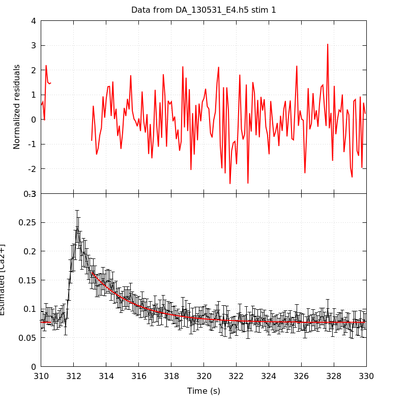
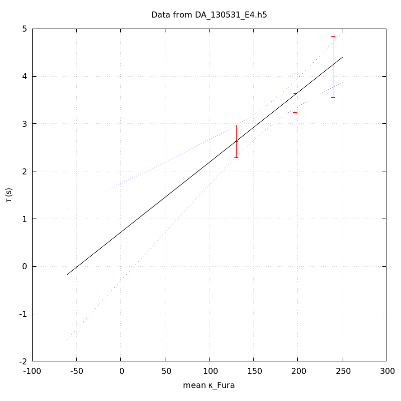

*Analysis of dataset DA_130531_E4*
-----

[TOC]

The baseline length is: 7.

**When fitting tau against kappa_Fura only the transients for which the fit RSS and the lag 1 auto-correlation of the residuals were small enough, giving an overall probability of false negative of 0.02, were kept** (see the numerical summary associated with each transient).

The good transients are: 1, 2, 3.

# Loading curve
The time at which the 'good' transients were recorded appear in red.

# Transients 
On each graph, the residuals appear on top.
**Under the null hypothesis**, if the monoexponential fit is correct **they should be centered on 0 and have a SD close to 1** (not exactly 1 since parameters were obtained through the fitting procedure form the data.

The estimated [Ca2+] appears on the second row. The estimate is show in black together with pointwise 95% confidence intervals. The fitted curve appears in red. **The whole transient is not fitted**, only a portion of it is: a portion of the baseline made of 7 points and the decay phase starting at the time where the Delta[Ca2+] has reached 50% of its peak value.

The time appearing on the abscissa is the time from the beginning of the experiment.

## Transient 1
**Transient 1 is 'good'.**

### Fit graphical summary

### Fit numerical summary

> nobs = 176

> number of degrees of freedom = 173

> baseline length = 7

> fit started from point 31

> estimated baseline 0.0764464 and standard error 0.000849376

> estimated delta 0.087004 and standard error 0.00360442

> estimated tau 2.62972 and standard error 0.175262

> residual sum of squares: 191.173

> RSS per degree of freedom: 1.10505

> Probability of observing a larger of equal RSS per DOF under the null hypothesis: 0.163475

> Lag 1 residuals auto-correlation: -0.004

> Pr[Lag 1 auto-corr. > -0.004] = 0.498

## Transient 2
**Transient 2 is 'good'.**

### Fit graphical summary

### Fit numerical summary

> nobs = 168

> number of degrees of freedom = 165

> baseline length = 7

> fit started from point 39

> estimated baseline 0.0857185 and standard error 0.000887417

> estimated delta 0.0776659 and standard error 0.00222682

> estimated tau 3.64248 and standard error 0.20858

> residual sum of squares: 192.652

> RSS per degree of freedom: 1.16759

> Probability of observing a larger of equal RSS per DOF under the null hypothesis: 0.0693226

> Lag 1 residuals auto-correlation: 0.069

> Pr[Lag 1 auto-corr. > 0.069] = 0.204

## Transient 3
**Transient 3 is 'good'.**

### Fit graphical summary

### Fit numerical summary

> nobs = 155

> number of degrees of freedom = 152

> baseline length = 7

> fit started from point 52

> estimated baseline 0.0784417 and standard error 0.000974499

> estimated delta 0.0507577 and standard error 0.00169389

> estimated tau 4.19953 and standard error 0.32695

> residual sum of squares: 179.972

> RSS per degree of freedom: 1.18403

> Probability of observing a larger of equal RSS per DOF under the null hypothesis: 0.0602137

> Lag 1 residuals auto-correlation: -0.071

> Pr[Lag 1 auto-corr. > -0.071] = 0.758

## Transient 4
**Transient 4 is a 'bad'.**

### Fit graphical summary

### Fit numerical summary

> nobs = 156

> number of degrees of freedom = 153

> baseline length = 7

> fit started from point 51

> estimated baseline 0.0856666 and standard error 0.000819338

> estimated delta 0.0545574 and standard error 0.00173281

> estimated tau 3.64483 and standard error 0.250615

> residual sum of squares: 202.466

> RSS per degree of freedom: 1.32331

> Probability of observing a larger of equal RSS per DOF under the null hypothesis: 0.00456268

> WARNING: THE FIT IS NOT GOOD!

> Lag 1 residuals auto-correlation: 0.143

> Pr[Lag 1 auto-corr. > 0.143] = 0.072

# tau vs kappa 
Since the [Fura] changes during a transient (and it can change a lot during the early transients), the _unique_ value to use as '[Fura]' is not obvious. We therefore perform 3 fits: one using the minimal value, one using the mean and one using the maximal value.

The observed tau (shown in red) are displayed with a 95% confidence interval that results from the fitting procedure and _is_ therefore _meaningful only if the fit is correct_!

No serious attempt at quantifying the precision of [Fura] and therefore kappa_Fura has been made since the choice of which [Fura] to use has a larger effect and since the other dominating effect is often the certainty we can have that the saturating value (the [Fura] in the pipette) has been reached.

The straight line in black is the result of a _weighted_ linear regression. The blue dotted lines correspond to the limits of _pointwise 95% confidence intervals_.

## tau vs kappa  using the min [Fura] value
### Fit graphical summary

### Fit numerical summary

> Best fit: tau = 0.823424 + 0.0149037 kappa_Fura

> Covariance matrix:

> [ +2.50118e-01, -1.46281e-03  

>   -1.46281e-03, +9.11692e-06  ]

> Total sum of squares (TSS) = 24.4199

> chisq (Residual sum of squares, RSS) = 0.0565167

> Probability of observing a larger of equal RSS per DOF under the null hypothesis: 0.812089

> R squared (1-RSS/TSS) = 0.997686

> Estimated gamma/v with standard error: 67.0976 +/- 13.5937

> Estimates kappa_S with standard error (using error propagation): 54.2497 +/- 35.3743

> kappa_S confidence intervals based on parametric bootstrap

> 0.95 CI for kappa_S: [-8.99834,197.852]

> 0.99 CI for kappa_S: [-23.1872,295.771]

## tau vs kappa  using the mean [Fura] value
### Fit graphical summary

### Fit numerical summary

> Best fit: tau = 0.717382 + 0.0147024 kappa_Fura

> Covariance matrix:

> [ +2.71289e-01, -1.50642e-03  

>   -1.50642e-03, +8.86861e-06  ]

> Total sum of squares (TSS) = 24.4199

> chisq (Residual sum of squares, RSS) = 0.0463479

> Probability of observing a larger of equal RSS per DOF under the null hypothesis: 0.829545

> R squared (1-RSS/TSS) = 0.998102

> Estimated gamma/v with standard error: 68.0162 +/- 13.7769

> Estimates kappa_S with standard error (using error propagation): 47.7936 +/- 36.7793

> kappa_S confidence intervals based on parametric bootstrap

> 0.95 CI for kappa_S: [-16.024,196.038]

> 0.99 CI for kappa_S: [-28.2767,300.604]

## tau vs kappa  using the max [Fura] value
### Fit graphical summary

### Fit numerical summary

> Best fit: tau = 0.622586 + 0.0146306 kappa_Fura

> Covariance matrix:

> [ +2.91289e-01, -1.55712e-03  

>   -1.55712e-03, +8.78873e-06  ]

> Total sum of squares (TSS) = 24.4199

> chisq (Residual sum of squares, RSS) = 0.0645045

> Probability of observing a larger of equal RSS per DOF under the null hypothesis: 0.799513

> R squared (1-RSS/TSS) = 0.997359

> Estimated gamma/v with standard error: 68.3501 +/- 13.8497

> Estimates kappa_S with standard error (using error propagation): 41.5538 +/- 37.8837

> kappa_S confidence intervals based on parametric bootstrap

> 0.95 CI for kappa_S: [-23.387,181.447]

> 0.99 CI for kappa_S: [-36.3989,273.048]

# RSS per DOF, standard error of tau and lag 1 residual correlation for each 'good' tansient
3 out of 4 transients  were kept.

sigma(tau): 0.175262, 0.20858, 0.32695

Residual correlation at lag 1: -0.0036153448246092207, 0.06867172848269495, -0.07089405254295318

Probablity of a correlation at lag 1 smaller or equal than observed: 0.498, 0.20399999999999996, 0.758

RSS/DOF: 1.10505, 1.16759, 1.18403
