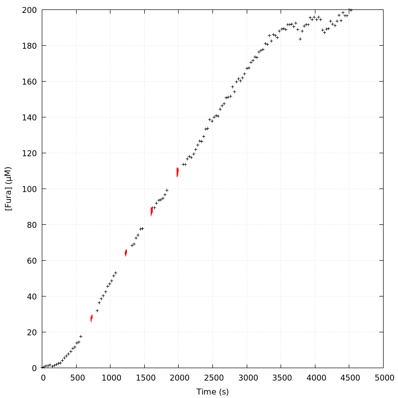
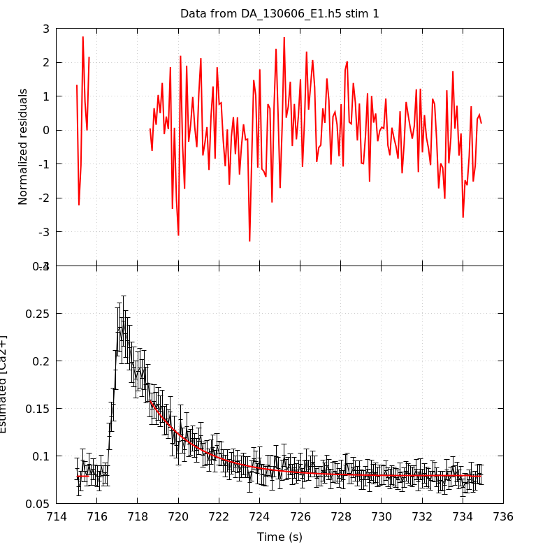
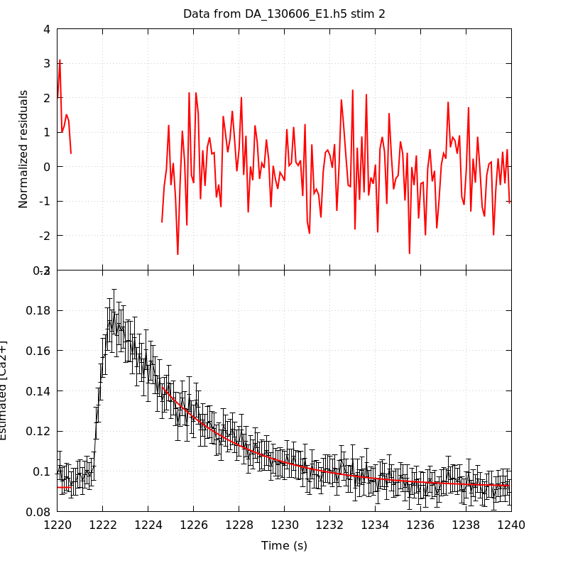
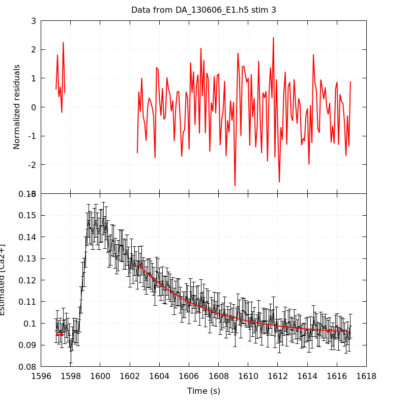
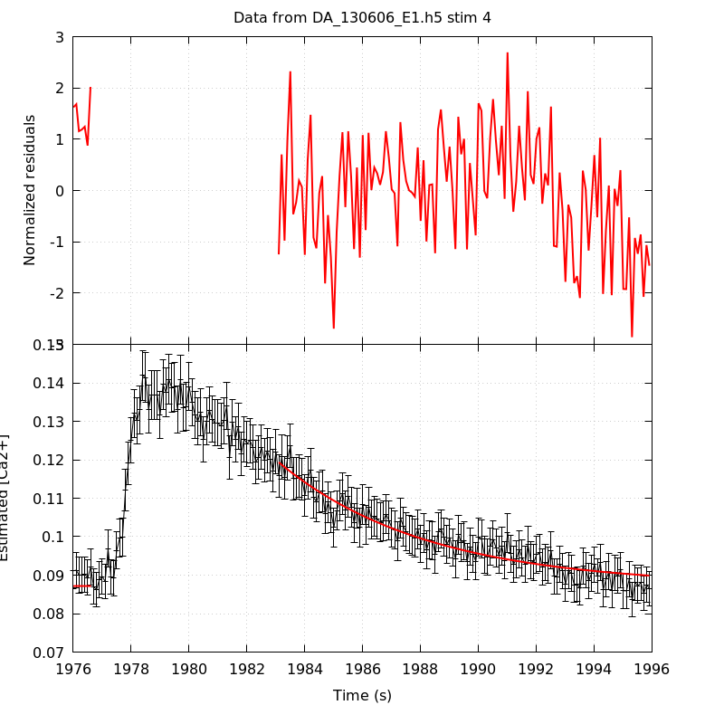

*Analysis of dataset DA_130606_E1*
-----

[TOC]

The baseline length is: 7.

**When fitting tau against kappa_Fura only the transients for which the fit RSS and the lag 1 auto-correlation of the residuals were small enough, giving an overall probability of false negative of 0.02, were kept** (see the numerical summary associated with each transient).

The good transients are: 2, 3.

**Not enough good transients to keep going!**

# Loading curve
The time at which the 'good' transients were recorded appear in red.

# Transients 
On each graph, the residuals appear on top.
**Under the null hypothesis**, if the monoexponential fit is correct **they should be centered on 0 and have a SD close to 1** (not exactly 1 since parameters were obtained through the fitting procedure form the data.

The estimated [Ca2+] appears on the second row. The estimate is show in black together with pointwise 95% confidence intervals. The fitted curve appears in red. **The whole transient is not fitted**, only a portion of it is: a portion of the baseline made of 7 points and the decay phase starting at the time where the Delta[Ca2+] has reached 50% of its peak value.

The time appearing on the abscissa is the time from the beginning of the experiment.

## Transient 1
**Transient 1 is a 'bad'.**

### Fit graphical summary

### Fit numerical summary

> nobs = 171

> number of degrees of freedom = 168

> baseline length = 7

> fit started from point 36

> estimated baseline 0.0789188 and standard error 0.000614924

> estimated delta 0.0790754 and standard error 0.00311185

> estimated tau 2.39126 and standard error 0.13972

> residual sum of squares: 221.323

> RSS per degree of freedom: 1.3174

> Probability of observing a larger of equal RSS per DOF under the null hypothesis: 0.00364197

> WARNING: THE FIT IS NOT GOOD!

> Lag 1 residuals auto-correlation: 0.014

> Pr[Lag 1 auto-corr. > 0.014] = 0.441

## Transient 2
**Transient 2 is 'good'.**

### Fit graphical summary

### Fit numerical summary

> nobs = 161

> number of degrees of freedom = 158

> baseline length = 7

> fit started from point 46

> estimated baseline 0.0919411 and standard error 0.000624249

> estimated delta 0.0500669 and standard error 0.001314

> estimated tau 3.90407 and standard error 0.22046

> residual sum of squares: 166.439

> RSS per degree of freedom: 1.05341

> Probability of observing a larger of equal RSS per DOF under the null hypothesis: 0.307174

> Lag 1 residuals auto-correlation: 0.062

> Pr[Lag 1 auto-corr. > 0.062] = 0.202

## Transient 3
**Transient 3 is 'good'.**

### Fit graphical summary

### Fit numerical summary

> nobs = 152

> number of degrees of freedom = 149

> baseline length = 7

> fit started from point 55

> estimated baseline 0.0948011 and standard error 0.000651327

> estimated delta 0.0328298 and standard error 0.000992187

> estimated tau 4.52266 and standard error 0.335543

> residual sum of squares: 157.908

> RSS per degree of freedom: 1.05979

> Probability of observing a larger of equal RSS per DOF under the null hypothesis: 0.293029

> Lag 1 residuals auto-correlation: -0.031

> Pr[Lag 1 auto-corr. > -0.031] = 0.619

## Transient 4
**Transient 4 is a 'bad'.**

### Fit graphical summary

### Fit numerical summary

> nobs = 136

> number of degrees of freedom = 133

> baseline length = 7

> fit started from point 71

> estimated baseline 0.0872709 and standard error 0.000686524

> estimated delta 0.032078 and standard error 0.000858267

> estimated tau 5.1089 and standard error 0.344024

> residual sum of squares: 161.966

> RSS per degree of freedom: 1.21779

> Probability of observing a larger of equal RSS per DOF under the null hypothesis: 0.0444193

> Lag 1 residuals auto-correlation: 0.273

> Pr[Lag 1 auto-corr. > 0.273] = 0.003

# RSS per DOF, standard error of tau and lag 1 residual correlation for each 'good' tansient
2 out of 4 transients  were kept.

sigma(tau): 0.22046, 0.335543

Residual correlation at lag 1: 0.06171192956806314, -0.031177431499323442

Probablity of a correlation at lag 1 smaller or equal than observed: 0.20199999999999996, 0.619

RSS/DOF: 1.05341, 1.05979
