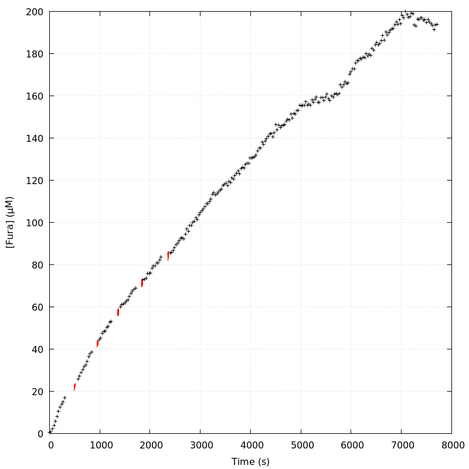
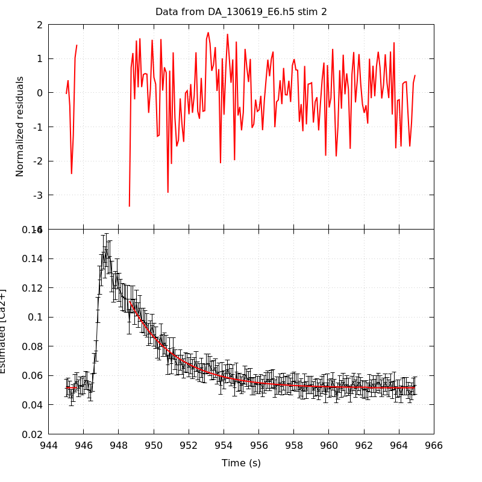
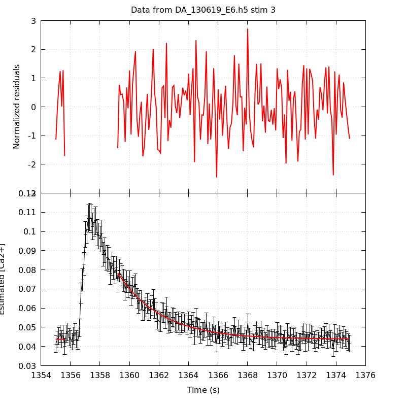
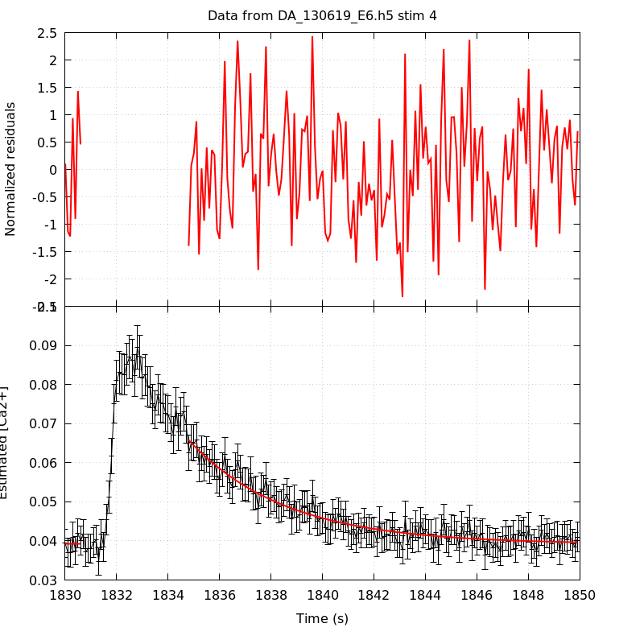
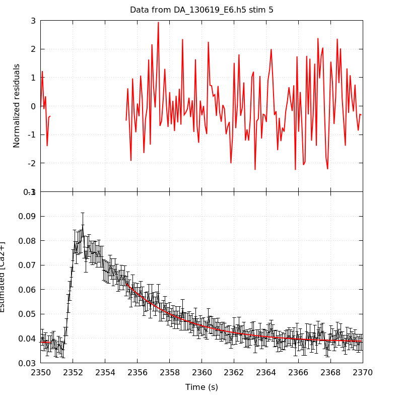
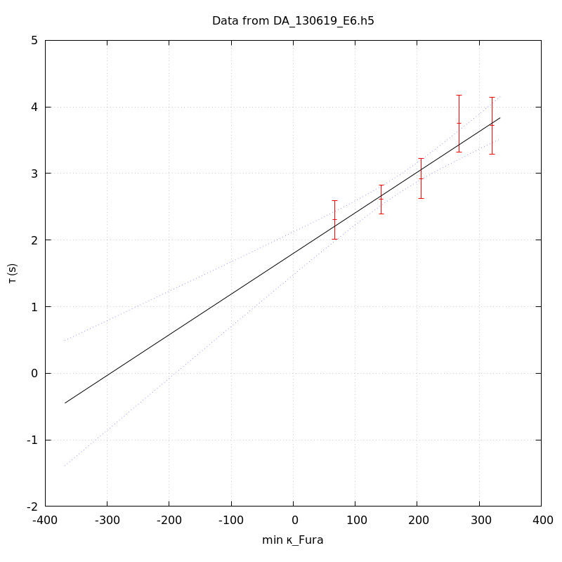
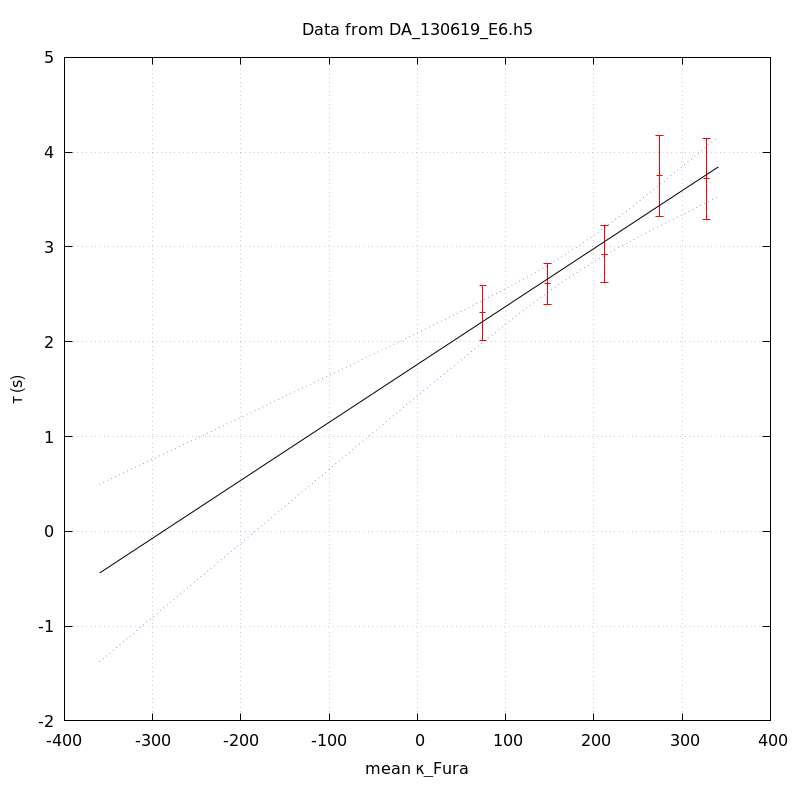
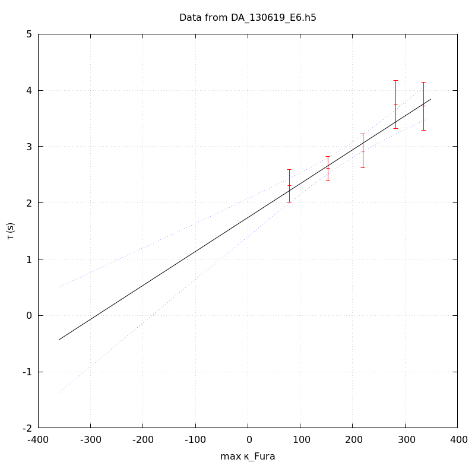

*Analysis of dataset DA_130619_E6*
-----

[TOC]

The baseline length is: 7.

**When fitting tau against kappa_Fura only the transients for which the fit RSS and the lag 1 auto-correlation of the residuals were small enough, giving an overall probability of false negative of 0.02, were kept** (see the numerical summary associated with each transient).

The good transients are: 1, 2, 3, 4, 5.

# Loading curve
The time at which the 'good' transients were recorded appear in red.

# Transients 
On each graph, the residuals appear on top.
**Under the null hypothesis**, if the monoexponential fit is correct **they should be centered on 0 and have a SD close to 1** (not exactly 1 since parameters were obtained through the fitting procedure form the data.

The estimated [Ca2+] appears on the second row. The estimate is show in black together with pointwise 95% confidence intervals. The fitted curve appears in red. **The whole transient is not fitted**, only a portion of it is: a portion of the baseline made of 7 points and the decay phase starting at the time where the Delta[Ca2+] has reached 50% of its peak value.

The time appearing on the abscissa is the time from the beginning of the experiment.

## Transient 1
**Transient 1 is 'good'.**

### Fit graphical summary

### Fit numerical summary

> nobs = 178

> number of degrees of freedom = 175

> baseline length = 7

> fit started from point 29

> estimated baseline 0.0561638 and standard error 0.000551898

> estimated delta 0.0667045 and standard error 0.00294167

> estimated tau 2.30425 and standard error 0.14914

> residual sum of squares: 188.851

> RSS per degree of freedom: 1.07915

> Probability of observing a larger of equal RSS per DOF under the null hypothesis: 0.224488

> Lag 1 residuals auto-correlation: 0.071

> Pr[Lag 1 auto-corr. > 0.071] = 0.154

## Transient 2
**Transient 2 is 'good'.**

### Fit graphical summary

### Fit numerical summary

> nobs = 171

> number of degrees of freedom = 168

> baseline length = 7

> fit started from point 36

> estimated baseline 0.051592 and standard error 0.000367325

> estimated delta 0.0593503 and standard error 0.00157842

> estimated tau 2.61376 and standard error 0.110116

> residual sum of squares: 157.746

> RSS per degree of freedom: 0.938962

> Probability of observing a larger of equal RSS per DOF under the null hypothesis: 0.703556

> Lag 1 residuals auto-correlation: -0.022

> Pr[Lag 1 auto-corr. > -0.022] = 0.575

## Transient 3
**Transient 3 is 'good'.**

### Fit graphical summary

### Fit numerical summary

> nobs = 165

> number of degrees of freedom = 162

> baseline length = 7

> fit started from point 42

> estimated baseline 0.0437799 and standard error 0.000314362

> estimated delta 0.034598 and standard error 0.00100593

> estimated tau 2.92173 and standard error 0.153886

> residual sum of squares: 161.979

> RSS per degree of freedom: 0.999873

> Probability of observing a larger of equal RSS per DOF under the null hypothesis: 0.485679

> Lag 1 residuals auto-correlation: -0.024

> Pr[Lag 1 auto-corr. > -0.024] = 0.601

## Transient 4
**Transient 4 is 'good'.**

### Fit graphical summary

### Fit numerical summary

> nobs = 159

> number of degrees of freedom = 156

> baseline length = 7

> fit started from point 48

> estimated baseline 0.0391716 and standard error 0.000343162

> estimated delta 0.0266107 and standard error 0.000710596

> estimated tau 3.75184 and standard error 0.218371

> residual sum of squares: 160.684

> RSS per degree of freedom: 1.03002

> Probability of observing a larger of equal RSS per DOF under the null hypothesis: 0.382003

> Lag 1 residuals auto-correlation: -0.015

> Pr[Lag 1 auto-corr. > -0.015] = 0.526

## Transient 5
**Transient 5 is 'good'.**

### Fit graphical summary

### Fit numerical summary

> nobs = 154

> number of degrees of freedom = 151

> baseline length = 7

> fit started from point 53

> estimated baseline 0.0384446 and standard error 0.000315947

> estimated delta 0.0240136 and standard error 0.000630452

> estimated tau 3.71715 and standard error 0.216038

> residual sum of squares: 175.698

> RSS per degree of freedom: 1.16356

> Probability of observing a larger of equal RSS per DOF under the null hypothesis: 0.0825293

> Lag 1 residuals auto-correlation: 0.009

> Pr[Lag 1 auto-corr. > 0.009] = 0.446

# tau vs kappa 
Since the [Fura] changes during a transient (and it can change a lot during the early transients), the _unique_ value to use as '[Fura]' is not obvious. We therefore perform 3 fits: one using the minimal value, one using the mean and one using the maximal value.

The observed tau (shown in red) are displayed with a 95% confidence interval that results from the fitting procedure and _is_ therefore _meaningful only if the fit is correct_!

No serious attempt at quantifying the precision of [Fura] and therefore kappa_Fura has been made since the choice of which [Fura] to use has a larger effect and since the other dominating effect is often the certainty we can have that the saturating value (the [Fura] in the pipette) has been reached.

The straight line in black is the result of a _weighted_ linear regression. The blue dotted lines correspond to the limits of _pointwise 95% confidence intervals_.

## tau vs kappa  using the min [Fura] value
### Fit graphical summary

### Fit numerical summary

> Best fit: tau = 1.7996 + 0.00610216 kappa_Fura

> Covariance matrix:

> [ +2.71228e-02, -1.32247e-04  

>   -1.32247e-04, +7.80532e-07  ]

> Total sum of squares (TSS) = 51.3195

> chisq (Residual sum of squares, RSS) = 3.61306

> Probability of observing a larger of equal RSS per DOF under the null hypothesis: 0.306391

> R squared (1-RSS/TSS) = 0.929597

> Estimated gamma/v with standard error: 163.876 +/- 23.7262

> Estimates kappa_S with standard error (using error propagation): 293.912 +/- 50.5122

> kappa_S confidence intervals based on parametric bootstrap

> 0.95 CI for kappa_S: [188.685,481.147]

> 0.99 CI for kappa_S: [160.77,573.101]

## tau vs kappa  using the mean [Fura] value
### Fit graphical summary

### Fit numerical summary

> Best fit: tau = 1.76168 + 0.00611072 kappa_Fura

> Covariance matrix:

> [ +2.87185e-02, -1.36846e-04  

>   -1.36846e-04, +7.80190e-07  ]

> Total sum of squares (TSS) = 51.3195

> chisq (Residual sum of squares, RSS) = 3.45815

> Probability of observing a larger of equal RSS per DOF under the null hypothesis: 0.32623

> R squared (1-RSS/TSS) = 0.932615

> Estimated gamma/v with standard error: 163.647 +/- 23.6546

> Estimates kappa_S with standard error (using error propagation): 287.293 +/- 50.0562

> kappa_S confidence intervals based on parametric bootstrap

> 0.95 CI for kappa_S: [182.859,474.458]

> 0.99 CI for kappa_S: [161.901,572.425]

## tau vs kappa  using the max [Fura] value
### Fit graphical summary

### Fit numerical summary

> Best fit: tau = 1.73993 + 0.00602268 kappa_Fura

> Covariance matrix:

> [ +2.96856e-02, -1.37517e-04  

>   -1.37517e-04, +7.57353e-07  ]

> Total sum of squares (TSS) = 51.3195

> chisq (Residual sum of squares, RSS) = 3.42547

> Probability of observing a larger of equal RSS per DOF under the null hypothesis: 0.330557

> R squared (1-RSS/TSS) = 0.933252

> Estimated gamma/v with standard error: 166.039 +/- 23.9922

> Estimates kappa_S with standard error (using error propagation): 287.896 +/- 50.6065

> kappa_S confidence intervals based on parametric bootstrap

> 0.95 CI for kappa_S: [182.148,468.261]

> 0.99 CI for kappa_S: [158.17,559.214]

# RSS per DOF, standard error of tau and lag 1 residual correlation for each 'good' tansient
5 out of 5 transients  were kept.

sigma(tau): 0.14914, 0.110116, 0.153886, 0.218371, 0.216038

Residual correlation at lag 1: 0.07109823025885532, -0.021740600513027585, -0.024139464757202578, -0.014722976784474815, 0.009096201076972404

Probablity of a correlation at lag 1 smaller or equal than observed: 0.15400000000000003, 0.575, 0.601, 0.526, 0.44599999999999995

RSS/DOF: 1.07915, 0.938962, 0.999873, 1.03002, 1.16356
