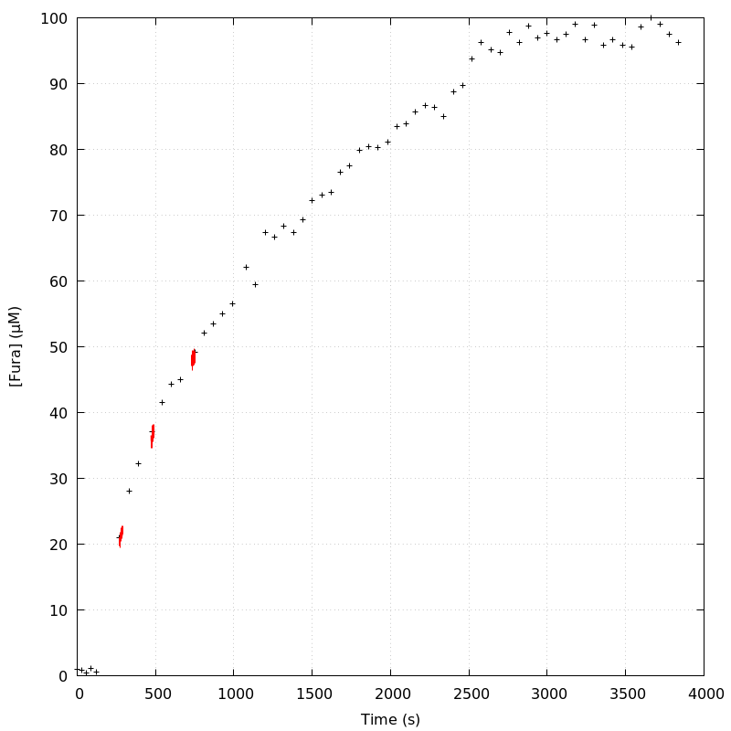
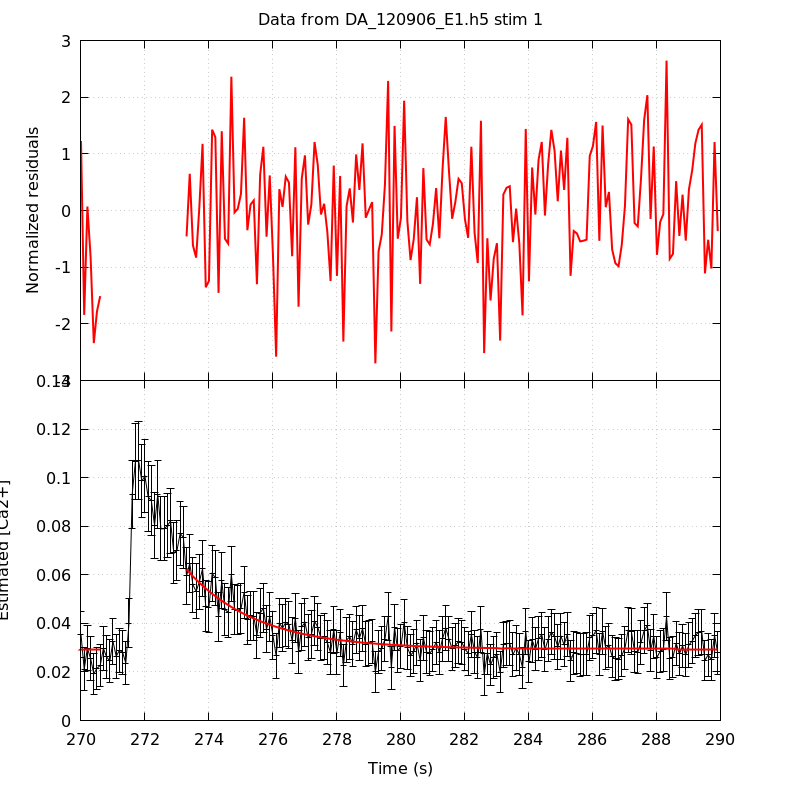
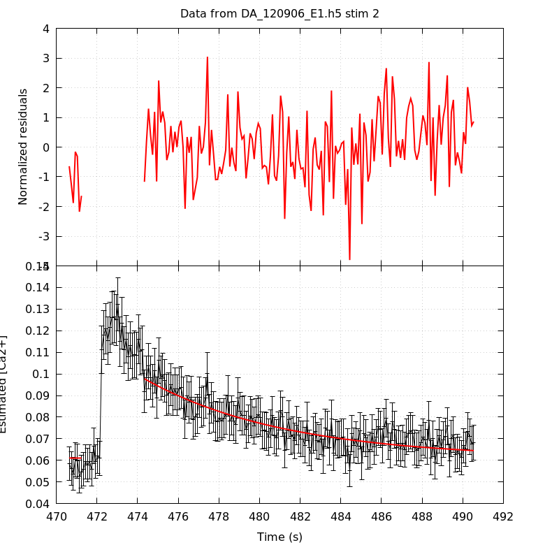
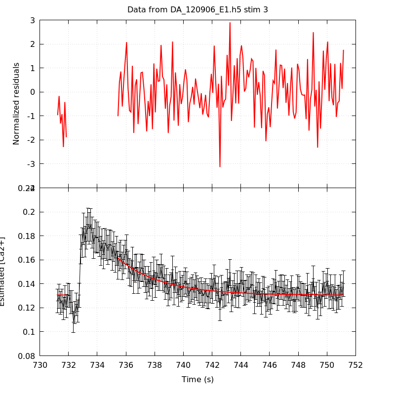
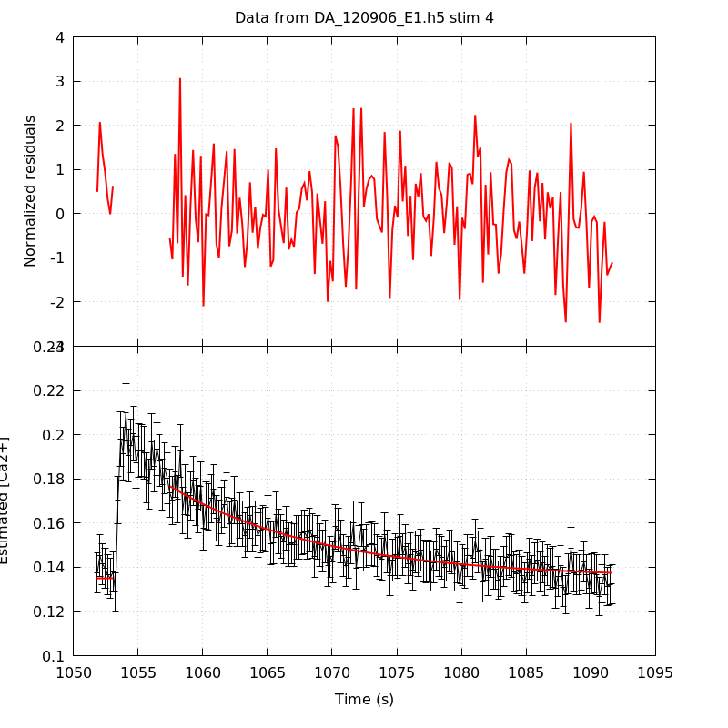
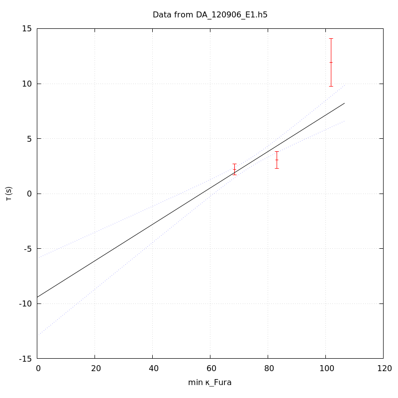
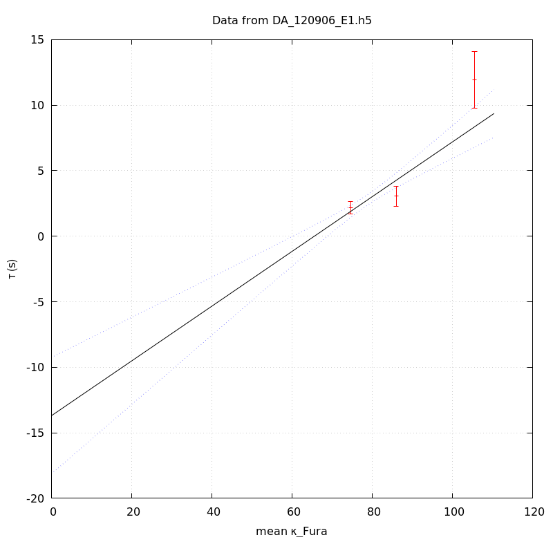
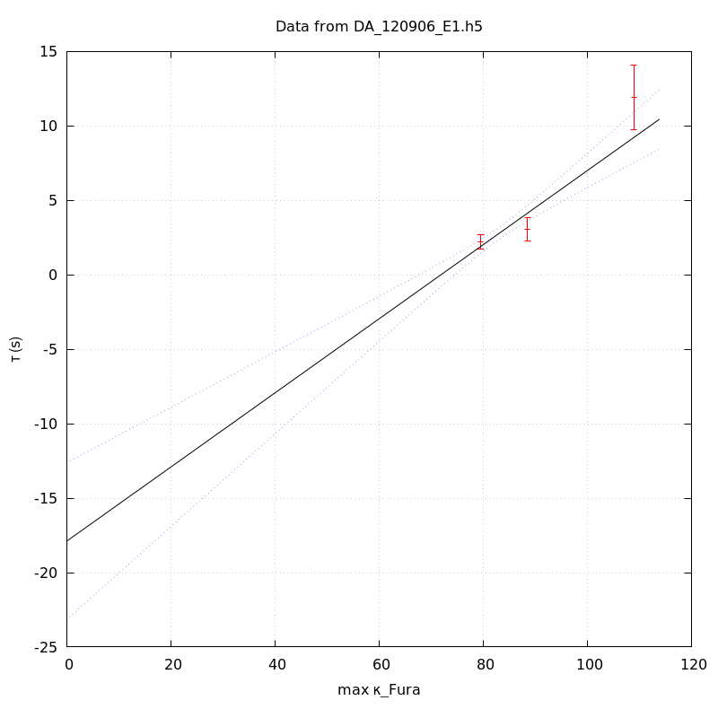

*Analysis of dataset DA_120906_E1*
-----

[TOC]

The baseline length is: 7.

**When fitting tau against kappa_Fura only the transients for which the fit RSS and the lag 1 auto-correlation of the residuals were small enough, giving an overall probability of false negative of 0.02, were kept** (see the numerical summary associated with each transient).

The good transients are: 1, 3, 4.

# Loading curve
The time at which the 'good' transients were recorded appear in red.

# Transients 
On each graph, the residuals appear on top.
**Under the null hypothesis**, if the monoexponential fit is correct **they should be centered on 0 and have a SD close to 1** (not exactly 1 since parameters were obtained through the fitting procedure form the data.

The estimated [Ca2+] appears on the second row. The estimate is show in black together with pointwise 95% confidence intervals. The fitted curve appears in red. **The whole transient is not fitted**, only a portion of it is: a portion of the baseline made of 7 points and the decay phase starting at the time where the Delta[Ca2+] has reached 50% of its peak value.

The time appearing on the abscissa is the time from the beginning of the experiment.

## Transient 1
**Transient 1 is 'good'.**

### Fit graphical summary

### Fit numerical summary

> nobs = 174

> number of degrees of freedom = 171

> baseline length = 7

> fit started from point 33

> estimated baseline 0.0294043 and standard error 0.000495979

> estimated delta 0.0328198 and standard error 0.00229856

> estimated tau 2.19606 and standard error 0.245396

> residual sum of squares: 189.522

> RSS per degree of freedom: 1.10831

> Probability of observing a larger of equal RSS per DOF under the null hypothesis: 0.15787

> Lag 1 residuals auto-correlation: -0.026

> Pr[Lag 1 auto-corr. > -0.026] = 0.599

## Transient 2
**Transient 2 is a 'bad'.**

### Fit graphical summary

### Fit numerical summary

> nobs = 170

> number of degrees of freedom = 167

> baseline length = 7

> fit started from point 37

> estimated baseline 0.0609398 and standard error 0.00117512

> estimated delta 0.0368121 and standard error 0.00138225

> estimated tau 6.92681 and standard error 0.655161

> residual sum of squares: 220.469

> RSS per degree of freedom: 1.32018

> Probability of observing a larger of equal RSS per DOF under the null hypothesis: 0.00349917

> WARNING: THE FIT IS NOT GOOD!

> Lag 1 residuals auto-correlation: 0.117

> Pr[Lag 1 auto-corr. > 0.117] = 0.099

## Transient 3
**Transient 3 is 'good'.**

### Fit graphical summary

### Fit numerical summary

> nobs = 165

> number of degrees of freedom = 162

> baseline length = 7

> fit started from point 42

> estimated baseline 0.130521 and standard error 0.000725029

> estimated delta 0.0308078 and standard error 0.00203744

> estimated tau 3.05313 and standard error 0.389237

> residual sum of squares: 179.504

> RSS per degree of freedom: 1.10805

> Probability of observing a larger of equal RSS per DOF under the null hypothesis: 0.164483

> Lag 1 residuals auto-correlation: 0.011

> Pr[Lag 1 auto-corr. > 0.011] = 0.404

## Transient 4
**Transient 4 is 'good'.**

### Fit graphical summary

### Fit numerical summary

> nobs = 179

> number of degrees of freedom = 176

> baseline length = 7

> fit started from point 28

> estimated baseline 0.135092 and standard error 0.0011255

> estimated delta 0.0415961 and standard error 0.00148409

> estimated tau 11.9335 and standard error 1.10399

> residual sum of squares: 182.36

> RSS per degree of freedom: 1.03613

> Probability of observing a larger of equal RSS per DOF under the null hypothesis: 0.355538

> Lag 1 residuals auto-correlation: 0.076

> Pr[Lag 1 auto-corr. > 0.076] = 0.161

# tau vs kappa 
Since the [Fura] changes during a transient (and it can change a lot during the early transients), the _unique_ value to use as '[Fura]' is not obvious. We therefore perform 3 fits: one using the minimal value, one using the mean and one using the maximal value.

The observed tau (shown in red) are displayed with a 95% confidence interval that results from the fitting procedure and _is_ therefore _meaningful only if the fit is correct_!

No serious attempt at quantifying the precision of [Fura] and therefore kappa_Fura has been made since the choice of which [Fura] to use has a larger effect and since the other dominating effect is often the certainty we can have that the saturating value (the [Fura] in the pipette) has been reached.

The straight line in black is the result of a _weighted_ linear regression. The blue dotted lines correspond to the limits of _pointwise 95% confidence intervals_.

## tau vs kappa  using the min [Fura] value
### Fit graphical summary

### Fit numerical summary

> Best fit: tau = -9.42271 + 0.165536 kappa_Fura

> Covariance matrix:

> [ +3.25022e+00, -4.35833e-02  

>   -4.35833e-02, +5.92004e-04  ]

> Total sum of squares (TSS) = 74.8946

> chisq (Residual sum of squares, RSS) = 28.6076

> Probability of observing a larger of equal RSS per DOF under the null hypothesis: 8.86332e-08

> R squared (1-RSS/TSS) = 0.618028

> Estimated gamma/v with standard error: 6.04099 +/- 0.88793

> Estimates kappa_S with standard error (using error propagation): -57.9226 +/- 13.7337

> kappa_S confidence intervals based on parametric bootstrap

> 0.95 CI for kappa_S: [-62.3143,-50.5641]

> 0.99 CI for kappa_S: [-63.3537,-46.825]

## tau vs kappa  using the mean [Fura] value
### Fit graphical summary

### Fit numerical summary

> Best fit: tau = -13.6918 + 0.208884 kappa_Fura

> Covariance matrix:

> [ +5.13322e+00, -6.46311e-02  

>   -6.46311e-02, +8.20406e-04  ]

> Total sum of squares (TSS) = 74.8946

> chisq (Residual sum of squares, RSS) = 21.7103

> Probability of observing a larger of equal RSS per DOF under the null hypothesis: 3.17091e-06

> R squared (1-RSS/TSS) = 0.710122

> Estimated gamma/v with standard error: 4.78733 +/- 0.65645

> Estimates kappa_S with standard error (using error propagation): -66.5471 +/- 14.0865

> kappa_S confidence intervals based on parametric bootstrap

> 0.95 CI for kappa_S: [-69.7983,-60.9418]

> 0.99 CI for kappa_S: [-70.6262,-58.1578]

## tau vs kappa  using the max [Fura] value
### Fit graphical summary

### Fit numerical summary

> Best fit: tau = -17.8818 + 0.248863 kappa_Fura

> Covariance matrix:

> [ +7.21813e+00, -8.65053e-02  

>   -8.65053e-02, +1.04273e-03  ]

> Total sum of squares (TSS) = 74.8946

> chisq (Residual sum of squares, RSS) = 15.4997

> Probability of observing a larger of equal RSS per DOF under the null hypothesis: 8.25195e-05

> R squared (1-RSS/TSS) = 0.793047

> Estimated gamma/v with standard error: 4.01827 +/- 0.521392

> Estimates kappa_S with standard error (using error propagation): -72.8537 +/- 14.2644

> kappa_S confidence intervals based on parametric bootstrap

> 0.95 CI for kappa_S: [-75.5726,-68.6405]

> 0.99 CI for kappa_S: [-76.2269,-66.7985]

# RSS per DOF, standard error of tau and lag 1 residual correlation for each 'good' tansient
3 out of 4 transients  were kept.

sigma(tau): 0.245396, 0.389237, 1.10399

Residual correlation at lag 1: -0.025562990498879737, 0.010664768462827427, 0.07628334371598358

Probablity of a correlation at lag 1 smaller or equal than observed: 0.599, 0.404, 0.16100000000000003

RSS/DOF: 1.10831, 1.10805, 1.03613
