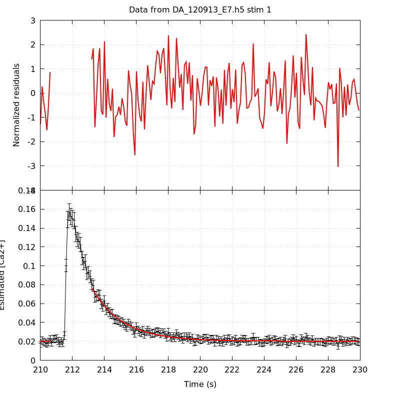
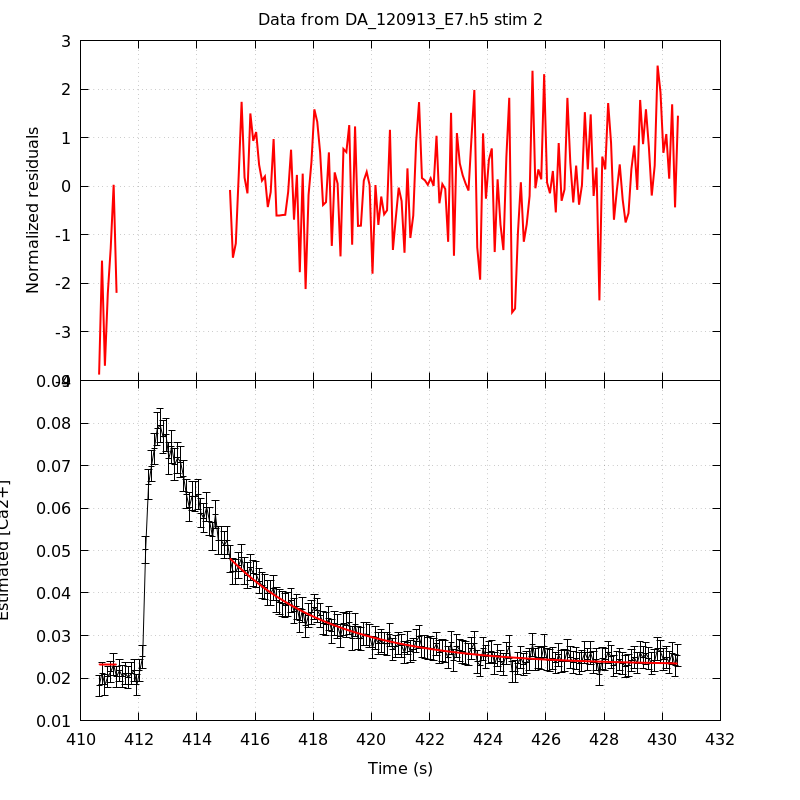
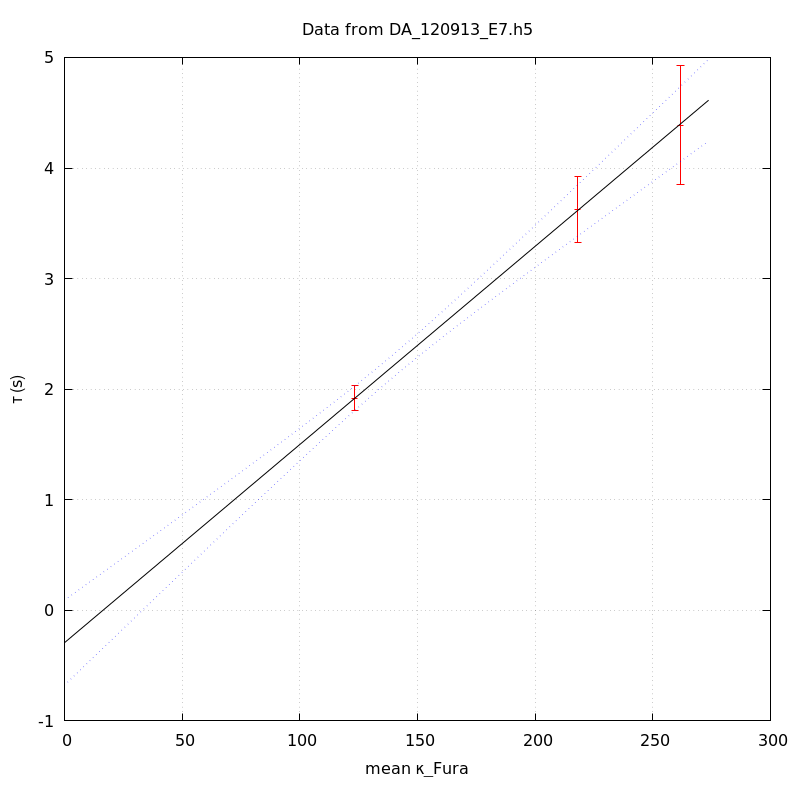
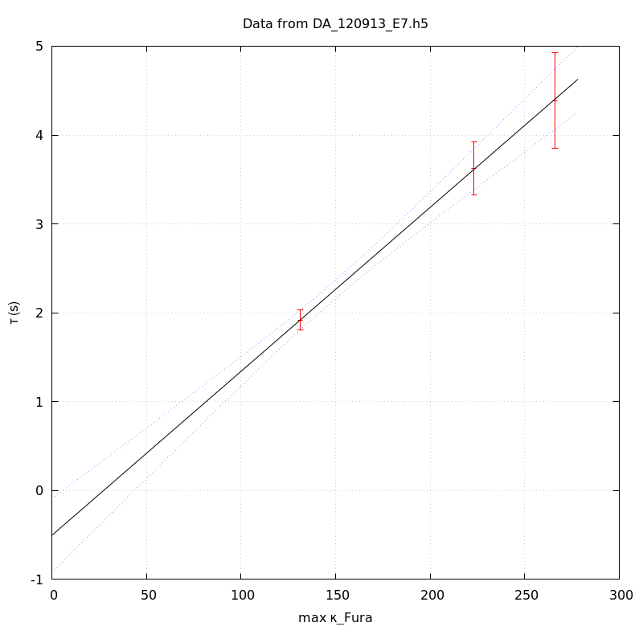

*Analysis of dataset DA_120913_E7*
-----

[TOC]

The baseline length is: 7.

**When fitting tau against kappa_Fura only the transients for which the fit RSS and the lag 1 auto-correlation of the residuals were small enough, giving an overall probability of false negative of 0.02, were kept** (see the numerical summary associated with each transient).

The good transients are: 1, 2, 3.

# Loading curve
The time at which the 'good' transients were recorded appear in red.

# Transients 
On each graph, the residuals appear on top.
**Under the null hypothesis**, if the monoexponential fit is correct **they should be centered on 0 and have a SD close to 1** (not exactly 1 since parameters were obtained through the fitting procedure form the data.

The estimated [Ca2+] appears on the second row. The estimate is show in black together with pointwise 95% confidence intervals. The fitted curve appears in red. **The whole transient is not fitted**, only a portion of it is: a portion of the baseline made of 7 points and the decay phase starting at the time where the Delta[Ca2+] has reached 50% of its peak value.

The time appearing on the abscissa is the time from the beginning of the experiment.

## Transient 1
**Transient 1 is 'good'.**

### Fit graphical summary

### Fit numerical summary

> nobs = 175

> number of degrees of freedom = 172

> baseline length = 7

> fit started from point 32

> estimated baseline 0.0202758 and standard error 0.000189835

> estimated delta 0.0561449 and standard error 0.00116294

> estimated tau 1.91964 and standard error 0.0568146

> residual sum of squares: 173.543

> RSS per degree of freedom: 1.00897

> Probability of observing a larger of equal RSS per DOF under the null hypothesis: 0.45269

> Lag 1 residuals auto-correlation: 0.113

> Pr[Lag 1 auto-corr. > 0.113] = 0.054

## Transient 2
**Transient 2 is 'good'.**

### Fit graphical summary

### Fit numerical summary

> nobs = 162

> number of degrees of freedom = 159

> baseline length = 7

> fit started from point 45

> estimated baseline 0.0230988 and standard error 0.000223063

> estimated delta 0.0250354 and standard error 0.000494898

> estimated tau 3.62301 and standard error 0.151921

> residual sum of squares: 198.984

> RSS per degree of freedom: 1.25147

> Probability of observing a larger of equal RSS per DOF under the null hypothesis: 0.0172396

> Lag 1 residuals auto-correlation: 0.226

> Pr[Lag 1 auto-corr. > 0.226] = 0.010

## Transient 3
**Transient 3 is 'good'.**

### Fit graphical summary

### Fit numerical summary

> nobs = 154

> number of degrees of freedom = 151

> baseline length = 7

> fit started from point 53

> estimated baseline 0.0287479 and standard error 0.000263838

> estimated delta 0.0159997 and standard error 0.000403451

> estimated tau 4.38565 and standard error 0.274299

> residual sum of squares: 179.146

> RSS per degree of freedom: 1.1864

> Probability of observing a larger of equal RSS per DOF under the null hypothesis: 0.0586175

> Lag 1 residuals auto-correlation: 0.047

> Pr[Lag 1 auto-corr. > 0.047] = 0.300

## Transient 4
**Transient 4 is a 'bad'.**

### Fit graphical summary

### Fit numerical summary

> nobs = 178

> number of degrees of freedom = 175

> baseline length = 7

> fit started from point 29

> estimated baseline 0.0265472 and standard error 0.000143812

> estimated delta 0.01219 and standard error 0.000412535

> estimated tau 6.2297 and standard error 0.407447

> residual sum of squares: 210.162

> RSS per degree of freedom: 1.20093

> Probability of observing a larger of equal RSS per DOF under the null hypothesis: 0.0357996

> Lag 1 residuals auto-correlation: 0.396

> Pr[Lag 1 auto-corr. > 0.396] = 0.000

# tau vs kappa 
Since the [Fura] changes during a transient (and it can change a lot during the early transients), the _unique_ value to use as '[Fura]' is not obvious. We therefore perform 3 fits: one using the minimal value, one using the mean and one using the maximal value.

The observed tau (shown in red) are displayed with a 95% confidence interval that results from the fitting procedure and _is_ therefore _meaningful only if the fit is correct_!

No serious attempt at quantifying the precision of [Fura] and therefore kappa_Fura has been made since the choice of which [Fura] to use has a larger effect and since the other dominating effect is often the certainty we can have that the saturating value (the [Fura] in the pipette) has been reached.

The straight line in black is the result of a _weighted_ linear regression. The blue dotted lines correspond to the limits of _pointwise 95% confidence intervals_.

## tau vs kappa  using the min [Fura] value
### Fit graphical summary

### Fit numerical summary

> Best fit: tau = -0.0368993 + 0.0172296 kappa_Fura

> Covariance matrix:

> [ +3.15025e-02, -2.20589e-04  

>   -2.20589e-04, +1.69113e-06  ]

> Total sum of squares (TSS) = 175.538

> chisq (Residual sum of squares, RSS) = 0.00016647

> Probability of observing a larger of equal RSS per DOF under the null hypothesis: 0.989706

> R squared (1-RSS/TSS) = 0.999999

> Estimated gamma/v with standard error: 58.0398 +/- 4.38066

> Estimates kappa_S with standard error (using error propagation): -3.14163 +/- 10.3027

> kappa_S confidence intervals based on parametric bootstrap

> 0.95 CI for kappa_S: [-20.6793,19.9355]

> 0.99 CI for kappa_S: [-25.7473,29.3511]

## tau vs kappa  using the mean [Fura] value
### Fit graphical summary

### Fit numerical summary

> Best fit: tau = -0.292744 + 0.0179219 kappa_Fura

> Covariance matrix:

> [ +3.84271e-02, -2.55578e-04  

>   -2.55578e-04, +1.82979e-06  ]

> Total sum of squares (TSS) = 175.538

> chisq (Residual sum of squares, RSS) = 0.00328115

> Probability of observing a larger of equal RSS per DOF under the null hypothesis: 0.954321

> R squared (1-RSS/TSS) = 0.999981

> Estimated gamma/v with standard error: 55.7978 +/- 4.21148

> Estimates kappa_S with standard error (using error propagation): -17.3345 +/- 11.0072

> kappa_S confidence intervals based on parametric bootstrap

> 0.95 CI for kappa_S: [-34.116,5.49188]

> 0.99 CI for kappa_S: [-38.2808,14.3063]

## tau vs kappa  using the max [Fura] value
### Fit graphical summary

### Fit numerical summary

> Best fit: tau = -0.50432 + 0.0184497 kappa_Fura

> Covariance matrix:

> [ +4.47173e-02, -2.85348e-04  

>   -2.85348e-04, +1.93919e-06  ]

> Total sum of squares (TSS) = 175.538

> chisq (Residual sum of squares, RSS) = 0.006514

> Probability of observing a larger of equal RSS per DOF under the null hypothesis: 0.935673

> R squared (1-RSS/TSS) = 0.999963

> Estimated gamma/v with standard error: 54.2015 +/- 4.09104

> Estimates kappa_S with standard error (using error propagation): -28.3349 +/- 11.6459

> kappa_S confidence intervals based on parametric bootstrap

> 0.95 CI for kappa_S: [-44.889,-7.14473]

> 0.99 CI for kappa_S: [-49.342,1.11591]

# RSS per DOF, standard error of tau and lag 1 residual correlation for each 'good' tansient
3 out of 4 transients  were kept.

sigma(tau): 0.0568146, 0.151921, 0.274299

Residual correlation at lag 1: 0.11295059907195004, 0.2262615694013584, 0.04655570761404221

Probablity of a correlation at lag 1 smaller or equal than observed: 0.05400000000000005, 0.010000000000000009, 0.30000000000000004

RSS/DOF: 1.00897, 1.25147, 1.1864
