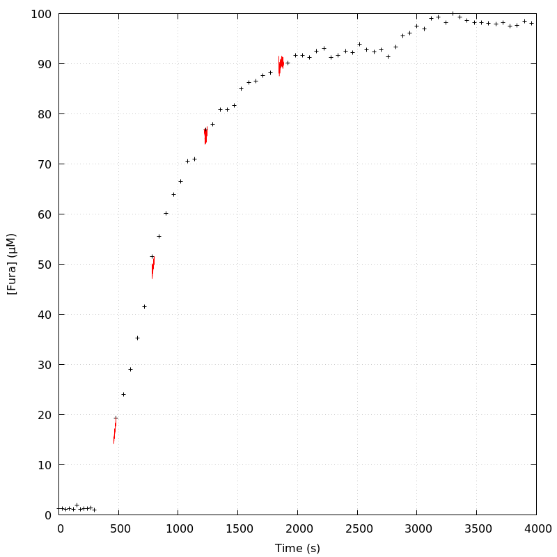
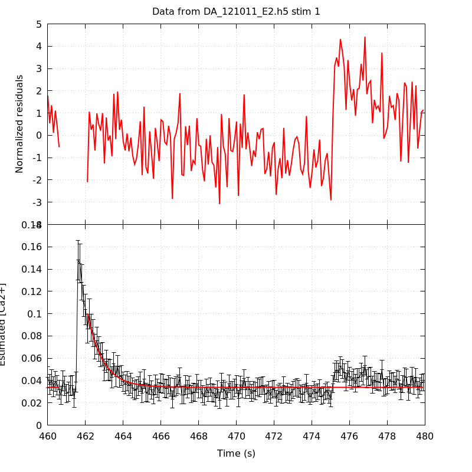
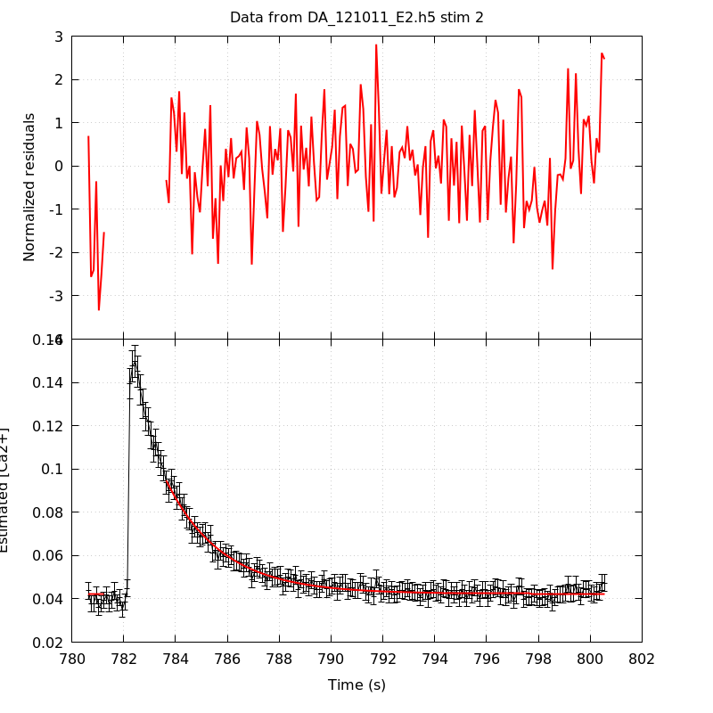
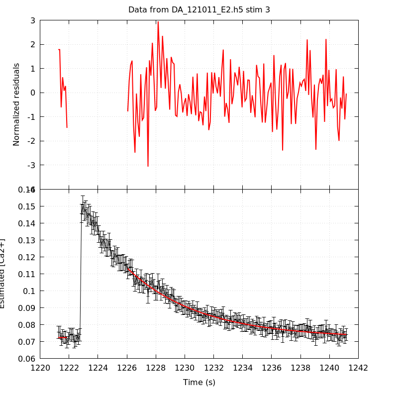
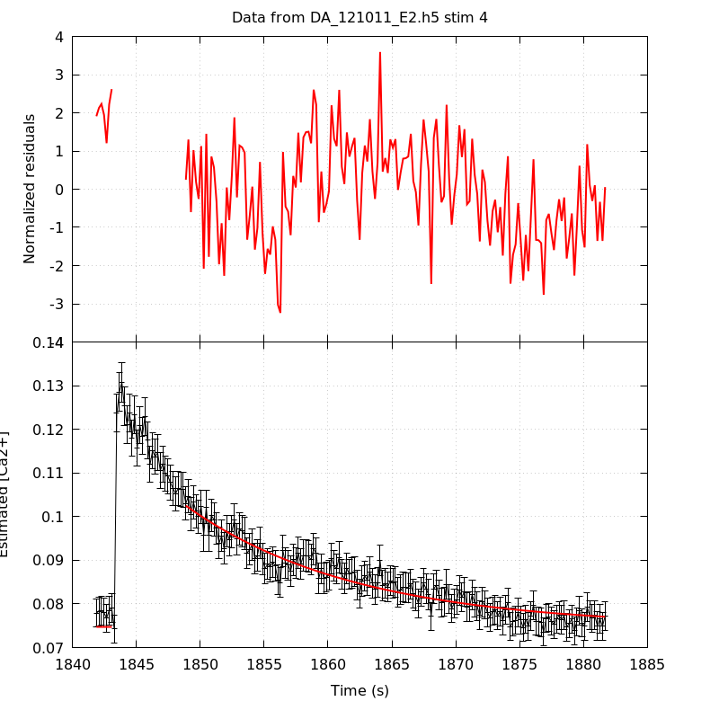

*Analysis of dataset DA_121011_E2*
-----

[TOC]

The baseline length is: 7.

**When fitting tau against kappa_Fura only the transients for which the fit RSS and the lag 1 auto-correlation of the residuals were small enough, giving an overall probability of false negative of 0.02, were kept** (see the numerical summary associated with each transient).

The good transients are: 2, 3.

**Not enough good transients to keep going!**

# Loading curve
The time at which the 'good' transients were recorded appear in red.

# Transients 
On each graph, the residuals appear on top.
**Under the null hypothesis**, if the monoexponential fit is correct **they should be centered on 0 and have a SD close to 1** (not exactly 1 since parameters were obtained through the fitting procedure form the data.

The estimated [Ca2+] appears on the second row. The estimate is show in black together with pointwise 95% confidence intervals. The fitted curve appears in red. **The whole transient is not fitted**, only a portion of it is: a portion of the baseline made of 7 points and the decay phase starting at the time where the Delta[Ca2+] has reached 50% of its peak value.

The time appearing on the abscissa is the time from the beginning of the experiment.

## Transient 1
**Transient 1 is a 'bad'.**

### Fit graphical summary

### Fit numerical summary

> nobs = 186

> number of degrees of freedom = 183

> baseline length = 7

> fit started from point 21

> estimated baseline 0.0340468 and standard error 0.000323908

> estimated delta 0.0661704 and standard error 0.0038857

> estimated tau 0.808245 and standard error 0.0621

> residual sum of squares: 426.211

> RSS per degree of freedom: 2.32902

> Probability of observing a larger of equal RSS per DOF under the null hypothesis: 1.87922e-21

> WARNING: THE FIT IS NOT GOOD!

> Lag 1 residuals auto-correlation: 1.159

> Pr[Lag 1 auto-corr. > 1.159] = 0.000

## Transient 2
**Transient 2 is 'good'.**

### Fit graphical summary

### Fit numerical summary

> nobs = 177

> number of degrees of freedom = 174

> baseline length = 7

> fit started from point 30

> estimated baseline 0.0423806 and standard error 0.000203824

> estimated delta 0.0523367 and standard error 0.00105707

> estimated tau 2.14881 and standard error 0.0657425

> residual sum of squares: 202.185

> RSS per degree of freedom: 1.16198

> Probability of observing a larger of equal RSS per DOF under the null hypothesis: 0.070574

> Lag 1 residuals auto-correlation: 0.150

> Pr[Lag 1 auto-corr. > 0.150] = 0.038

## Transient 3
**Transient 3 is 'good'.**

### Fit graphical summary

### Fit numerical summary

> nobs = 159

> number of degrees of freedom = 156

> baseline length = 7

> fit started from point 48

> estimated baseline 0.0722043 and standard error 0.000437676

> estimated delta 0.0409214 and standard error 0.000631848

> estimated tau 5.02954 and standard error 0.192819

> residual sum of squares: 173.463

> RSS per degree of freedom: 1.11194

> Probability of observing a larger of equal RSS per DOF under the null hypothesis: 0.160741

> Lag 1 residuals auto-correlation: -0.004

> Pr[Lag 1 auto-corr. > -0.004] = 0.493

## Transient 4
**Transient 4 is a 'bad'.**

### Fit graphical summary

### Fit numerical summary

> nobs = 172

> number of degrees of freedom = 169

> baseline length = 7

> fit started from point 35

> estimated baseline 0.0747292 and standard error 0.000461961

> estimated delta 0.0277771 and standard error 0.000532699

> estimated tau 13.2325 and standard error 0.669589

> residual sum of squares: 290.504

> RSS per degree of freedom: 1.71896

> Probability of observing a larger of equal RSS per DOF under the null hypothesis: 1.82029e-08

> WARNING: THE FIT IS NOT GOOD!

> Lag 1 residuals auto-correlation: 0.741

> Pr[Lag 1 auto-corr. > 0.741] = 0.000

# RSS per DOF, standard error of tau and lag 1 residual correlation for each 'good' tansient
2 out of 4 transients  were kept.

sigma(tau): 0.0657425, 0.192819

Residual correlation at lag 1: 0.14991920663820357, -0.00421235174644544

Probablity of a correlation at lag 1 smaller or equal than observed: 0.038000000000000034, 0.493

RSS/DOF: 1.16198, 1.11194
