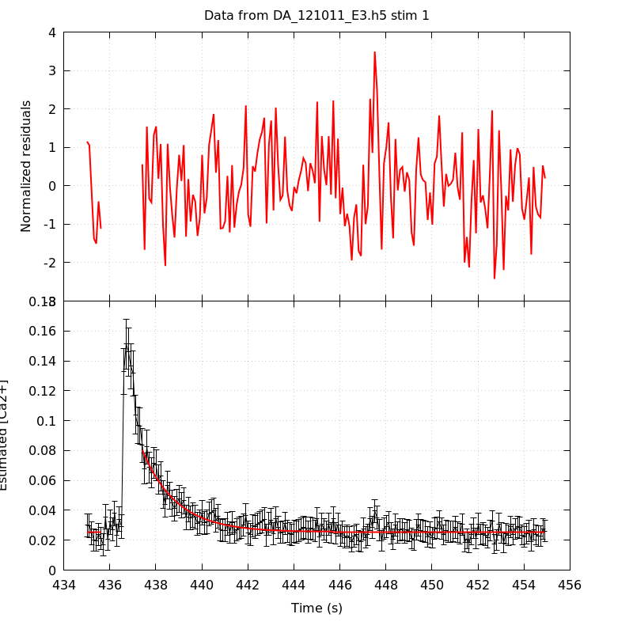
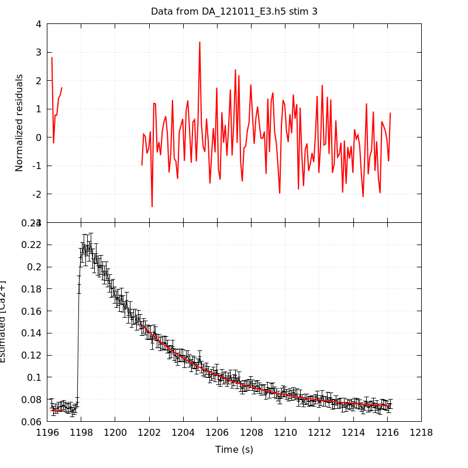
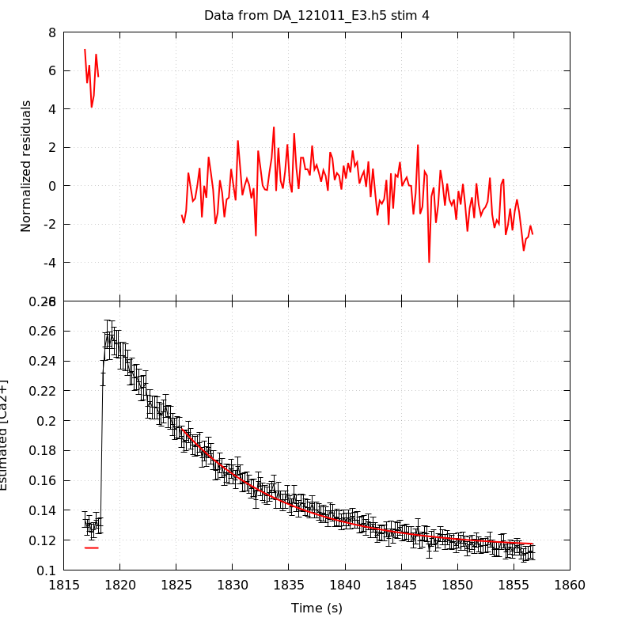
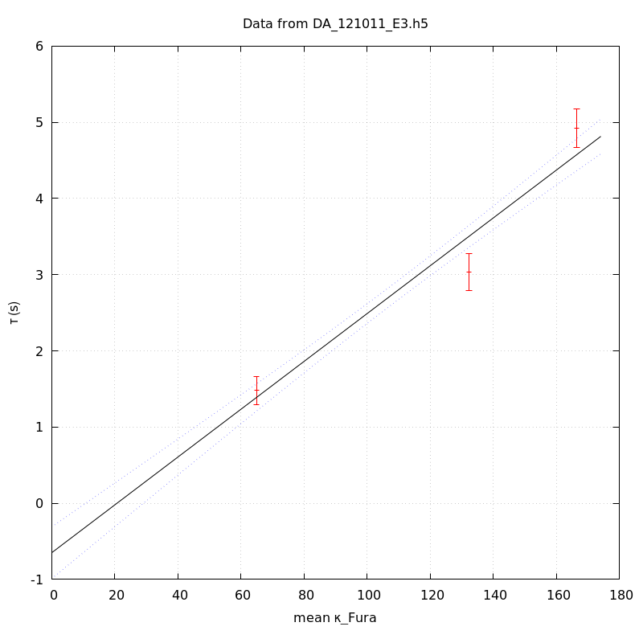

*Analysis of dataset DA_121011_E3*
-----

[TOC]

The baseline length is: 7.

**When fitting tau against kappa_Fura only the transients for which the fit RSS and the lag 1 auto-correlation of the residuals were small enough, giving an overall probability of false negative of 0.02, were kept** (see the numerical summary associated with each transient).

The good transients are: 1, 2, 3.

# Loading curve
The time at which the 'good' transients were recorded appear in red.

# Transients 
On each graph, the residuals appear on top.
**Under the null hypothesis**, if the monoexponential fit is correct **they should be centered on 0 and have a SD close to 1** (not exactly 1 since parameters were obtained through the fitting procedure form the data.

The estimated [Ca2+] appears on the second row. The estimate is show in black together with pointwise 95% confidence intervals. The fitted curve appears in red. **The whole transient is not fitted**, only a portion of it is: a portion of the baseline made of 7 points and the decay phase starting at the time where the Delta[Ca2+] has reached 50% of its peak value.

The time appearing on the abscissa is the time from the beginning of the experiment.

## Transient 1
**Transient 1 is 'good'.**

### Fit graphical summary

### Fit numerical summary

> nobs = 183

> number of degrees of freedom = 180

> baseline length = 7

> fit started from point 24

> estimated baseline 0.0254829 and standard error 0.000329797

> estimated delta 0.0549105 and standard error 0.0025399

> estimated tau 1.47966 and standard error 0.0933651

> residual sum of squares: 206.939

> RSS per degree of freedom: 1.14966

> Probability of observing a larger of equal RSS per DOF under the null hypothesis: 0.0823716

> Lag 1 residuals auto-correlation: 0.147

> Pr[Lag 1 auto-corr. > 0.147] = 0.036

## Transient 2
**Transient 2 is 'good'.**

### Fit graphical summary

### Fit numerical summary

> nobs = 170

> number of degrees of freedom = 167

> baseline length = 7

> fit started from point 37

> estimated baseline 0.0372288 and standard error 0.000316304

> estimated delta 0.0457024 and standard error 0.00103654

> estimated tau 3.03295 and standard error 0.122822

> residual sum of squares: 178.923

> RSS per degree of freedom: 1.0714

> Probability of observing a larger of equal RSS per DOF under the null hypothesis: 0.250224

> Lag 1 residuals auto-correlation: 0.056

> Pr[Lag 1 auto-corr. > 0.056] = 0.210

## Transient 3
**Transient 3 is 'good'.**

### Fit graphical summary

### Fit numerical summary

> nobs = 154

> number of degrees of freedom = 151

> baseline length = 7

> fit started from point 53

> estimated baseline 0.070116 and standard error 0.000549546

> estimated delta 0.0774127 and standard error 0.000869241

> estimated tau 4.92475 and standard error 0.129902

> residual sum of squares: 166.322

> RSS per degree of freedom: 1.10147

> Probability of observing a larger of equal RSS per DOF under the null hypothesis: 0.186317

> Lag 1 residuals auto-correlation: 0.060

> Pr[Lag 1 auto-corr. > 0.060] = 0.216

## Transient 4
**Transient 4 is a 'bad'.**

### Fit graphical summary

### Fit numerical summary

> nobs = 164

> number of degrees of freedom = 161

> baseline length = 7

> fit started from point 43

> estimated baseline 0.11465 and standard error 0.000567282

> estimated delta 0.0799823 and standard error 0.000957125

> estimated tau 9.52079 and standard error 0.268262

> residual sum of squares: 494.079

> RSS per degree of freedom: 3.06882

> Probability of observing a larger of equal RSS per DOF under the null hypothesis: 1.59194e-35

> WARNING: THE FIT IS NOT GOOD!

> Lag 1 residuals auto-correlation: 1.759

> Pr[Lag 1 auto-corr. > 1.759] = 0.000

# tau vs kappa 
Since the [Fura] changes during a transient (and it can change a lot during the early transients), the _unique_ value to use as '[Fura]' is not obvious. We therefore perform 3 fits: one using the minimal value, one using the mean and one using the maximal value.

The observed tau (shown in red) are displayed with a 95% confidence interval that results from the fitting procedure and _is_ therefore _meaningful only if the fit is correct_!

No serious attempt at quantifying the precision of [Fura] and therefore kappa_Fura has been made since the choice of which [Fura] to use has a larger effect and since the other dominating effect is often the certainty we can have that the saturating value (the [Fura] in the pipette) has been reached.

The straight line in black is the result of a _weighted_ linear regression. The blue dotted lines correspond to the limits of _pointwise 95% confidence intervals_.

## tau vs kappa  using the min [Fura] value
### Fit graphical summary

### Fit numerical summary

> Best fit: tau = -0.410355 + 0.0307088 kappa_Fura

> Covariance matrix:

> [ +2.65741e-02, -2.17231e-04  

>   -2.17231e-04, +2.10553e-06  ]

> Total sum of squares (TSS) = 470.696

> chisq (Residual sum of squares, RSS) = 22.8138

> Probability of observing a larger of equal RSS per DOF under the null hypothesis: 1.78481e-06

> R squared (1-RSS/TSS) = 0.951532

> Estimated gamma/v with standard error: 32.5639 +/- 1.5387

> Estimates kappa_S with standard error (using error propagation): -14.3628 +/- 5.34585

> kappa_S confidence intervals based on parametric bootstrap

> 0.95 CI for kappa_S: [-23.0005,-4.20586]

> 0.99 CI for kappa_S: [-25.6815,-0.586103]

## tau vs kappa  using the mean [Fura] value
### Fit graphical summary

### Fit numerical summary

> Best fit: tau = -0.648177 + 0.0313714 kappa_Fura

> Covariance matrix:

> [ +3.00629e-02, -2.38557e-04  

>   -2.38557e-04, +2.19720e-06  ]

> Total sum of squares (TSS) = 470.696

> chisq (Residual sum of squares, RSS) = 22.7773

> Probability of observing a larger of equal RSS per DOF under the null hypothesis: 1.81905e-06

> R squared (1-RSS/TSS) = 0.951609

> Estimated gamma/v with standard error: 31.8761 +/- 1.50614

> Estimates kappa_S with standard error (using error propagation): -21.6614 +/- 5.61246

> kappa_S confidence intervals based on parametric bootstrap

> 0.95 CI for kappa_S: [-30.0742,-11.4398]

> 0.99 CI for kappa_S: [-32.3528,-7.92428]

## tau vs kappa  using the max [Fura] value
### Fit graphical summary

### Fit numerical summary

> Best fit: tau = -0.833393 + 0.0318132 kappa_Fura

> Covariance matrix:

> [ +3.28969e-02, -2.54545e-04  

>   -2.54545e-04, +2.25485e-06  ]

> Total sum of squares (TSS) = 470.696

> chisq (Residual sum of squares, RSS) = 21.85

> Probability of observing a larger of equal RSS per DOF under the null hypothesis: 2.94814e-06

> R squared (1-RSS/TSS) = 0.953579

> Estimated gamma/v with standard error: 31.4335 +/- 1.48369

> Estimates kappa_S with standard error (using error propagation): -27.1964 +/- 5.8338

> kappa_S confidence intervals based on parametric bootstrap

> 0.95 CI for kappa_S: [-35.5953,-17.671]

> 0.99 CI for kappa_S: [-38.0829,-14.22]

# RSS per DOF, standard error of tau and lag 1 residual correlation for each 'good' tansient
3 out of 4 transients  were kept.

sigma(tau): 0.0933651, 0.122822, 0.129902

Residual correlation at lag 1: 0.14694671702604067, 0.05643923435805149, 0.060061285757553075

Probablity of a correlation at lag 1 smaller or equal than observed: 0.03600000000000003, 0.20999999999999996, 0.21599999999999997

RSS/DOF: 1.14966, 1.0714, 1.10147
