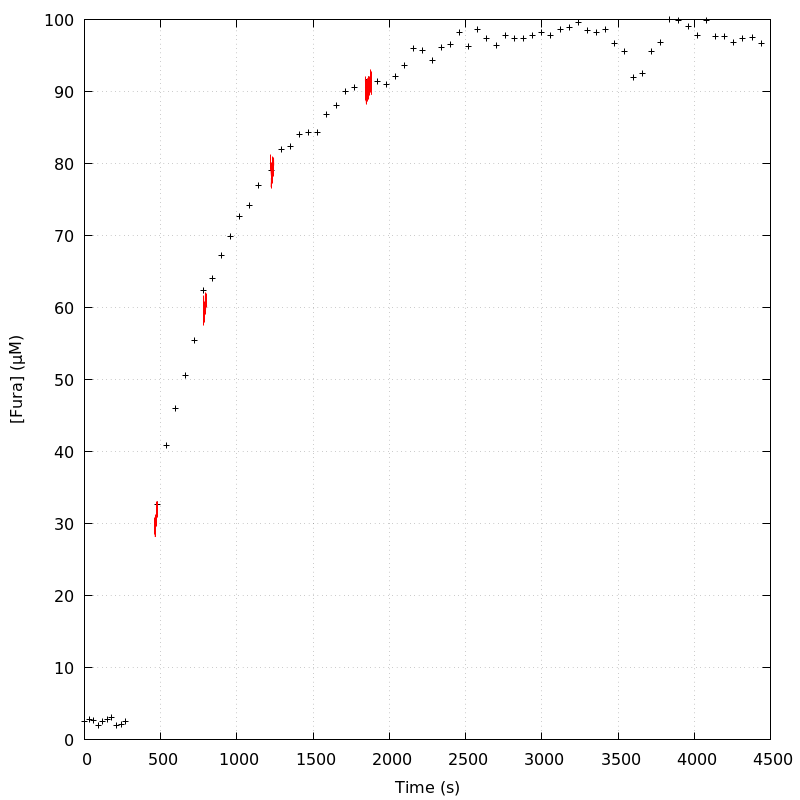
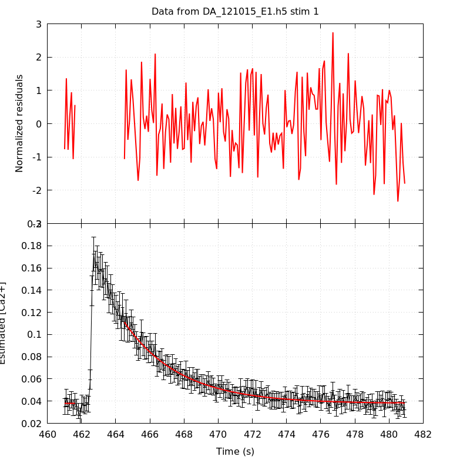
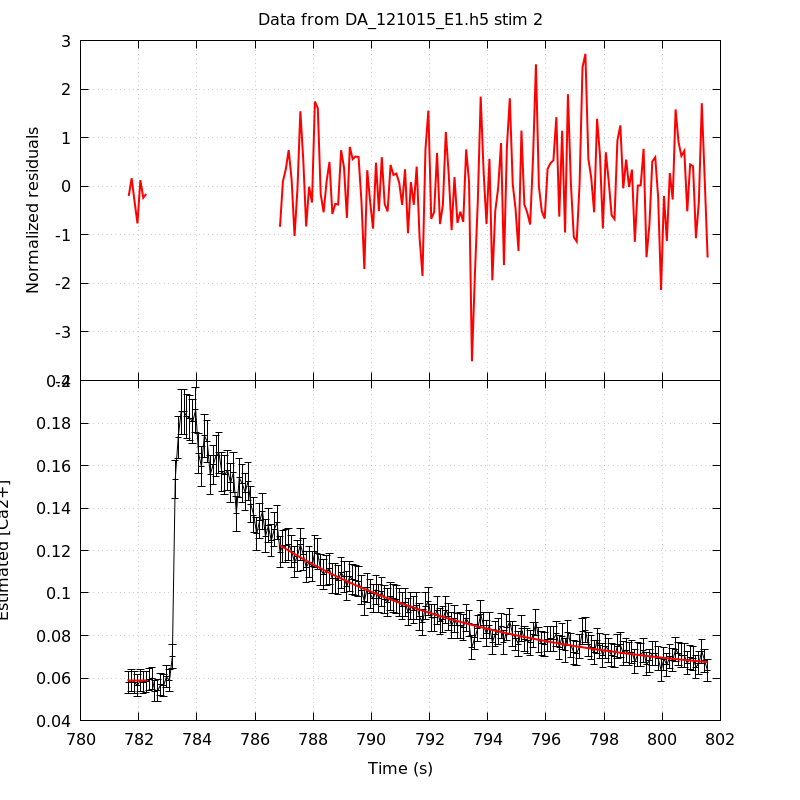
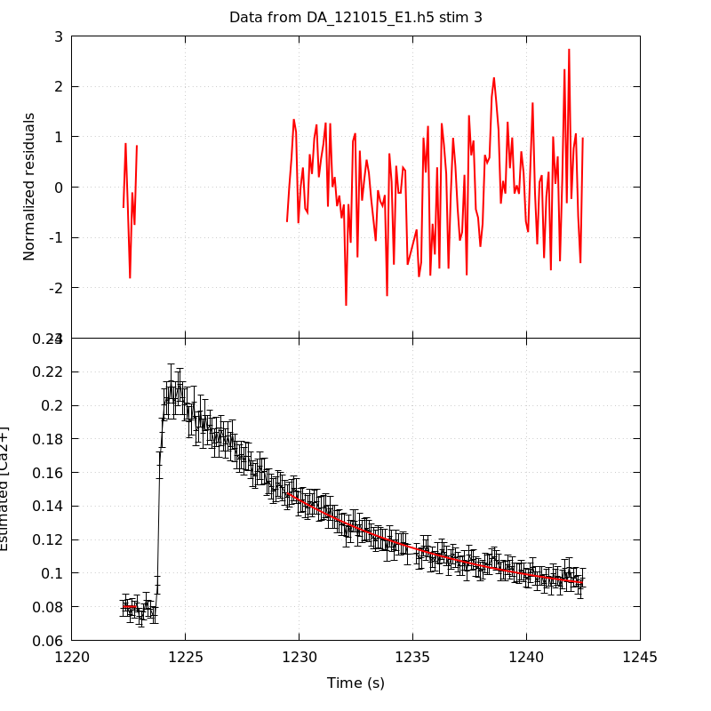
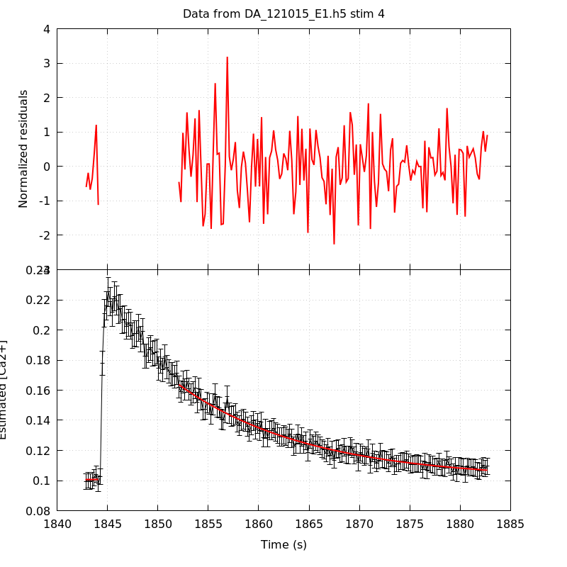
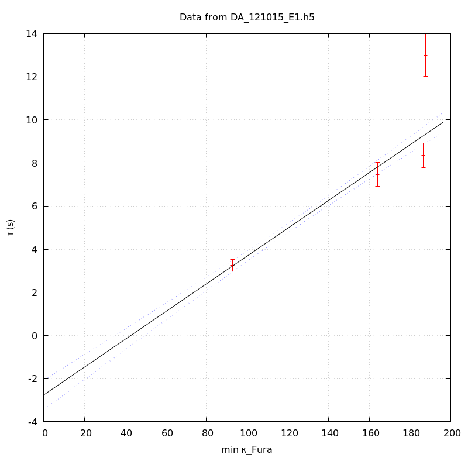
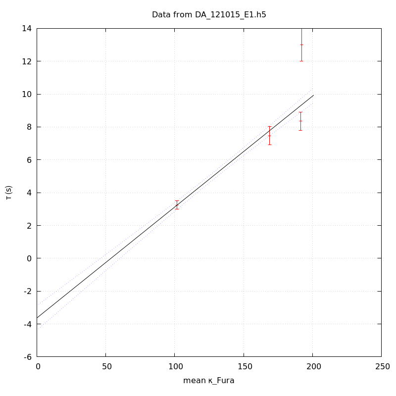
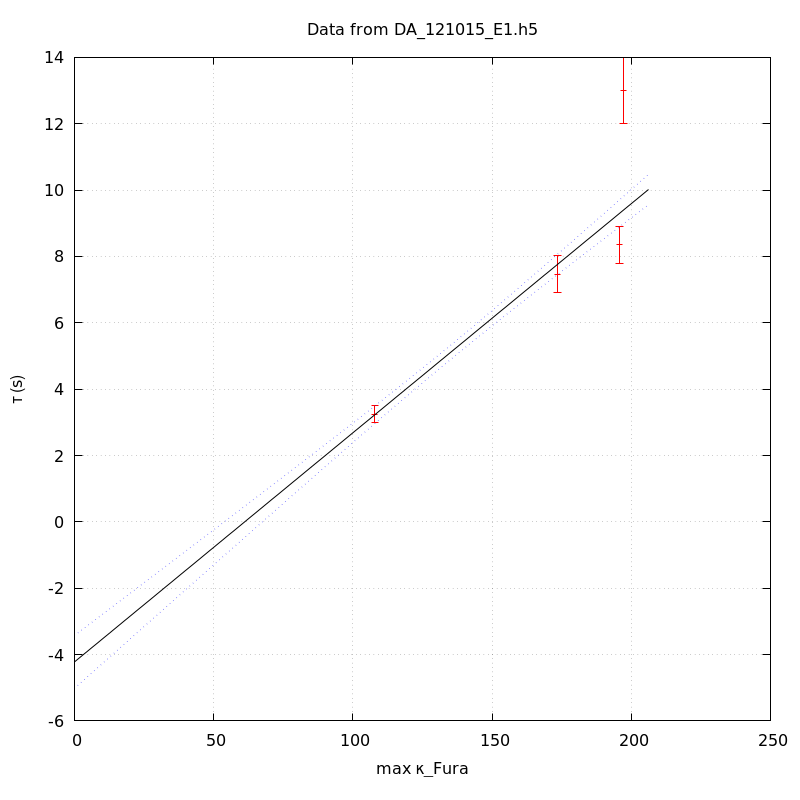

*Analysis of dataset DA_121015_E1*
-----

[TOC]

The baseline length is: 7.

**When fitting tau against kappa_Fura only the transients for which the fit RSS and the lag 1 auto-correlation of the residuals were small enough, giving an overall probability of false negative of 0.02, were kept** (see the numerical summary associated with each transient).

The good transients are: 1, 2, 3, 4.

# Loading curve
The time at which the 'good' transients were recorded appear in red.

# Transients 
On each graph, the residuals appear on top.
**Under the null hypothesis**, if the monoexponential fit is correct **they should be centered on 0 and have a SD close to 1** (not exactly 1 since parameters were obtained through the fitting procedure form the data.

The estimated [Ca2+] appears on the second row. The estimate is show in black together with pointwise 95% confidence intervals. The fitted curve appears in red. **The whole transient is not fitted**, only a portion of it is: a portion of the baseline made of 7 points and the decay phase starting at the time where the Delta[Ca2+] has reached 50% of its peak value.

The time appearing on the abscissa is the time from the beginning of the experiment.

## Transient 1
**Transient 1 is 'good'.**

### Fit graphical summary

### Fit numerical summary

> nobs = 172

> number of degrees of freedom = 169

> baseline length = 7

> fit started from point 35

> estimated baseline 0.0378067 and standard error 0.00051524

> estimated delta 0.0733526 and standard error 0.00178231

> estimated tau 3.25205 and standard error 0.13552

> residual sum of squares: 165.939

> RSS per degree of freedom: 0.981887

> Probability of observing a larger of equal RSS per DOF under the null hypothesis: 0.552188

> Lag 1 residuals auto-correlation: -0.024

> Pr[Lag 1 auto-corr. > -0.024] = 0.601

## Transient 2
**Transient 2 is 'good'.**

### Fit graphical summary

### Fit numerical summary

> nobs = 155

> number of degrees of freedom = 152

> baseline length = 7

> fit started from point 52

> estimated baseline 0.0585828 and standard error 0.000881081

> estimated delta 0.0638981 and standard error 0.0010527

> estimated tau 7.46707 and standard error 0.283033

> residual sum of squares: 136.299

> RSS per degree of freedom: 0.896702

> Probability of observing a larger of equal RSS per DOF under the null hypothesis: 0.814598

> Lag 1 residuals auto-correlation: 0.087

> Pr[Lag 1 auto-corr. > 0.087] = 0.107

## Transient 3
**Transient 3 is 'good'.**

### Fit graphical summary

### Fit numerical summary

> nobs = 135

> number of degrees of freedom = 132

> baseline length = 7

> fit started from point 72

> estimated baseline 0.0800915 and standard error 0.000918754

> estimated delta 0.0677632 and standard error 0.00111113

> estimated tau 8.35488 and standard error 0.284295

> residual sum of squares: 126.058

> RSS per degree of freedom: 0.954986

> Probability of observing a larger of equal RSS per DOF under the null hypothesis: 0.629351

> Lag 1 residuals auto-correlation: 0.081

> Pr[Lag 1 auto-corr. > 0.081] = 0.133

## Transient 4
**Transient 4 is 'good'.**

### Fit graphical summary

### Fit numerical summary

> nobs = 161

> number of degrees of freedom = 158

> baseline length = 7

> fit started from point 46

> estimated baseline 0.100917 and standard error 0.00080187

> estimated delta 0.0627568 and standard error 0.000986153

> estimated tau 13.0041 and standard error 0.504556

> residual sum of squares: 130.29

> RSS per degree of freedom: 0.82462

> Probability of observing a larger of equal RSS per DOF under the null hypothesis: 0.94765

> Lag 1 residuals auto-correlation: -0.088

> Pr[Lag 1 auto-corr. > -0.088] = 0.912

# tau vs kappa 
Since the [Fura] changes during a transient (and it can change a lot during the early transients), the _unique_ value to use as '[Fura]' is not obvious. We therefore perform 3 fits: one using the minimal value, one using the mean and one using the maximal value.

The observed tau (shown in red) are displayed with a 95% confidence interval that results from the fitting procedure and _is_ therefore _meaningful only if the fit is correct_!

No serious attempt at quantifying the precision of [Fura] and therefore kappa_Fura has been made since the choice of which [Fura] to use has a larger effect and since the other dominating effect is often the certainty we can have that the saturating value (the [Fura] in the pipette) has been reached.

The straight line in black is the result of a _weighted_ linear regression. The blue dotted lines correspond to the limits of _pointwise 95% confidence intervals_.

## tau vs kappa  using the min [Fura] value
### Fit graphical summary

### Fit numerical summary

> Best fit: tau = -2.7618 + 0.0644621 kappa_Fura

> Covariance matrix:

> [ +1.20960e-01, -8.92951e-04  

>   -8.92951e-04, +7.31890e-06  ]

> Total sum of squares (TSS) = 632.37

> chisq (Residual sum of squares, RSS) = 64.6124

> Probability of observing a larger of equal RSS per DOF under the null hypothesis: 9.32363e-15

> R squared (1-RSS/TSS) = 0.897825

> Estimated gamma/v with standard error: 15.513 +/- 0.65105

> Estimates kappa_S with standard error (using error propagation): -43.8438 +/- 5.68704

> kappa_S confidence intervals based on parametric bootstrap

> 0.95 CI for kappa_S: [-50.7583,-35.8668]

> 0.99 CI for kappa_S: [-52.7969,-33.211]

## tau vs kappa  using the mean [Fura] value
### Fit graphical summary

### Fit numerical summary

> Best fit: tau = -3.63077 + 0.0675316 kappa_Fura

> Covariance matrix:

> [ +1.46389e-01, -1.03902e-03  

>   -1.03902e-03, +8.03394e-06  ]

> Total sum of squares (TSS) = 632.37

> chisq (Residual sum of squares, RSS) = 64.7138

> Probability of observing a larger of equal RSS per DOF under the null hypothesis: 8.86299e-15

> R squared (1-RSS/TSS) = 0.897665

> Estimated gamma/v with standard error: 14.8079 +/- 0.621513

> Estimates kappa_S with standard error (using error propagation): -54.764 +/- 6.09847

> kappa_S confidence intervals based on parametric bootstrap

> 0.95 CI for kappa_S: [-61.2509,-46.9312]

> 0.99 CI for kappa_S: [-63.0965,-44.2471]

## tau vs kappa  using the max [Fura] value
### Fit graphical summary

### Fit numerical summary

> Best fit: tau = -4.22176 + 0.0690607 kappa_Fura

> Covariance matrix:

> [ +1.64786e-01, -1.13146e-03  

>   -1.13146e-03, +8.37977e-06  ]

> Total sum of squares (TSS) = 632.37

> chisq (Residual sum of squares, RSS) = 63.2162

> Probability of observing a larger of equal RSS per DOF under the null hypothesis: 1.87403e-14

> R squared (1-RSS/TSS) = 0.900033

> Estimated gamma/v with standard error: 14.48 +/- 0.606952

> Estimates kappa_S with standard error (using error propagation): -62.1312 +/- 6.41224

> kappa_S confidence intervals based on parametric bootstrap

> 0.95 CI for kappa_S: [-68.6007,-54.8779]

> 0.99 CI for kappa_S: [-70.4805,-52.1554]

# RSS per DOF, standard error of tau and lag 1 residual correlation for each 'good' tansient
4 out of 4 transients  were kept.

sigma(tau): 0.13552, 0.283033, 0.284295, 0.504556

Residual correlation at lag 1: -0.023774248949651692, 0.08717198591871417, 0.08115058883632117, -0.087834441906979

Probablity of a correlation at lag 1 smaller or equal than observed: 0.601, 0.10699999999999998, 0.133, 0.912

RSS/DOF: 0.981887, 0.896702, 0.954986, 0.82462
