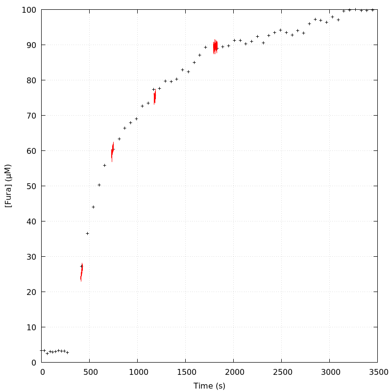
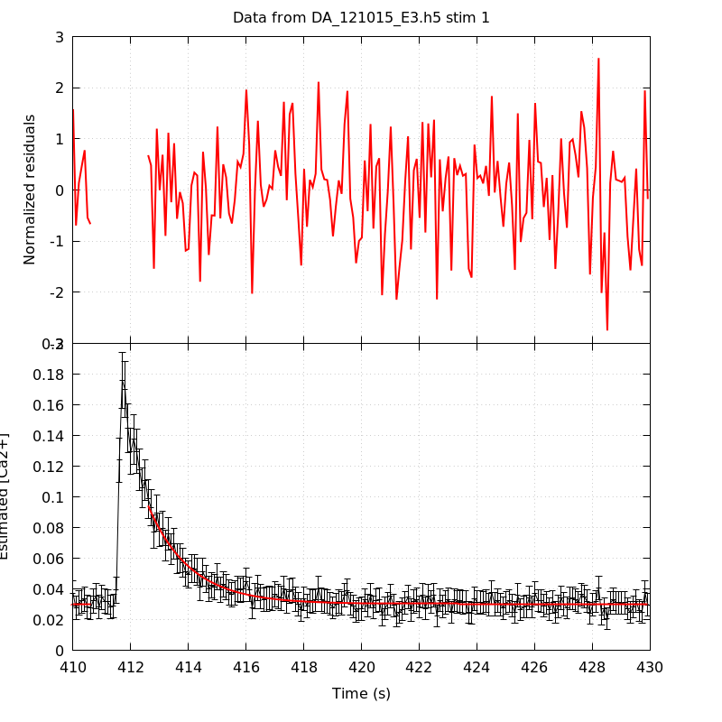
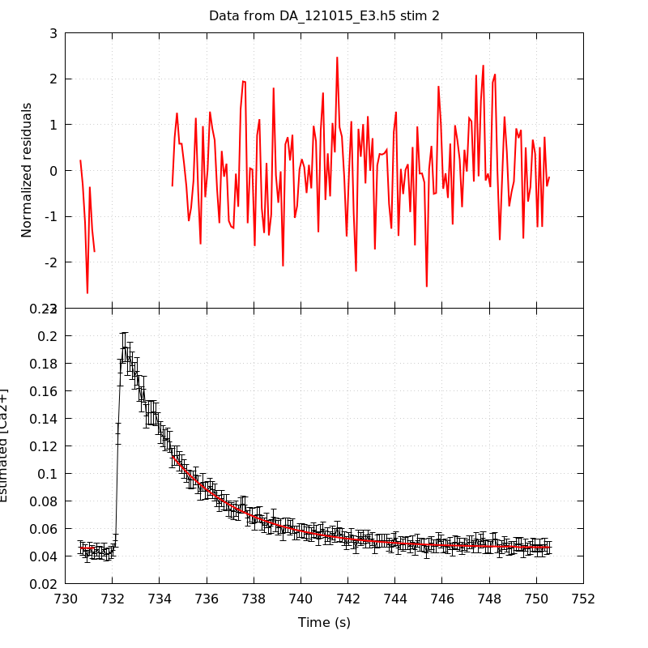
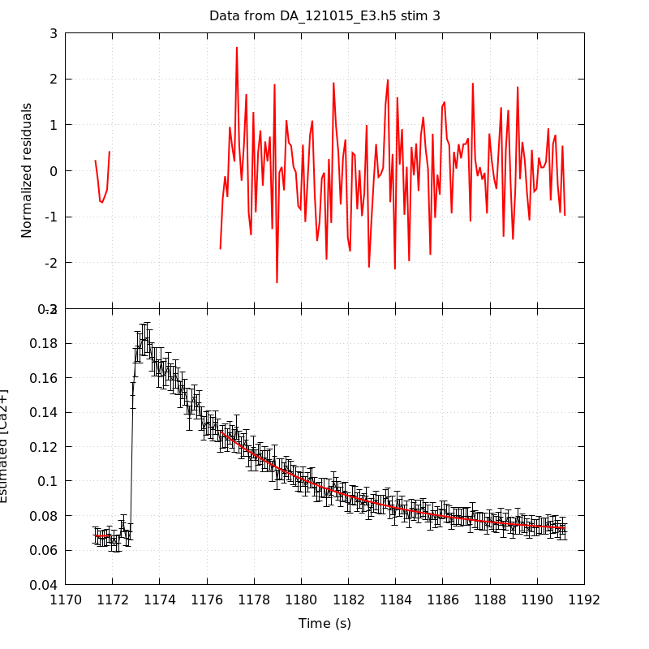
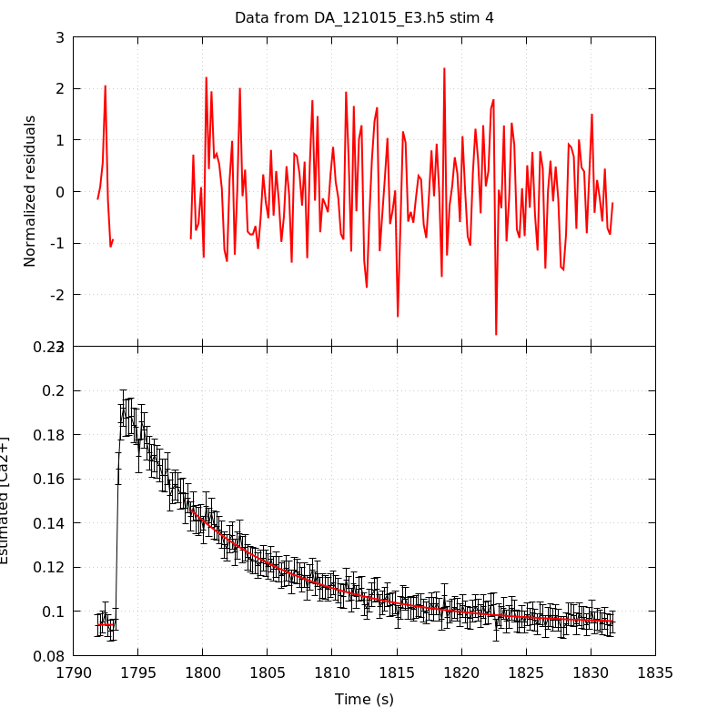
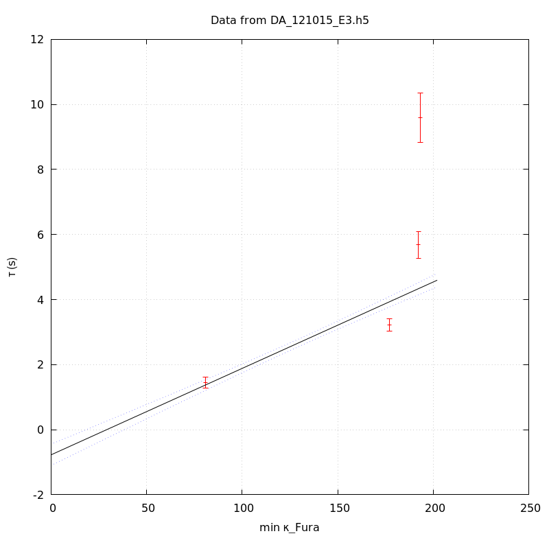
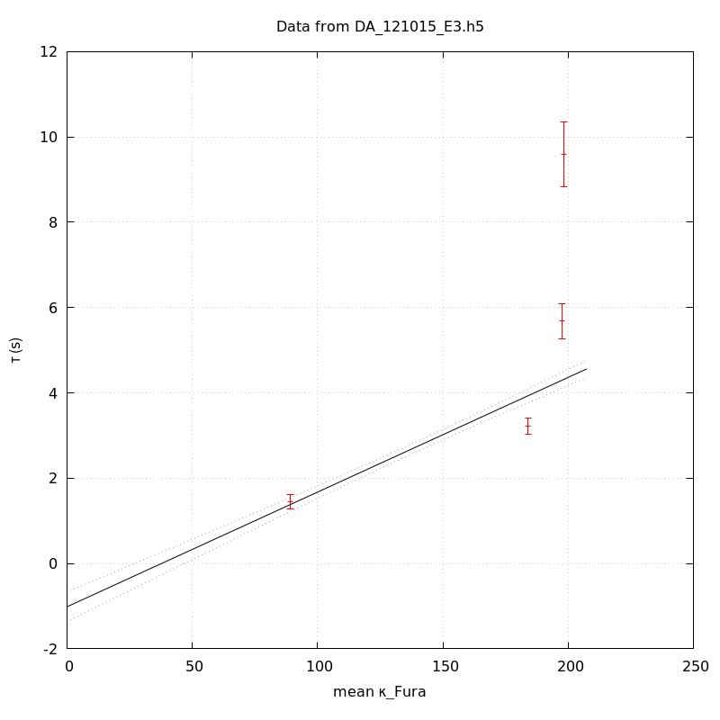
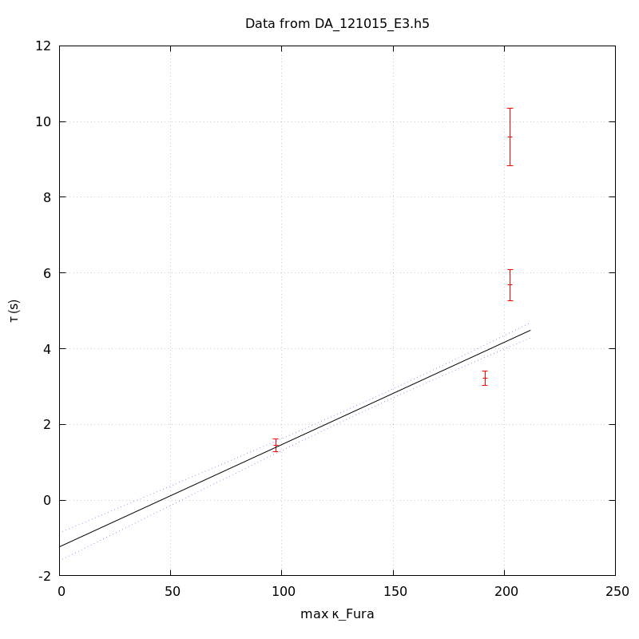

*Analysis of dataset DA_121015_E3*
-----

[TOC]

The baseline length is: 7.

**When fitting tau against kappa_Fura only the transients for which the fit RSS and the lag 1 auto-correlation of the residuals were small enough, giving an overall probability of false negative of 0.02, were kept** (see the numerical summary associated with each transient).

The good transients are: 1, 2, 3, 4.

# Loading curve
The time at which the 'good' transients were recorded appear in red.

# Transients 
On each graph, the residuals appear on top.
**Under the null hypothesis**, if the monoexponential fit is correct **they should be centered on 0 and have a SD close to 1** (not exactly 1 since parameters were obtained through the fitting procedure form the data.

The estimated [Ca2+] appears on the second row. The estimate is show in black together with pointwise 95% confidence intervals. The fitted curve appears in red. **The whole transient is not fitted**, only a portion of it is: a portion of the baseline made of 7 points and the decay phase starting at the time where the Delta[Ca2+] has reached 50% of its peak value.

The time appearing on the abscissa is the time from the beginning of the experiment.

## Transient 1
**Transient 1 is 'good'.**

### Fit graphical summary

### Fit numerical summary

> nobs = 181

> number of degrees of freedom = 178

> baseline length = 7

> fit started from point 26

> estimated baseline 0.0302444 and standard error 0.000343892

> estimated delta 0.0639845 and standard error 0.0027467

> estimated tau 1.4512 and standard error 0.0837448

> residual sum of squares: 168.023

> RSS per degree of freedom: 0.943947

> Probability of observing a larger of equal RSS per DOF under the null hypothesis: 0.692695

> Lag 1 residuals auto-correlation: -0.010

> Pr[Lag 1 auto-corr. > -0.010] = 0.522

## Transient 2
**Transient 2 is 'good'.**

### Fit graphical summary

### Fit numerical summary

> nobs = 168

> number of degrees of freedom = 165

> baseline length = 7

> fit started from point 39

> estimated baseline 0.0460622 and standard error 0.000350198

> estimated delta 0.066416 and standard error 0.00112497

> estimated tau 3.21585 and standard error 0.0968943

> residual sum of squares: 163.751

> RSS per degree of freedom: 0.992428

> Probability of observing a larger of equal RSS per DOF under the null hypothesis: 0.51285

> Lag 1 residuals auto-correlation: 0.075

> Pr[Lag 1 auto-corr. > 0.075] = 0.146

## Transient 3
**Transient 3 is 'good'.**

### Fit graphical summary

### Fit numerical summary

> nobs = 154

> number of degrees of freedom = 151

> baseline length = 7

> fit started from point 53

> estimated baseline 0.068179 and standard error 0.000676047

> estimated delta 0.0606593 and standard error 0.000905032

> estimated tau 5.67869 and standard error 0.206915

> residual sum of squares: 132.928

> RSS per degree of freedom: 0.880315

> Probability of observing a larger of equal RSS per DOF under the null hypothesis: 0.85218

> Lag 1 residuals auto-correlation: -0.087

> Pr[Lag 1 auto-corr. > -0.087] = 0.868

## Transient 4
**Transient 4 is 'good'.**

### Fit graphical summary

### Fit numerical summary

> nobs = 171

> number of degrees of freedom = 168

> baseline length = 7

> fit started from point 36

> estimated baseline 0.0939105 and standard error 0.00053253

> estimated delta 0.0520937 and standard error 0.000903073

> estimated tau 9.59201 and standard error 0.391216

> residual sum of squares: 147.919

> RSS per degree of freedom: 0.880469

> Probability of observing a larger of equal RSS per DOF under the null hypothesis: 0.865579

> Lag 1 residuals auto-correlation: -0.008

> Pr[Lag 1 auto-corr. > -0.008] = 0.502

# tau vs kappa 
Since the [Fura] changes during a transient (and it can change a lot during the early transients), the _unique_ value to use as '[Fura]' is not obvious. We therefore perform 3 fits: one using the minimal value, one using the mean and one using the maximal value.

The observed tau (shown in red) are displayed with a 95% confidence interval that results from the fitting procedure and _is_ therefore _meaningful only if the fit is correct_!

No serious attempt at quantifying the precision of [Fura] and therefore kappa_Fura has been made since the choice of which [Fura] to use has a larger effect and since the other dominating effect is often the certainty we can have that the saturating value (the [Fura] in the pipette) has been reached.

The straight line in black is the result of a _weighted_ linear regression. The blue dotted lines correspond to the limits of _pointwise 95% confidence intervals_.

## tau vs kappa  using the min [Fura] value
### Fit graphical summary

### Fit numerical summary

> Best fit: tau = -0.772091 + 0.0265642 kappa_Fura

> Covariance matrix:

> [ +2.76644e-02, -1.85865e-04  

>   -1.85865e-04, +1.43463e-06  ]

> Total sum of squares (TSS) = 768.038

> chisq (Residual sum of squares, RSS) = 276.163

> Probability of observing a larger of equal RSS per DOF under the null hypothesis: 1.07638e-60

> R squared (1-RSS/TSS) = 0.640431

> Estimated gamma/v with standard error: 37.6446 +/- 1.69737

> Estimates kappa_S with standard error (using error propagation): -30.0651 +/- 6.39697

> kappa_S confidence intervals based on parametric bootstrap

> 0.95 CI for kappa_S: [-39.3737,-19.1854]

> 0.99 CI for kappa_S: [-42.2198,-15.4887]

## tau vs kappa  using the mean [Fura] value
### Fit graphical summary

### Fit numerical summary

> Best fit: tau = -1.01321 + 0.026882 kappa_Fura

> Covariance matrix:

> [ +3.14655e-02, -2.03520e-04  

>   -2.03520e-04, +1.48561e-06  ]

> Total sum of squares (TSS) = 768.038

> chisq (Residual sum of squares, RSS) = 281.61

> Probability of observing a larger of equal RSS per DOF under the null hypothesis: 7.06458e-62

> R squared (1-RSS/TSS) = 0.633338

> Estimated gamma/v with standard error: 37.1996 +/- 1.68667

> Estimates kappa_S with standard error (using error propagation): -38.6909 +/- 6.81636

> kappa_S confidence intervals based on parametric bootstrap

> 0.95 CI for kappa_S: [-47.8321,-27.6295]

> 0.99 CI for kappa_S: [-50.3468,-23.7489]

## tau vs kappa  using the max [Fura] value
### Fit graphical summary

### Fit numerical summary

> Best fit: tau = -1.23238 + 0.0270059 kappa_Fura

> Covariance matrix:

> [ +3.55073e-02, -2.20948e-04  

>   -2.20948e-04, +1.52925e-06  ]

> Total sum of squares (TSS) = 768.038

> chisq (Residual sum of squares, RSS) = 291.125

> Probability of observing a larger of equal RSS per DOF under the null hypothesis: 6.06666e-64

> R squared (1-RSS/TSS) = 0.62095

> Estimated gamma/v with standard error: 37.0289 +/- 1.69559

> Estimates kappa_S with standard error (using error propagation): -46.6337 +/- 7.28369

> kappa_S confidence intervals based on parametric bootstrap

> 0.95 CI for kappa_S: [-55.9137,-36.073]

> 0.99 CI for kappa_S: [-58.6356,-32.1935]

# RSS per DOF, standard error of tau and lag 1 residual correlation for each 'good' tansient
4 out of 4 transients  were kept.

sigma(tau): 0.0837448, 0.0968943, 0.206915, 0.391216

Residual correlation at lag 1: -0.01016578504005216, 0.07488813738567233, -0.08743426464485923, -0.007768266361038915

Probablity of a correlation at lag 1 smaller or equal than observed: 0.522, 0.14600000000000002, 0.868, 0.502

RSS/DOF: 0.943947, 0.992428, 0.880315, 0.880469
