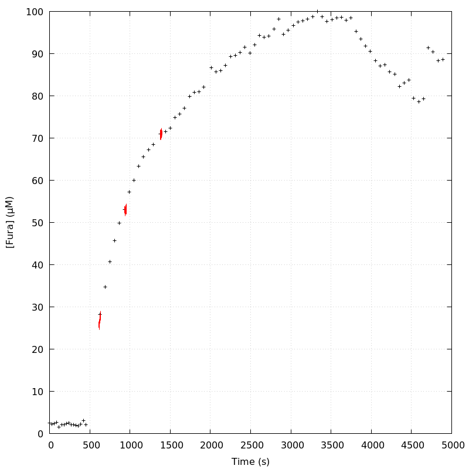
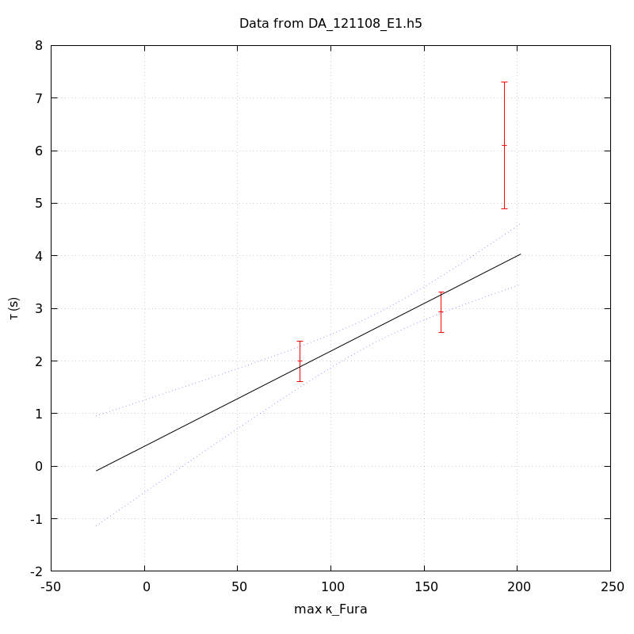

*Analysis of dataset DA_121108_E1*
-----

[TOC]

The baseline length is: 7.

**When fitting tau against kappa_Fura only the transients for which the fit RSS and the lag 1 auto-correlation of the residuals were small enough, giving an overall probability of false negative of 0.02, were kept** (see the numerical summary associated with each transient).

The good transients are: 1, 2, 3.

# Loading curve
The time at which the 'good' transients were recorded appear in red.

# Transients 
On each graph, the residuals appear on top.
**Under the null hypothesis**, if the monoexponential fit is correct **they should be centered on 0 and have a SD close to 1** (not exactly 1 since parameters were obtained through the fitting procedure form the data.

The estimated [Ca2+] appears on the second row. The estimate is show in black together with pointwise 95% confidence intervals. The fitted curve appears in red. **The whole transient is not fitted**, only a portion of it is: a portion of the baseline made of 7 points and the decay phase starting at the time where the Delta[Ca2+] has reached 50% of its peak value.

The time appearing on the abscissa is the time from the beginning of the experiment.

## Transient 1
**Transient 1 is 'good'.**

### Fit graphical summary

### Fit numerical summary

> nobs = 183

> number of degrees of freedom = 180

> baseline length = 7

> fit started from point 24

> estimated baseline 0.0548853 and standard error 0.000402974

> estimated delta 0.0332599 and standard error 0.00217027

> estimated tau 1.99378 and standard error 0.199313

> residual sum of squares: 168.541

> RSS per degree of freedom: 0.936341

> Probability of observing a larger of equal RSS per DOF under the null hypothesis: 0.719683

> Lag 1 residuals auto-correlation: 0.048

> Pr[Lag 1 auto-corr. > 0.048] = 0.213

## Transient 2
**Transient 2 is 'good'.**

### Fit graphical summary

### Fit numerical summary

> nobs = 174

> number of degrees of freedom = 171

> baseline length = 7

> fit started from point 33

> estimated baseline 0.0523869 and standard error 0.000314945

> estimated delta 0.0274604 and standard error 0.00101321

> estimated tau 2.92963 and standard error 0.197633

> residual sum of squares: 179.913

> RSS per degree of freedom: 1.05212

> Probability of observing a larger of equal RSS per DOF under the null hypothesis: 0.305118

> Lag 1 residuals auto-correlation: -0.072

> Pr[Lag 1 auto-corr. > -0.072] = 0.796

## Transient 3
**Transient 3 is 'good'.**

### Fit graphical summary

### Fit numerical summary

> nobs = 144

> number of degrees of freedom = 141

> baseline length = 7

> fit started from point 63

> estimated baseline 0.065251 and standard error 0.00067101

> estimated delta 0.0188987 and standard error 0.000765734

> estimated tau 6.09501 and standard error 0.615253

> residual sum of squares: 135.816

> RSS per degree of freedom: 0.963232

> Probability of observing a larger of equal RSS per DOF under the null hypothesis: 0.607479

> Lag 1 residuals auto-correlation: 0.025

> Pr[Lag 1 auto-corr. > 0.025] = 0.336

## Transient 4
**Transient 4 is a 'bad'.**

### Fit graphical summary

### Fit numerical summary

> nobs = 177

> number of degrees of freedom = 174

> baseline length = 7

> fit started from point 30

> estimated baseline 0.0757214 and standard error 0.000316306

> estimated delta 0.0229617 and standard error 0.000745726

> estimated tau 7.37169 and standard error 0.500271

> residual sum of squares: 259.686

> RSS per degree of freedom: 1.49245

> Probability of observing a larger of equal RSS per DOF under the null hypothesis: 2.71725e-05

> WARNING: THE FIT IS NOT GOOD!

> Lag 1 residuals auto-correlation: 0.297

> Pr[Lag 1 auto-corr. > 0.297] = 0.000

# tau vs kappa 
Since the [Fura] changes during a transient (and it can change a lot during the early transients), the _unique_ value to use as '[Fura]' is not obvious. We therefore perform 3 fits: one using the minimal value, one using the mean and one using the maximal value.

The observed tau (shown in red) are displayed with a 95% confidence interval that results from the fitting procedure and _is_ therefore _meaningful only if the fit is correct_!

No serious attempt at quantifying the precision of [Fura] and therefore kappa_Fura has been made since the choice of which [Fura] to use has a larger effect and since the other dominating effect is often the certainty we can have that the saturating value (the [Fura] in the pipette) has been reached.

The straight line in black is the result of a _weighted_ linear regression. The blue dotted lines correspond to the limits of _pointwise 95% confidence intervals_.

## tau vs kappa  using the min [Fura] value
### Fit graphical summary

### Fit numerical summary

> Best fit: tau = 0.676264 + 0.0171388 kappa_Fura

> Covariance matrix:

> [ +1.56689e-01, -1.20098e-03  

>   -1.20098e-03, +1.04542e-05  ]

> Total sum of squares (TSS) = 44.193

> chisq (Residual sum of squares, RSS) = 16.0955

> Probability of observing a larger of equal RSS per DOF under the null hypothesis: 6.02258e-05

> R squared (1-RSS/TSS) = 0.63579

> Estimated gamma/v with standard error: 58.3473 +/- 11.0075

> Estimates kappa_S with standard error (using error propagation): 38.4582 +/- 24.2661

> kappa_S confidence intervals based on parametric bootstrap

> 0.95 CI for kappa_S: [-5.58742,131.51]

> 0.99 CI for kappa_S: [-15.7548,186.719]

## tau vs kappa  using the mean [Fura] value
### Fit graphical summary

### Fit numerical summary

> Best fit: tau = 0.529794 + 0.0176248 kappa_Fura

> Covariance matrix:

> [ +1.78187e-01, -1.32864e-03  

>   -1.32864e-03, +1.10700e-05  ]

> Total sum of squares (TSS) = 44.193

> chisq (Residual sum of squares, RSS) = 16.1321

> Probability of observing a larger of equal RSS per DOF under the null hypothesis: 5.90729e-05

> R squared (1-RSS/TSS) = 0.634962

> Estimated gamma/v with standard error: 56.7382 +/- 10.7109

> Estimates kappa_S with standard error (using error propagation): 29.0596 +/- 24.6135

> kappa_S confidence intervals based on parametric bootstrap

> 0.95 CI for kappa_S: [-13.5835,120.546]

> 0.99 CI for kappa_S: [-22.0695,183.558]

## tau vs kappa  using the max [Fura] value
### Fit graphical summary

### Fit numerical summary

> Best fit: tau = 0.377723 + 0.0181103 kappa_Fura

> Covariance matrix:

> [ +2.01694e-01, -1.46143e-03  

>   -1.46143e-03, +1.16727e-05  ]

> Total sum of squares (TSS) = 44.193

> chisq (Residual sum of squares, RSS) = 16.0946

> Probability of observing a larger of equal RSS per DOF under the null hypothesis: 6.02546e-05

> R squared (1-RSS/TSS) = 0.635811

> Estimated gamma/v with standard error: 55.2172 +/- 10.4168

> Estimates kappa_S with standard error (using error propagation): 19.8568 +/- 25.1085

> kappa_S confidence intervals based on parametric bootstrap

> 0.95 CI for kappa_S: [-22.2469,103.343]

> 0.99 CI for kappa_S: [-31.2335,154.646]

# RSS per DOF, standard error of tau and lag 1 residual correlation for each 'good' tansient
3 out of 4 transients  were kept.

sigma(tau): 0.199313, 0.197633, 0.615253

Residual correlation at lag 1: 0.04832951825482965, -0.07243591245147639, 0.02465864153833827

Probablity of a correlation at lag 1 smaller or equal than observed: 0.21299999999999997, 0.796, 0.33599999999999997

RSS/DOF: 0.936341, 1.05212, 0.963232
