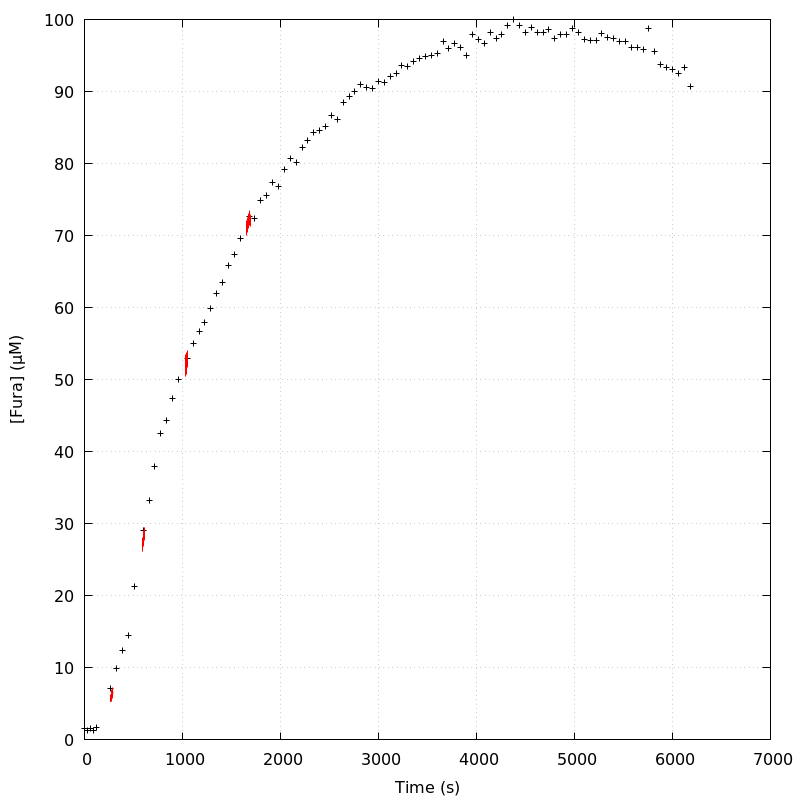
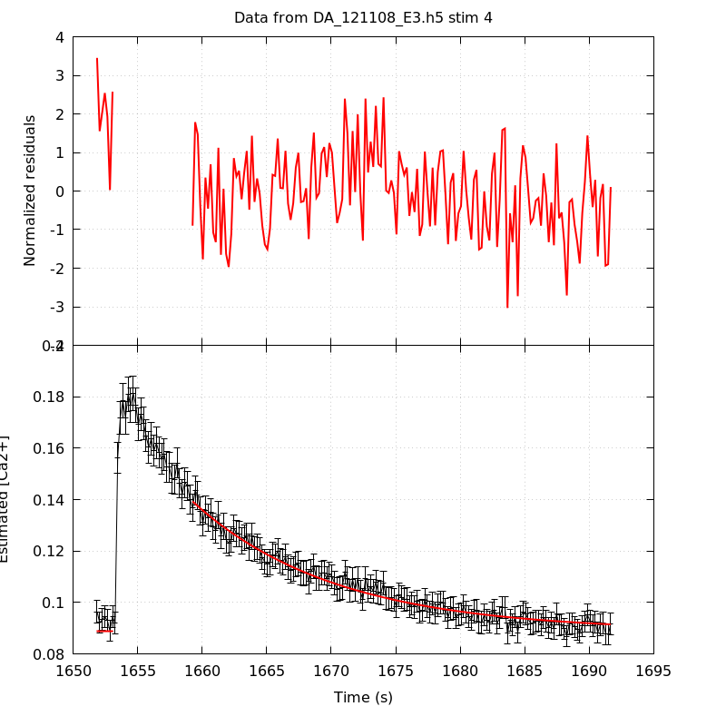

*Analysis of dataset DA_121108_E3*
-----

[TOC]

The baseline length is: 7.

**When fitting tau against kappa_Fura only the transients for which the fit RSS and the lag 1 auto-correlation of the residuals were small enough, giving an overall probability of false negative of 0.02, were kept** (see the numerical summary associated with each transient).

The good transients are: 1, 2.

**Not enough good transients to keep going!**

# Loading curve
The time at which the 'good' transients were recorded appear in red.

# Transients 
On each graph, the residuals appear on top.
**Under the null hypothesis**, if the monoexponential fit is correct **they should be centered on 0 and have a SD close to 1** (not exactly 1 since parameters were obtained through the fitting procedure form the data.

The estimated [Ca2+] appears on the second row. The estimate is show in black together with pointwise 95% confidence intervals. The fitted curve appears in red. **The whole transient is not fitted**, only a portion of it is: a portion of the baseline made of 7 points and the decay phase starting at the time where the Delta[Ca2+] has reached 50% of its peak value.

The time appearing on the abscissa is the time from the beginning of the experiment.

## Transient 1
**Transient 1 is 'good'.**

### Fit graphical summary

### Fit numerical summary

> nobs = 186

> number of degrees of freedom = 183

> baseline length = 7

> fit started from point 21

> estimated baseline 0.0273222 and standard error 0.000805364

> estimated delta 0.0181871 and standard error 0.00416596

> estimated tau 2.03877 and standard error 0.745111

> residual sum of squares: 191.363

> RSS per degree of freedom: 1.0457

> Probability of observing a larger of equal RSS per DOF under the null hypothesis: 0.320831

> Lag 1 residuals auto-correlation: -0.041

> Pr[Lag 1 auto-corr. > -0.041] = 0.695

## Transient 2
**Transient 2 is 'good'.**

### Fit graphical summary

### Fit numerical summary

> nobs = 173

> number of degrees of freedom = 170

> baseline length = 7

> fit started from point 34

> estimated baseline 0.0369405 and standard error 0.000330969

> estimated delta 0.060833 and standard error 0.00144917

> estimated tau 2.59043 and standard error 0.0976462

> residual sum of squares: 186.849

> RSS per degree of freedom: 1.09911

> Probability of observing a larger of equal RSS per DOF under the null hypothesis: 0.178507

> Lag 1 residuals auto-correlation: 0.027

> Pr[Lag 1 auto-corr. > 0.027] = 0.340

## Transient 3
**Transient 3 is a 'bad'.**

### Fit graphical summary

### Fit numerical summary

> nobs = 155

> number of degrees of freedom = 152

> baseline length = 7

> fit started from point 52

> estimated baseline 0.0733931 and standard error 0.000767053

> estimated delta 0.0653986 and standard error 0.000922069

> estimated tau 7.57061 and standard error 0.243137

> residual sum of squares: 230.397

> RSS per degree of freedom: 1.51577

> Probability of observing a larger of equal RSS per DOF under the null hypothesis: 4.20253e-05

> WARNING: THE FIT IS NOT GOOD!

> Lag 1 residuals auto-correlation: 0.514

> Pr[Lag 1 auto-corr. > 0.514] = 0.000

## Transient 4
**Transient 4 is a 'bad'.**

### Fit graphical summary

### Fit numerical summary

> nobs = 170

> number of degrees of freedom = 167

> baseline length = 7

> fit started from point 37

> estimated baseline 0.0888365 and standard error 0.000517875

> estimated delta 0.0504728 and standard error 0.000728252

> estimated tau 10.9868 and standard error 0.400463

> residual sum of squares: 216.145

> RSS per degree of freedom: 1.29428

> Probability of observing a larger of equal RSS per DOF under the null hypothesis: 0.0062332

> WARNING: THE FIT IS NOT GOOD!

> Lag 1 residuals auto-correlation: 0.271

> Pr[Lag 1 auto-corr. > 0.271] = 0.003

# RSS per DOF, standard error of tau and lag 1 residual correlation for each 'good' tansient
2 out of 4 transients  were kept.

sigma(tau): 0.745111, 0.0976462

Residual correlation at lag 1: -0.04084392384801662, 0.027032740705266275

Probablity of a correlation at lag 1 smaller or equal than observed: 0.6950000000000001, 0.33999999999999997

RSS/DOF: 1.0457, 1.09911
